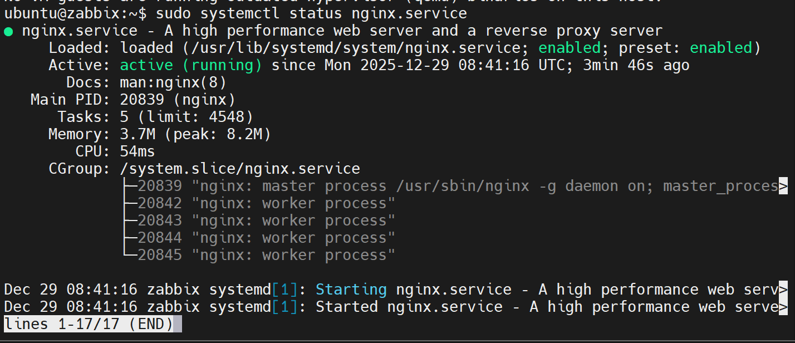

# Cài đặt Zabbix Server và tích hợp với Discord

## Zabbix Server 
### Cập nhật hệ thống trước tiên :
```bash
sudo apt update && sudo apt upgrade -y 
```

### Cài đặt các dependencies cần thiết và khởi động nginx services :
```bash
sudo apt install -y nginx mysql-server php-fpm php-mysql php-bcmath php-xml php-mbstring php-gd snmp fping php-curl php-ldap zabbix-agent2

sudo systemctl start nginx
sudo systemctl enable nginx
sudo systemctl status nginx
```



### Bảo mật MySQL 
```bash
sudo mysql_secure_installation 
# y 1 y n y y 
```

### Thay đổi root pwd, zabbix database và user cho Zabbix :
```bash
sudo mysql -u root -p 


ALTER USER 'root'@'localhost' IDENTIFIED WITH mysql_native_password BY 'RootPass123@';

DROP DATABASE IF EXISTS zabbix;
CREATE DATABASE zabbix CHARACTER SET utf8mb4 COLLATE utf8mb4_bin;

DROP USER IF EXISTS 'zabbix'@'localhost';
CREATE USER 'zabbix'@'localhost' IDENTIFIED BY 'ZabbixPass123@';

GRANT ALL PRIVILEGES ON zabbix.* TO 'zabbix'@'localhost';

SET GLOBAL log_bin_trust_function_creators = 1;

FLUSH PRIVILEGES;
EXIT;
```
> Quan trọng: Dùng password mạnh (có chữ hoa, thường, số, ký tự đặc biệt) để tránh lỗi password policy.

### Thêm Zabbix Repository:
```bash
wget https://repo.zabbix.com/zabbix/7.0/ubuntu/pool/main/z/zabbix-release/zabbix-release_latest_7.0+ubuntu24.04_all.deb
sudo dpkg -i zabbix-release_latest_7.0+ubuntu24.04_all.deb
sudo apt update
```
### Firewall
```bash
sudo ufw allow 8080/tcp
sudo ufw allow 10050/tcp
sudo ufw allow 10051/tcp
sudo ufw reload
```

### Cài đặt Zabbix Server , Frontend 

```bash
sudo apt install -y zabbix-server-mysql zabbix-frontend-php zabbix-nginx-conf zabbix-sql-scripts 
```

### Import initial schema và dữ liệu vào Zabbix db

```bash
sudo zcat /usr/share/zabbix-sql-scripts/mysql/server.sql.gz | mysql --default-character-set=utf8mb4 -uzabbix -pZabbixPass123@ zabbix

# Tắt log bin trust để bảo mật 
sudo mysql -u root -p -e "SET GLOBAL log_bin_trust_function_creators = 0;"
```

> `zabbix` ở cuối lệnh để chỉ định database.
### Config Zabbix Server 
- Chỉnh sửa Zabbix config file để setup kết nối DB :

`sudo vi /etc/zabbix/zabbix_server.conf`

DBPassword = your_db_password 
ListenIP=0.0.0.0

### Config PHP cho Zabbix Frontend 
- Chỉnh sửa PHP config cho Zabbix:

`sudo vi /etc/php/8.3/fpm/php.ini`

```yaml
date.timezone = Asia/Ho_Chi_Minh
max_execution_time = 300 
post_max_size = 16M 
upload_max_filesize = 2M
max_input_time = 300
memory_limit = 128M
```


### Restart PHP-FPM
```bash
sudo systemctl restart php8.3-fpm 
```


### Config Nginx for Zabbix 
`sudo vi /etc/zabbix/nginx.conf`

```yaml
# Chỉnh sửa cổng và IP 
server {
    listen 8080;
    server_name YOUR_SERVER_IP; # 192.168.198.175
}
```

- Kích hoạt Zabbix site và restart Nginx 
```bash
# Xóa các symlink cũ nếu có
sudo rm -f /etc/nginx/sites-enabled/zabbix
sudo rm -f /etc/nginx/sites-enabled/default

# Tạo symlink đúng cách
sudo ln -s /etc/zabbix/nginx.conf /etc/nginx/conf.d/zabbix.conf

# Kiểm tra config
sudo nginx -t

# Restart Nginx
sudo systemctl restart nginx
sudo systemctl status nginx
```

### Config  Zabbix Server

```bash
sudo systemctl start zabbix-server zabbix-agent2
sudo systemctl enable zabbix-server zabbix-agent2
```

### Truy cập Zabbix Web Interface 
Kiểm tra : 192.168.198.175:8080
// Admin zabbix 