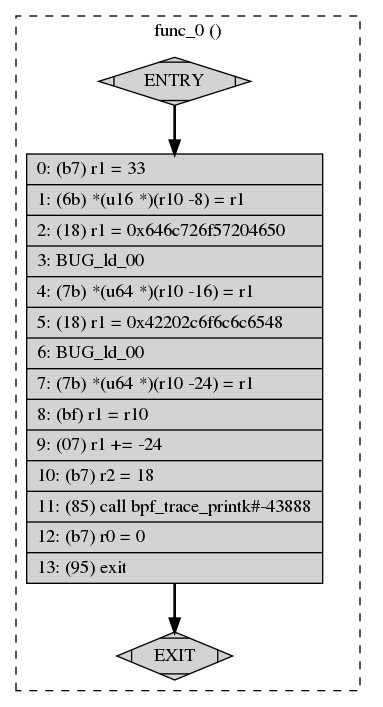
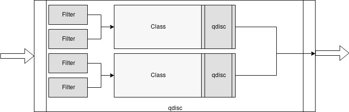
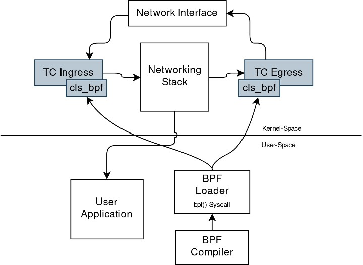
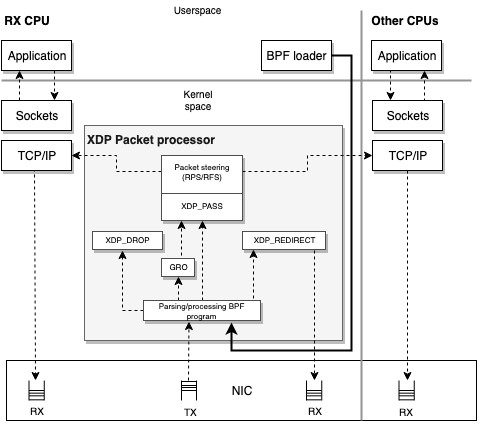
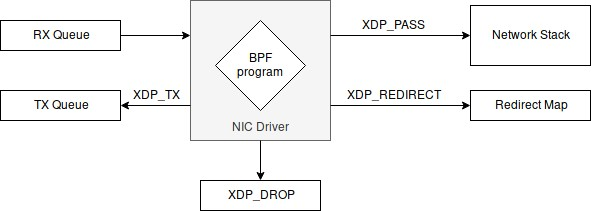
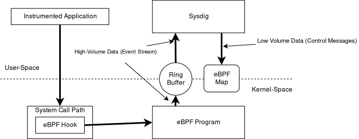

# eBPF, BPFTrace And XDP Observability

Note này chuyển hóa `_inbox/Linux_Observability_with_BPF_Advanced_Programming_for_Performance.docx`, tập trung vào BPF program, maps, tracing, BPFTrace và XDP ở góc nhìn vận hành.

## eBPF Là Gì

eBPF là cơ chế cho phép nạp chương trình nhỏ vào kernel để chạy tại các hook được kiểm soát. Trước khi chạy, chương trình phải qua verifier để hạn chế lỗi làm hỏng kernel.

Điểm cốt lõi:

- program chạy theo event;
- map dùng để lưu state/chia sẻ dữ liệu với user space;
- helper function cho phép tương tác có giới hạn với kernel;
- loader/user-space tool nạp program và đọc kết quả;
- verifier đảm bảo program an toàn theo rule của kernel.



## BPF Maps

BPF map là vùng dữ liệu dùng chung giữa eBPF program và user-space.

| Map type | Dùng khi |
|---|---|
| hash map | đếm theo key như PID, IP, syscall |
| array | lookup index cố định |
| perf/ring buffer | stream event về user-space |
| per-CPU map | giảm contention khi ghi theo CPU |
| LRU hash | cache giới hạn size |

Ví dụ use case:

- đếm số syscall theo process;
- lưu latency histogram;
- track connection theo tuple;
- gửi security event về agent.

## Tracing Hook

| Hook | Quan sát được |
|---|---|
| kprobe/kretprobe | function trong kernel, linh hoạt nhưng phụ thuộc symbol |
| tracepoint | event kernel ổn định hơn kprobe |
| uprobe/uretprobe | function trong user-space binary/library |
| USDT | tracepoint do application/library định nghĩa |
| XDP | packet path sớm ở network driver |
| tc | traffic control hook ở network stack |

Rule thực tế: ưu tiên tracepoint nếu có signal đủ tốt; dùng kprobe khi cần đào sâu kernel function cụ thể.

## BPFTrace

BPFTrace là công cụ viết script eBPF nhanh để điều tra ad-hoc.

Ví dụ ý tưởng:

```bash
# Đếm exec theo command.
sudo bpftrace -e 'tracepoint:syscalls:sys_enter_execve { @[comm] = count(); }'

# In process mở file.
sudo bpftrace -e 'tracepoint:syscalls:sys_enter_openat { printf("%s %s\n", comm, str(args->filename)); }'
```

Dùng BPFTrace khi:

- cần trả lời câu hỏi nhanh trong incident;
- cần prototype signal trước khi viết exporter/agent;
- muốn histogram latency syscall/function.

Không để script ad-hoc chạy lâu trên production nếu chưa đánh giá overhead và cardinality.





## XDP

XDP chạy rất sớm trong packet path, trước nhiều lớp network stack. Nó phù hợp cho filtering, drop, redirect, load balancing hoặc telemetry packet-level.

Action thường gặp:

| Action | Ý nghĩa |
|---|---|
| `XDP_PASS` | cho packet đi tiếp vào kernel network stack |
| `XDP_DROP` | drop packet sớm |
| `XDP_REDIRECT` | chuyển packet sang interface/CPU/path khác |
| `XDP_TX` | gửi ngược packet ra interface nhận |

Use case:

- drop traffic xấu sớm;
- đo packet rate;
- redirect traffic;
- DDoS mitigation ở edge;
- network observability có overhead thấp.





## Operational Safety

Checklist trước khi chạy eBPF tool trong production:

- kernel hỗ trợ hook/tool cần dùng;
- symbol/tracepoint tồn tại ở kernel hiện tại;
- có rollback/unload program;
- giới hạn cardinality của map;
- không in quá nhiều event ra stdout/log;
- đo overhead trước và sau;
- biết tool cần capability/root nào.

Command kiểm tra:

```bash
uname -a
bpftool prog show
bpftool map show
mount | grep bpf
```

## Khi Debug Performance

Đi từ câu hỏi đến hook:

| Câu hỏi | Signal/hook |
|---|---|
| Process nào gọi syscall nhiều? | syscall tracepoint |
| File nào bị mở/đọc/ghi liên tục? | open/read/write tracepoint |
| Latency network nằm ở đâu? | TCP tracepoint/kprobe, XDP/tc |
| CPU time kẹt ở kernel function nào? | profiling/perf/kprobe |
| App gọi library function nào? | uprobe/USDT |



## Source Coverage Matrix

`Linux_Observability_with_BPF_Advanced_Programming_for_Performance.docx` da duoc gom theo cac nhom:

| Source topic | Da chuyen hoa vao |
|---|---|
| Introduction to BPF/eBPF and observability motivation | eBPF La Gi |
| BPF program lifecycle, verifier, helpers, loader | eBPF La Gi va Operational Safety |
| BPF maps | BPF Maps |
| Tracing with BPF: kernel probes, user-space probes, USDT | Tracing Hook |
| BPF utilities and BPFTrace | BPFTrace |
| Visualizing tracing data | Khi Debug Performance va Related observability pages |
| XDP actions: drop, redirect, pass, sections | XDP |
| Packet filtering / networking use cases | XDP va Khi Debug Performance |
| Sysdig/eBPF-style runtime visibility | Operational Safety va related security note |

Phan code/lab chi tiet trong source duoc giu o muc command mau va mental model. Neu can hoc lap trinh eBPF that su, nen tao mot module rieng ve C/libbpf/bcc/bpftrace theo tung lab.

## Related Pages

- [Observability Overview](../overview.md)
- [Prometheus Architecture](../01-metrics-and-monitoring/Prometheus/Architecture.md)
- [Network Monitoring And Packet Analysis](../../02-security-and-hardening/02-os-and-network-security/network-monitoring-and-packet-analysis.md)
