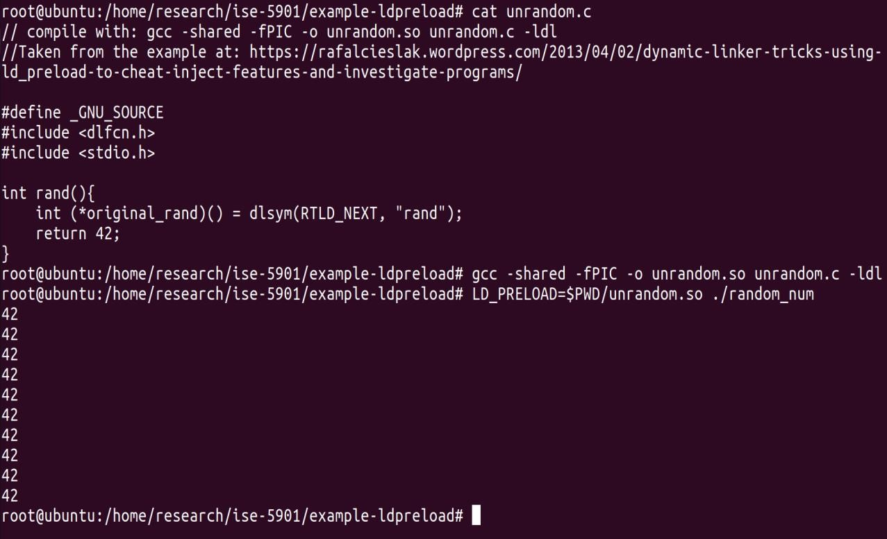
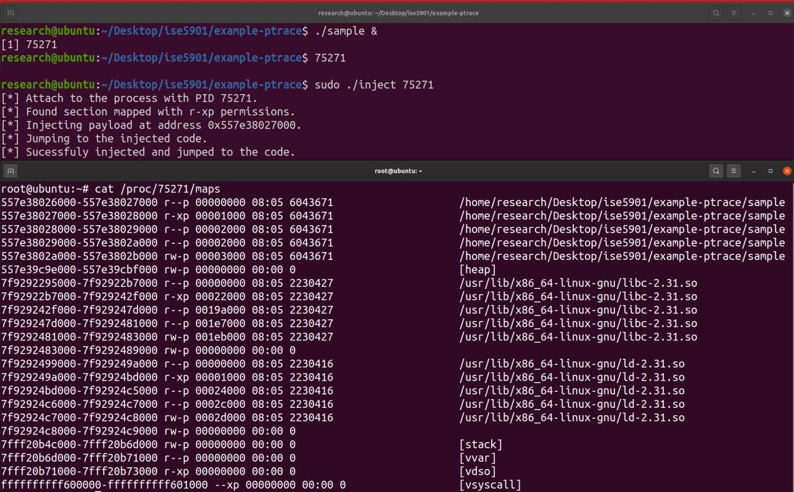
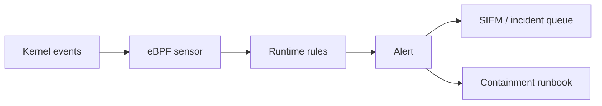
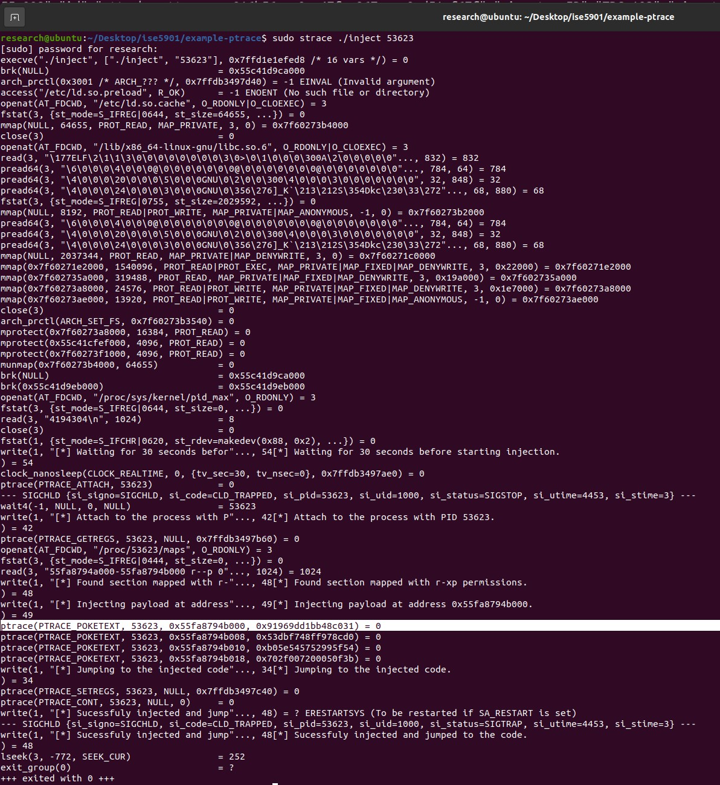
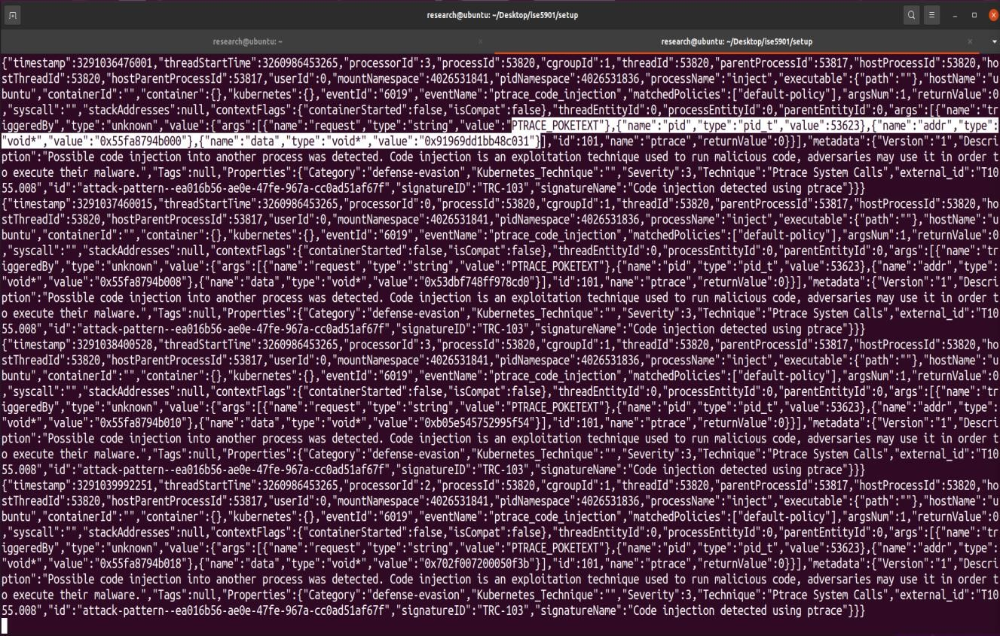

# eBPF Security And Process Injection Detection

Note này chuyển hóa `_inbox/Observing_PI_eBPF_Linux.docx`, tập trung vào việc dùng eBPF để quan sát process injection và tăng visibility cho Linux runtime security.

## Process Injection Là Gì

Process injection là nhóm kỹ thuật đưa code hoặc hành vi vào process khác để né tránh detection, lấy quyền hoặc ẩn execution.

Các kỹ thuật trong nguồn:

- `LD_PRELOAD` để ép process load shared object trước library bình thường.
- `ptrace`/debugger để attach và thao tác process khác.
- memory mapping hoặc ghi vào vùng nhớ process.
- VDSO/shared object abuse tùy kỹ thuật.

## Vì Sao eBPF Hữu Ích

Nhiều kỹ thuật injection để lại dấu vết ở syscall/kernel boundary:

- `ptrace`;
- `process_vm_writev`;
- `mmap`, `mprotect`;
- `execve`;
- `openat` các shared object bất thường;
- thay đổi environment như `LD_PRELOAD`;
- load library lạ;
- behavior bất thường sau attach.

eBPF không thay thế EDR/SIEM, nhưng là sensor mạnh để thu runtime event từ kernel với overhead thấp.

## Detection Signals

| Technique | Signal nên quan sát |
|---|---|
| LD_PRELOAD | env var khi exec, file `.so` được mở/load, process tree bất thường |
| ptrace/debugger | syscall `ptrace`, process attach, capability, parent/child relation |
| memory injection | `process_vm_writev`, `mprotect` chuyển memory executable, mmap anonymous executable |
| suspicious library load | open/read shared object từ path lạ như `/tmp`, user home |
| privilege boundary | user/capability thay đổi, sudo/suid chain |

Ví dụ điều tra thủ công:

```bash
ps auxf
cat /proc/<pid>/environ 2>/dev/null | tr '\0' '\n'
cat /proc/<pid>/maps 2>/dev/null
ls -l /proc/<pid>/fd 2>/dev/null
```





## Tooling

Các nhóm tool có thể dùng:

- BPFTrace cho investigation nhanh.
- Tracee/Falco/Tetragon hoặc runtime security agent dựa trên eBPF cho detection liên tục.
- auditd làm lớp audit truyền thống.
- SIEM/log pipeline để correlate event.

Pattern triển khai:







## Hardening Chống Process Injection

Các control nên có:

- giới hạn quyền `ptrace` bằng YAMA `ptrace_scope`;
- giảm capability của service;
- bật SELinux/AppArmor nếu phù hợp;
- không chạy service bằng root nếu không cần;
- mount option `noexec`, `nodev`, `nosuid` cho path phù hợp;
- kiểm soát writable/executable path;
- audit binary/library ở path bất thường;
- dùng allowlist hoặc policy cho workload nhạy cảm.

Ví dụ kiểm tra YAMA:

```bash
cat /proc/sys/kernel/yama/ptrace_scope
```

Thiết lập runtime cần test kỹ trước khi áp dụng rộng:

```bash
sudo sysctl kernel.yama.ptrace_scope=1
```

## Incident Workflow

Khi có alert injection:

1. Xác định PID, user, command, parent process.
2. Thu thập `/proc/<pid>/maps`, `/proc/<pid>/environ`, fd, network connection.
3. Kiểm tra binary/hash/path của shared object.
4. Đối chiếu timeline với auth log, sudo log, deploy log.
5. Cô lập host/container nếu nghi compromise.
6. Thu evidence trước khi kill process nếu cần forensic.

Không paste environment thật có secret vào ticket. Sanitize token/password trước khi lưu.

## Limitations

- eBPF phụ thuộc kernel version và capability.
- High-volume syscall tracing có thể tạo nhiều event.
- Detection rule kém có thể false positive nhiều.
- Container context cần map PID namespace/cgroup/container ID đúng.
- Advanced attacker có thể tìm cách giảm visibility nếu đã có quyền cao.

## Research Method Tu Source

Tai lieu nguon dung cach tiep can lab de quan sat process injection:

- tao baseline Linux environment;
- chay cac ky thuat injection nhu `LD_PRELOAD` va `ptrace`;
- quan sat syscall, loaded libraries va runtime signal bang tooling eBPF/security;
- so sanh signal giua hanh vi binh thuong va hanh vi injection;
- ghi nhan gioi han ve dependency, compatibility va kha nang scale detection.

Khi ap dung vao moi truong that, nen bien phan research nay thanh detection engineering loop:

```text
hypothesis -> lab reproduction -> signal capture -> rule draft -> false-positive test -> rollout -> alert review
```

## LD_PRELOAD Va Ptrace Trong Thuc Te

`LD_PRELOAD`:

- tan cong qua dynamic linker bang cach nap shared object truoc library mac dinh;
- de lai dau vet trong environment, file open/load va process behavior;
- giam rui ro bang cach kiem soat writable library path, service environment va file integrity.

`ptrace`:

- duoc debugger dung hop phap, nhung cung co the bi abuse de inspect/modify process khac;
- signal quan trong la syscall `ptrace`, relationship giua tracer/tracee va capability cua process;
- YAMA `ptrace_scope` co the giam kha nang attach tuy tien.

## Appendix Handling

Source co cac appendix gom installation script, JSON output mau, `inject.c`, YAMA Linux Security Module va default policy cho Tracee. Cac phan nay khong duoc copy nguyen vao vault vi vua dai vua co tinh lab-specific. Kien thuc ben vung da duoc chuyen hoa thanh:

- nhom syscall/signal can quan sat;
- quy trinh lab-to-rule;
- hardening bang YAMA/capability/MAC/mount option;
- incident workflow khi co alert process injection.

## Related Pages

- [eBPF, BPFTrace And XDP Observability](./01-ebpf-bpftrace-xdp-observability.md)
- [Linux Incident Response Live Triage](../../../02-core-infrastructure/01-linux/03-security-logs-troubleshooting/07-linux-incident-response-live-triage.md)
- [SUID, SGID, SELinux, PAM, auditd hardening](../../../02-core-infrastructure/01-linux/03-security-logs-troubleshooting/03-suid-sgid-selinux-pam-auditd-hardening.md)
