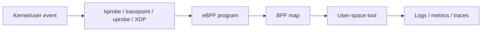

# eBPF Observability And Security

Folder này gom note từ hai nguồn `_inbox/Linux_Observability_with_BPF_Advanced_Programming_for_Performance.docx` và `_inbox/Observing_PI_eBPF_Linux.docx`.

## Reading Path

- [eBPF, BPFTrace And XDP Observability](./01-ebpf-bpftrace-xdp-observability.md)
- [eBPF Security And Process Injection Detection](./02-ebpf-security-process-injection-detection.md)

## Mental Model

eBPF cho phép chạy chương trình nhỏ trong kernel ở các hook an toàn đã được verifier kiểm tra. Với observability, eBPF giúp thu thập signal gần kernel mà không cần sửa application.

## Khi Nào Dùng eBPF

- Cần nhìn syscall, network packet, file access, scheduler latency hoặc kernel behavior.
- Không thể sửa code ứng dụng để thêm instrumentation.
- Cần điều tra performance hoặc security với overhead thấp.
- Cần runtime detection ở tầng kernel/container.

Không nên dùng eBPF như giải pháp đầu tiên nếu metrics/log/tracing thông thường đã đủ trả lời câu hỏi.
