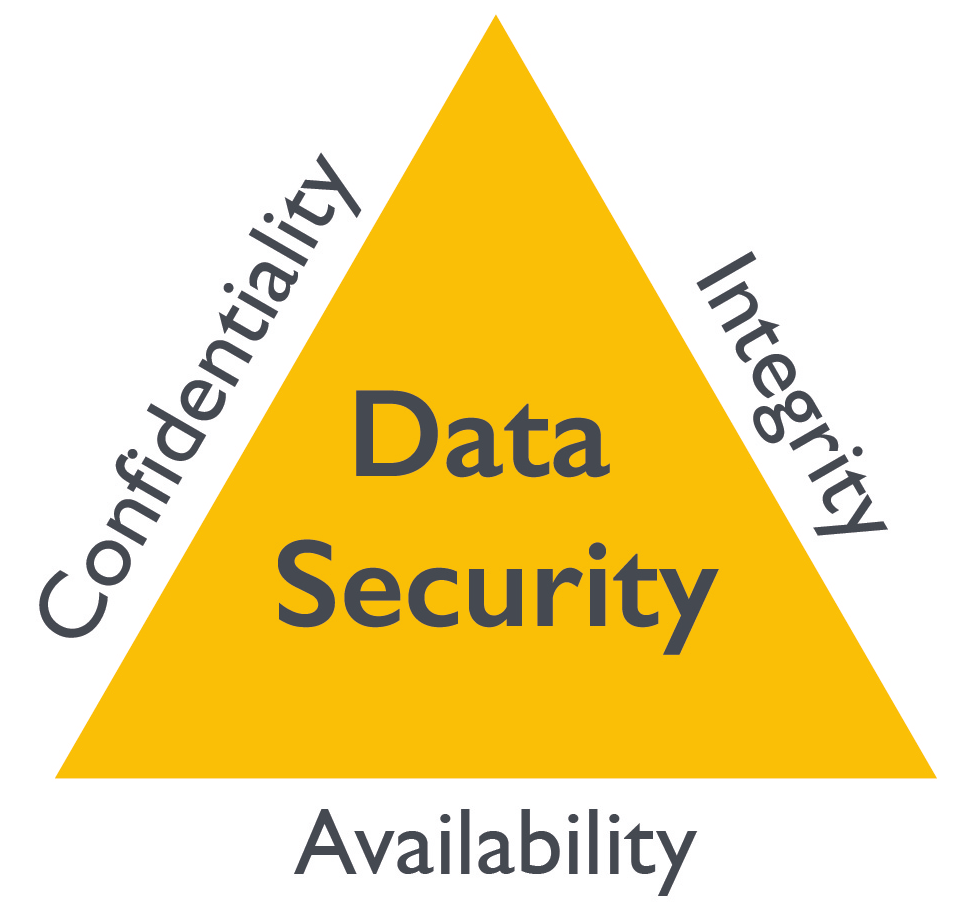
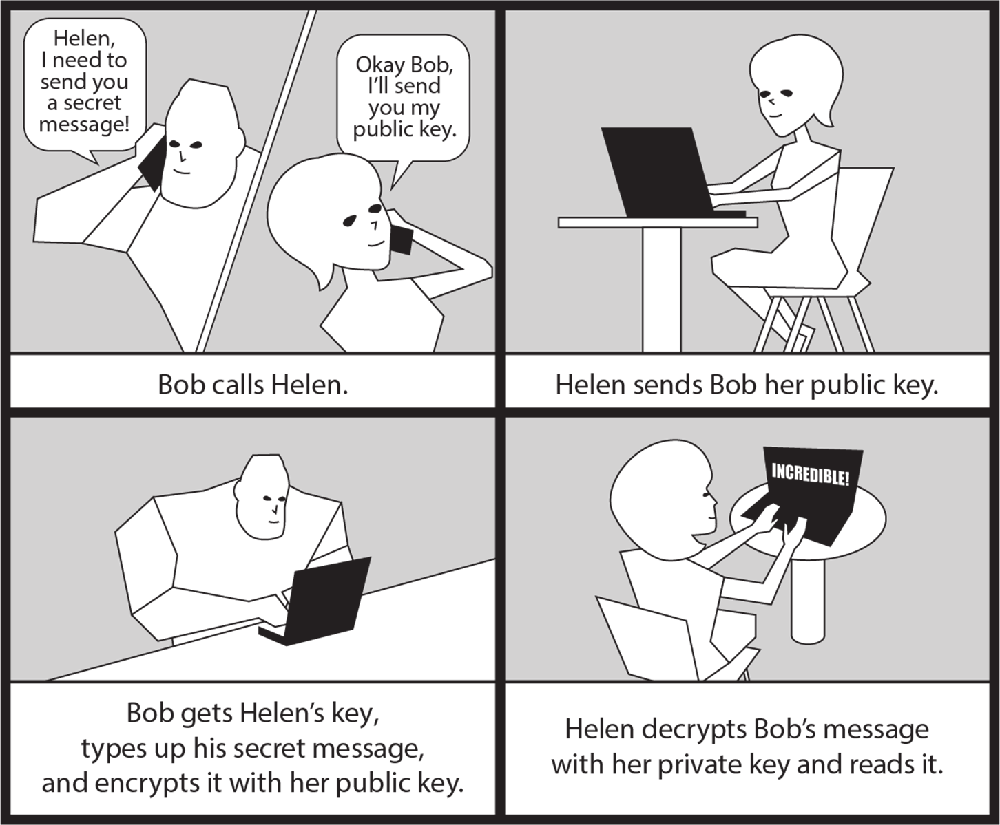

# Privacy, Compliance, Cryptography And Data Protection

Note này gom các note `_inbox/Cryptography & Data Protection/*` và `_inbox/Compliance & Regulations/regulations-compliance.md` thành một khung học bền hơn về bảo vệ dữ liệu, privacy, compliance, audit và cryptography.

## Security Vs Privacy

`Information security` bảo vệ dữ liệu khỏi truy cập, sửa đổi, tiết lộ hoặc phá hủy trái phép.

`Information privacy` tập trung vào quyền kiểm soát của cá nhân/tổ chức đối với việc dữ liệu cá nhân được thu thập, dùng, chia sẻ và lưu trong bao lâu.

Nói ngắn gọn:

- Security bảo vệ dữ liệu.
- Privacy bảo vệ quyền quyết định liên quan đến dữ liệu.
- Compliance chứng minh tổ chức đang vận hành theo luật, tiêu chuẩn hoặc cam kết đã nhận.

Một hệ thống có thể mã hóa dữ liệu tốt nhưng vẫn vi phạm privacy nếu thu thập quá mức, không xin consent hoặc dùng dữ liệu ngoài mục đích đã công bố.

## CIA Triad

`Confidentiality`, `Integrity` và `Availability` là mô hình nền tảng để kiểm tra một control bảo mật có đang bảo vệ đúng thứ cần bảo vệ hay không.



| Mục tiêu | Ý nghĩa vận hành | Control thường dùng |
|---|---|---|
| Confidentiality | chỉ người, service hoặc hệ thống được phép mới đọc hoặc nhận dữ liệu | encryption, IAM/RBAC, network segmentation, DLP, data minimization |
| Integrity | dữ liệu, cấu hình và message không bị sửa trái phép hoặc sửa mà không để lại dấu vết | checksum, hash, digital signature, immutable log, change approval, audit trail |
| Availability | user hoặc service hợp lệ truy cập được dữ liệu và hệ thống khi cần | redundancy, backup/restore, failover, rate limit, capacity planning, incident response |

Trong production, ba mục tiêu này thường kéo nhau: tăng confidentiality bằng encryption nhưng mất key management thì availability bị ảnh hưởng; tăng availability bằng replica nhưng không kiểm soát replication path thì confidentiality và integrity có thể yếu đi. Vì vậy mỗi thiết kế bảo mật nên ghi rõ trade-off, owner và cách validate control.

## Security Policy Va Mechanism

`Security policy` nói rõ điều gì được phép, điều gì bị cấm và ai chịu trách nhiệm. `Security mechanism` là cách thực thi policy đó: encryption, authentication, authorization, firewall, audit log, IDS, key rotation hoặc workflow phê duyệt.

Ba nhóm threat cơ bản cần kiểm tra khi thiết kế control:

| Threat | Ý nghĩa | Control thường dùng |
|---|---|---|
| Unauthorized disclosure | dữ liệu bị đọc hoặc lộ cho bên không được phép | encryption, access control, data minimization, DLP |
| Unauthorized modification | dữ liệu, cấu hình hoặc message bị sửa trái phép | integrity check, digital signature, audit log, change approval |
| Denial of use | người dùng hợp lệ không dùng được service/resource | redundancy, rate limit, capacity guardrail, incident response |

Guardrails cho distributed system:

- Fail-safe default: khi policy không rõ, token hết hạn, certificate lỗi hoặc identity không xác minh được thì deny.
- Open design: không dựa vào việc giấu cơ chế bảo mật; bí mật nằm ở key/secret, không nằm ở thuật toán tự chế.
- Separation of privilege: thao tác nhạy cảm nên cần nhiều điều kiện hoặc nhiều vai trò thay vì một quyền toàn năng.
- Least privilege: cấp đúng quyền, đúng resource, đúng thời gian; không dùng wildcard rộng nếu không có lý do vận hành.
- Complete mediation: mọi request nhạy cảm phải đi qua điểm kiểm tra quyền, kể cả request nội bộ giữa service.
- Psychological acceptability: control phải đủ dễ dùng để người vận hành không tạo bypass không chính thức.

## Data Lifecycle

| Giai đoạn | Câu hỏi bảo mật |
|---|---|
| Collect | có cần thu thập dữ liệu này không, có consent/legal basis không |
| Store | dữ liệu nằm ở đâu, ai có quyền, mã hóa at rest chưa |
| Use | ai truy cập, dùng vào mục đích gì, có audit không |
| Share / Transfer | có mã hóa in transit, DLP, third-party risk không |
| Archive | retention bao lâu, có phân tầng/lưu trữ an toàn không |
| Destroy | xóa có kiểm chứng được không, backup/snapshot có còn dữ liệu không |

Vai trò governance:

- `Data owner`: quyết định mục đích, phân loại và quyền dùng dữ liệu.
- `Data custodian`: vận hành hệ thống lưu trữ, backup, transport và technical controls.
- `Data steward`: duy trì chính sách, chất lượng, metadata và tuân thủ quy trình dữ liệu.

## Information Classification Và NDA

Data classification giúp quyết định control theo mức nhạy cảm thay vì xử lý mọi dữ liệu như nhau. Một mô hình đơn giản thường đủ cho nhiều tổ chức:

| Mức | Ví dụ | Control gợi ý |
|---|---|---|
| Public | nội dung marketing, tài liệu đã công bố | kiểm soát integrity và nguồn phát hành |
| Internal | tài liệu vận hành nội bộ, sơ đồ không nhạy cảm | access nội bộ, không public mặc định |
| Confidential | customer data, hợp đồng, tài chính, nhân sự | least privilege, encryption, audit, DLP khi phù hợp |
| Highly confidential | secret, trade secret, dữ liệu regulated, incident evidence | approval, strong encryption, restricted sharing, retention rõ |

NDA là guardrail pháp lý cho thông tin chia sẻ với bên thứ ba, nhưng không thay thế technical control. Trước khi chia sẻ dữ liệu theo NDA vẫn cần xác định scope, owner, kênh truyền, thời hạn retention, quyền truy cập, audit trail và quy trình thu hồi/xóa sau khi hết mục đích.

Classification phải gắn với hành vi thật: email subject/footer chỉ là tín hiệu. Control cần nằm ở IAM, cloud share permission, encryption, data loss prevention, logging, backup retention và incident response.

## Protected Data

| Loại dữ liệu | Ý nghĩa |
|---|---|
| `PII` | thông tin có thể nhận diện một cá nhân, như tên, email, số điện thoại, ID |
| `SPII` | PII nhạy cảm hơn, như credential, số tài khoản, số định danh, dữ liệu tài chính |
| `PHI` | thông tin sức khỏe được bảo vệ, thường liên quan đến HIPAA hoặc quy định y tế |
| Payment data | dữ liệu thẻ/thanh toán, liên quan PCI DSS |
| Secrets | password, token, private key, API key, certificate key |

Nguyên tắc tốt: thu thập ít nhất có thể, phân loại rõ, gắn owner, mã hóa đúng chỗ và xóa khi hết mục đích hợp lệ.

## Cryptography

Cryptography biến dữ liệu dễ đọc thành dạng không thể hiểu nếu không có key hoặc context phù hợp.

| Khái niệm | Dùng để |
|---|---|
| Encryption | bảo mật dữ liệu at rest hoặc in transit |
| Hashing | kiểm tra integrity, lưu password hash, nhận diện file |
| Salting | làm password hash khó bị rainbow table/dictionary attack |
| Digital signature | chứng minh integrity và nguồn gốc |
| Certificate | bind public key với identity đã được xác minh |
| PKI | hệ thống cấp, quản lý, revoke certificate và trust chain |

Ba primitive hay bị trộn lẫn:

- `Hash function` tạo digest cố định để kiểm tra integrity, fingerprint artifact, lưu password hash hoặc làm input cho digital signature. Không dùng MD5/SHA-1 cho security decision mới vì collision risk.
- `Cipher` thực hiện encryption/decryption. Symmetric cipher như AES phù hợp data path lớn; asymmetric cipher/key algorithm phù hợp identity, key exchange hoặc signature.
- `Key exchange` thiết lập shared secret qua kênh không tin cậy. Diffie-Hellman/ECDH thường dùng ephemeral key để giảm blast radius khi long-term key bị lộ.

## Symmetric Vs Asymmetric

| Loại | Đặc điểm | Use case |
|---|---|---|
| Symmetric encryption | cùng một secret key để encrypt/decrypt | mã hóa volume, object storage, session data |
| Asymmetric encryption | public key/private key pair | TLS handshake, key exchange, digital signature |

Trong thực tế, nhiều hệ thống dùng hybrid model: asymmetric để thiết lập trust/key exchange, symmetric để mã hóa data path vì nhanh hơn.



Mental model với public/private key:

- Muốn gửi dữ liệu mật cho người nhận, dùng public key của người nhận để encrypt.
- Chỉ private key tương ứng của người nhận mới decrypt được.
- Muốn chứng minh dữ liệu đến từ mình, dùng private key của mình để ký; người nhận dùng public key của mình để verify.
- Public key được chia sẻ, nhưng vẫn phải verify fingerprint/identity qua kênh độc lập để tránh MITM.

`Perfect Forward Secrecy` bảo vệ phiên cũ khi long-term private key bị compromise sau này. Mỗi session dùng ephemeral key riêng và discard sau phiên; attacker có private key về sau vẫn không tự động giải mã được traffic đã capture trước đó. Khi kiểm tra TLS/VPN/mTLS, đừng chỉ nhìn "đã bật encryption", cần kiểm tra cipher suite/key exchange có hỗ trợ PFS và có loại bỏ protocol/cipher cũ không.

Lưu ý vận hành:

- Không tự thiết kế thuật toán cryptography.
- Dùng library/protocol đã được kiểm chứng.
- Bảo vệ private key trong KMS/HSM/secret manager khi có thể.
- Có quy trình rotation, revoke và backup key.
- Kiểm tra certificate expiry và chain trust.

## End-To-End, Transport Va Email Encryption

`Transport encryption` bảo vệ dữ liệu trên đường truyền giữa hai hop, ví dụ browser tới web server qua TLS. Sau khi đến server, dữ liệu có thể được decrypt để xử lý, log, index hoặc lưu trữ. Control này phù hợp cho API/web/service-to-service traffic nhưng không che dữ liệu khỏi chính service nhận.

`End-to-end encryption` bảo vệ dữ liệu từ sender đến recipient cuối. Server trung gian chỉ thấy ciphertext hoặc metadata cần thiết để chuyển tiếp. E2EE tăng confidentiality nhưng làm key recovery, eDiscovery, DLP, malware scanning, backup và incident investigation phức tạp hơn. Production policy cần ghi rõ ai quản lý key, mất key thì recover thế nào, metadata nào vẫn lộ và trường hợp nào organization có quyền escrow/recovery.

Email encryption thường có hai mô hình:

| Mô hình | Trust model | Ghi nhớ vận hành |
|---|---|---|
| OpenPGP/GPG | decentralized, user tự quản key và trust/fingerprint | phải verify fingerprint qua kênh độc lập, tạo revocation certificate, backup private key an toàn, tránh upload private key lên shared host |
| S/MIME | centralized PKI, certificate do CA phát hành gắn với email address | phụ thuộc CA/certificate lifecycle, cần import certificate đúng email, theo dõi expiry/revocation và bảo vệ private key |

Digital signature trong email chứng minh message chưa bị sửa và gắn với key/certificate của sender. Encryption chứng minh chỉ recipient có private key phù hợp mới đọc được nội dung. Hai control này độc lập: có thể ký mà không mã hóa, hoặc mã hóa nhưng không ký.

### GPG Workflow Cơ Bản

GPG/OpenPGP phù hợp cho file/email object-level encryption và signing khi recipient tự quản key.

Tạo và kiểm tra keyring:

```bash
gpg --full-generate-key
gpg --list-keys
gpg --list-secret-keys
```

Export public key để chia sẻ:

```bash
gpg --armor --export user@example.com > user-example-com.pub.asc
```

Import public key của người khác:

```bash
gpg --import recipient.pub.asc
gpg --fingerprint recipient@example.com
```

Encrypt/decrypt file:

```bash
gpg --output secret.txt.gpg --recipient recipient@example.com --encrypt secret.txt
gpg --output secret.txt --decrypt secret.txt.gpg
```

Sign và verify:

```bash
gpg --armor --detach-sign artifact.tar.gz
gpg --verify artifact.tar.gz.asc artifact.tar.gz
```

Revocation certificate nên được tạo và lưu an toàn ngay khi key còn kiểm soát được:

```bash
gpg --output revoke-user-example-com.asc --gen-revoke user@example.com
```

Guardrails:

- Không gửi private key hoặc secret keyring qua email/chat/shared drive.
- Không tin public key chỉ vì nhận được qua email; verify fingerprint qua kênh độc lập.
- Backup private key và revocation certificate trong vault có kiểm soát.
- Khi private key nghi lộ, revoke key, publish revocation theo kênh đã dùng để phân phối public key, rotate credential/artifact signing phụ thuộc và thông báo recipient.
- `gpg-agent` giữ private key đã unlock trong memory; trên host shared hoặc bastion, kết thúc session/clear cache theo policy sau khi dùng.

## Secure Sharing Và Messaging

Chia sẻ thông tin qua email, cloud drive hoặc chat cần phân biệt ba câu hỏi: dữ liệu thuộc classification nào, recipient có đúng không, và link/file có còn truy cập được sau khi mục đích kết thúc không.

Guardrails:

- Không gửi password, token, private key, recovery code hoặc dữ liệu tài chính trực tiếp trong email/chat plaintext.
- Với file nhạy cảm, dùng encrypted attachment, secure file share có expiry, hoặc kênh E2EE phù hợp.
- Trước khi gửi, verify recipient và domain; lỗi autocomplete email là một nguồn data leak thực tế.
- Với cloud share, tránh `anyone with the link` cho dữ liệu nội bộ/nhạy cảm; dùng named users/groups, expiry và audit.
- Với email attachment không mong đợi, kiểm tra sender, business context, file type và sandbox/AV nếu có; executable/script như `.exe`, `.js`, `.vbs`, `.bat` phải bị coi là rủi ro cao.
- E2EE bảo vệ nội dung, nhưng metadata như người gửi, người nhận, thời gian, kích thước message và thiết bị endpoint vẫn cần quản trị theo threat model.

Spam filter, attachment scanner và phishing detection là lớp giảm rủi ro, không phải cam kết an toàn tuyệt đối. False positive có thể chặn email hợp lệ; false negative vẫn đưa phishing/malware vào inbox. Vì vậy cần có reporting workflow, quarantine review và playbook xử lý khi user đã mở attachment hoặc nhập credential.

## User Privacy, Passwords Va Local Encryption

Các control phía người dùng và endpoint cần được hiểu đúng phạm vi, nếu không dễ tạo cảm giác an toàn giả:

- Private browsing chủ yếu giảm dấu vết local như history/cookie/session sau khi đóng cửa sổ; nó không làm user ẩn danh trước website, DNS resolver, proxy, ISP hoặc hệ thống logging của tổ chức.
- `Do Not Track` là tín hiệu yêu cầu website tôn trọng privacy, không phải security control bắt buộc.
- TLS bảo vệ dữ liệu in transit giữa client và endpoint đã xác thực, nhưng không chứng minh website an toàn về nghiệp vụ, không ngăn phishing nếu user nhập credential vào domain sai, và không bảo vệ dữ liệu sau khi endpoint đã nhận.
- Password manager giúp tạo password dài, ngẫu nhiên và khác nhau cho từng service. Production policy cần bảo vệ master password, recovery method, MFA và thiết bị đã đăng nhập, vì compromise password vault có blast radius lớn.
- GnuPG phù hợp cho mã hóa/ký file hoặc email ở cấp object/message. Disk encryption như `dm-crypt`/LUKS bảo vệ block device at rest khi máy tắt hoặc volume bị tháo ra khỏi host. File-level encryption có thể hữu ích cho vài folder cụ thể nhưng cần đánh giá metadata leakage, backup behavior và khả năng restore.

## Anonymity Và Recognition

Anonymity trên Internet là bài toán nhiều lớp, không phải chỉ bật một công cụ. Một user có thể bị nhận diện qua IP public, account đăng nhập, cookie, browser fingerprinting, DNS/proxy log, timing, metadata, device posture hoặc hành vi lặp lại. Private browsing chỉ giảm dấu vết local; VPN, proxy hoặc Tor chỉ thay đổi một phần trust boundary.

So sánh nhanh:

| Công cụ | Che bớt điều gì | Không che bớt điều gì |
|---|---|---|
| Proxy | IP client trước website đích ở mức nhất định | proxy operator, traffic không mã hóa, account/cookie/fingerprint |
| VPN | traffic giữa client và VPN server, IP thật trước website đích | VPN provider, endpoint sau VPN, account/cookie/fingerprint |
| Tor | source IP qua nhiều relay và onion routing | hành vi tự lộ danh tính, tải file nguy hiểm, login account cá nhân, unencrypted exit traffic |
| E2EE | nội dung message giữa hai đầu cuối | metadata, endpoint compromise, identity/account correlation |

`.onion` service không dùng DNS truyền thống. Địa chỉ được gắn với khóa mật mã của service và chỉ truy cập qua Tor-compatible client. Mô hình này có thể bảo vệ cả user lẫn server trong use case hợp pháp như secure dropbox, báo chí, chống kiểm duyệt hoặc liên lạc nhạy cảm. Tuy nhiên nó cũng có thể bị lạm dụng cho hoạt động bất hợp pháp, nên tài liệu vận hành chỉ nên mô tả risk và guardrail, không hướng dẫn né tránh pháp luật hoặc truy cập nội dung trái phép.

Cryptocurrency cũng không đồng nghĩa anonymous. Blockchain công khai như Bitcoin thường là pseudonymous: address không trực tiếp là tên người, nhưng transaction graph, KYC exchange, reuse address, leak metadata và blockchain analytics có thể liên kết address với danh tính thật. Privacy coin hoặc mixer có thiết kế che giấu mạnh hơn, nhưng kéo theo rủi ro pháp lý/compliance và không nên được xem là cơ chế hợp thức hóa dòng tiền không rõ nguồn gốc.

Guardrail cho organization:

- Không dựa vào VPN/proxy/Tor như control duy nhất để bảo vệ dữ liệu nhạy cảm; vẫn cần TLS/E2EE, IAM, logging và DLP phù hợp.
- Khi monitoring user hoặc network metadata, cần legal/privacy review, retention rõ và access control cho log.
- Trong incident, không công bố kết luận attribution chỉ vì thấy IP, exit node, VPN provider hoặc cryptocurrency address; cần kết hợp nhiều nguồn bằng chứng.

## Personal Information Exposure Và Tracking

Personal information không chỉ là số định danh hoặc tài khoản ngân hàng. Location, lịch di chuyển, nơi làm việc, quan hệ gia đình, trường học, ảnh, thói quen online và contact graph đều có thể giúp attacker dựng profile để phishing, stalking, cybermobbing hoặc identity theft.

Khi public thông tin cá nhân hoặc thông tin nhân viên/công ty:

- giả định dữ liệu có thể bị copy, index, screenshot hoặc lưu ở cache dù bài đăng đã xóa;
- tránh chia sẻ routine, travel plan, badge, màn hình làm việc, tài liệu nội bộ hoặc thông tin giúp trả lời security question;
- tách profile cá nhân và profile công việc khi có thể;
- review privacy setting định kỳ vì platform có thể đổi UI, default hoặc chính sách chia sẻ.

Tracking phổ biến gồm third-party cookie, browser fingerprinting, tracking pixel trong email/web, ad-tech identifier và script analytics. Cookie có thể xóa hoặc block được, còn fingerprinting dựa trên tổ hợp tín hiệu như browser, font, plugin, OS, screen và device behavior nên khó tránh hơn.

Privacy tooling cần hiểu đúng trade-off:

- script blocker giảm tracking và malicious script nhưng có thể làm hỏng chức năng site;
- ad blocker giảm tracking/malvertising nhưng không thay thế endpoint security;
- privacy browser và third-party cookie blocking giảm cross-site tracking;
- VPN che IP trước website đích ở một mức nhất định nhưng không xóa account, cookie hay fingerprint.

Guardrail vận hành:

- Không bật encryption chỉ như checkbox compliance; phải có owner cho key, recovery path, rotation/revocation process và test restore định kỳ.
- Trước khi triển khai disk encryption cho server, cần backup đã test, console/out-of-band access và maintenance window. Sai device, mất passphrase/keyfile hoặc hỏng initramfs có thể làm host không boot được.
- Với workstation hoặc admin laptop, ưu tiên full-disk encryption, screen lock, MFA và policy xóa/rotate credential khi thiết bị mất.

## At-Rest Encryption Patterns

Chọn encryption at rest theo threat model, không chọn theo tên tool:

| Pattern | Bảo vệ tốt khi | Không bảo vệ tốt khi |
|---|---|---|
| File encryption | cần chia sẻ hoặc backup một số file nhạy cảm riêng lẻ | app đang mở file, metadata/path còn lộ, key/password yếu |
| Encrypted container | cần một vault portable trên nhiều OS, ví dụ VeraCrypt | container đang mounted, endpoint đã compromise |
| Full-disk encryption | laptop/server/USB bị mất hoặc bị tháo disk khi powered off | máy đang boot và user/session đã unlock, attacker có admin/root runtime |
| Client-side cloud vault | muốn cloud provider chỉ thấy encrypted blob, ví dụ Cryptomator | mất vault password/recovery key, endpoint sync malware, metadata vẫn có thể lộ một phần |
| Platform-managed encryption | cloud/object/block storage encryption do provider/KMS quản lý | IAM yếu, key policy sai, application log làm lộ dữ liệu đã decrypt |

Guardrail trước khi bật FDE hoặc encryption container trong production:

- backup đã restore-test và không phụ thuộc duy nhất vào key đang chuẩn bị thay đổi;
- có break-glass/recovery key trong vault được kiểm soát;
- xác định rõ owner của key, passphrase, TPM/KMS policy và quy trình rotation;
- test boot/unlock/mount trên maintenance window, đặc biệt với remote server;
- sau khi mất thiết bị hoặc nghi lộ key, rotate credential nằm trên thiết bị chứ không chỉ tin vào encryption at rest.

## Key Exchange, Session Key Va Certificate

Distributed system thường dùng nhiều lớp cryptography cùng lúc:

- Symmetric key bảo vệ data path vì nhanh hơn và phù hợp cho lưu lượng lớn.
- Asymmetric key giúp xác thực peer, ký dữ liệu hoặc thiết lập key ban đầu khi hai bên chưa có shared secret.
- Session key là key ngắn hạn cho một phiên làm việc; khi phiên kết thúc hoặc bị nghi compromise, blast radius nhỏ hơn long-lived key.
- Hash function dùng cho integrity, password hashing, fingerprint, Merkle/log structure và chữ ký số.
- Digital signature ký digest thay vì ký toàn bộ payload lớn, giúp kiểm tra cả integrity lẫn nguồn gốc.

Trong production, key management quan trọng hơn bản thân thuật toán:

- Private key phải nằm trong KMS/HSM/secret manager hoặc nơi có access control và audit rõ.
- Không ghi key, token, access token hoặc Authorization header vào log.
- Dùng TLS/mTLS, SSH, Kerberos hoặc protocol chuẩn thay vì tự ghép primitive cryptography.
- Certificate cần được monitor expiry, chain, SAN, revocation và ownership.
- Khi key/certificate nghi lộ, phải có runbook revoke, rotate, invalidate session và kiểm tra lại workload phụ thuộc.

## Compliance Regulations

| Regulation / Standard | Trọng tâm |
|---|---|
| `GDPR` | quyền kiểm soát dữ liệu cá nhân của công dân/cư dân EU, consent, lawful basis, data subject rights |
| `PCI DSS` | bảo vệ dữ liệu thẻ thanh toán và môi trường xử lý thanh toán |
| `HIPAA` | bảo vệ thông tin sức khỏe nhạy cảm tại Hoa Kỳ |
| `FIPS` | tiêu chuẩn cryptographic module/control trong một số môi trường yêu cầu |

Không nên học compliance như checklist giấy tờ. Hãy nối từng yêu cầu với control thật: IAM, logging, encryption, retention, backup, incident response, vendor risk và audit evidence.

### Data Subject Rights Và Breach Handling

Với dữ liệu cá nhân, các quyền thường gặp gồm được thông báo, truy cập dữ liệu, sửa dữ liệu sai, xóa trong một số điều kiện, hạn chế xử lý, phản đối một số mục đích xử lý và chuyển dữ liệu sang nơi khác. Tùy jurisdiction, tên gọi và phạm vi quyền có thể khác nhau, nên KB chỉ nên giữ mental model; yêu cầu pháp lý cụ thể cần legal/privacy review.

Production guardrails:

- Biết dữ liệu cá nhân nằm ở hệ thống nào, backup nào, log nào và bên thứ ba nào.
- Có workflow xử lý data subject request với owner, deadline, xác minh danh tính requester và audit trail.
- Có data retention/deletion policy; xóa application record nhưng bỏ quên backup, log hoặc export có thể tạo rủi ro compliance.
- Với breach dữ liệu cá nhân, kích hoạt incident response có legal/privacy/comms tham gia; không tự công bố số liệu khi chưa xác minh evidence.

## Audit Vs Assessment

| Hoạt động | Mục tiêu |
|---|---|
| Security assessment | đánh giá posture hiện tại, tìm điểm yếu, đo khả năng chống chịu |
| Security audit | so control/policy/procedure với tiêu chuẩn hoặc yêu cầu cụ thể |
| Evidence collection | thu bằng chứng rằng control đang tồn tại và hoạt động |
| Remediation tracking | theo dõi gap đến khi được xử lý hoặc được chấp nhận rủi ro |

Security assessment thường diễn ra thường xuyên hơn audit. Audit có thể nội bộ hoặc bên thứ ba, và thường cần evidence rõ ràng: log, ticket, policy, screenshot, report, cấu hình, kết quả test.

## Security Roles And Ethics

Security không chỉ là tooling. Một chương trình bảo mật cần phân vai để tránh khoảng trống trách nhiệm:

- `CIO` chịu trách nhiệm chiến lược công nghệ, ngân sách và tài sản IT ở cấp tổ chức.
- `CISO` chịu trách nhiệm chiến lược security, policy, risk, compliance và kết nối yêu cầu business với control kỹ thuật.
- `Enterprise architect` thiết kế kiến trúc logic/vật lý để security requirement có thể thực thi được.
- `System/network/platform administrator` vận hành control hằng ngày: hardening, firewall, logging, patching, automation, backup và response.

Người làm security có quyền truy cập vào dữ liệu nhạy cảm và công cụ có thể gây tác động lớn. Guardrail tối thiểu:

- chỉ truy cập dữ liệu theo mandate rõ ràng, ticket/approval hoặc incident scope đã được xác nhận;
- ghi lại mục đích, thời gian, hệ thống và hành động đã thực hiện;
- không dùng quyền security để xem dữ liệu cá nhân, customer data hoặc log nhạy cảm ngoài nhu cầu điều tra hợp lệ;
- với phát hiện lỗ hổng, ưu tiên responsible disclosure: báo riêng cho owner/vendor, cho thời gian xử lý hợp lý, rồi mới công bố chi tiết theo policy;
- bug bounty hoặc pentest phải tuân thủ scope, rules of engagement và kênh báo cáo đã định nghĩa.

Nếu phát hiện lạm dụng quyền nội bộ hoặc truy cập dữ liệu cá nhân không có lý do hợp lệ, xử lý như security incident: preserve evidence, hạn chế quyền liên quan, phối hợp HR/legal/privacy và chỉ thông báo theo kênh được phê duyệt.

## Operating Checklist

1. Dữ liệu đã được phân loại chưa?
2. Có owner và custodian rõ không?
3. Có thu thập vượt nhu cầu không?
4. Dữ liệu nhạy cảm có mã hóa at rest/in transit không?
5. Key nằm ở đâu, ai có quyền dùng/xoay/revoke?
6. Retention và deletion có được định nghĩa không?
7. Access log có đủ để điều tra không?
8. Có bằng chứng compliance dễ truy xuất không?
9. Third-party/vendor có xử lý dữ liệu không?
10. Incident response có xử lý breach/privacy notification không?

## Related Pages

- [Identity, Authentication And Authorization](../01-access-control/01-identity-authentication-authorization.md)
- [Key rotation](../01-access-control/Key rotation.md)
- Secrets management: `../03-container-and-cloud-security/Secrets management (Vault, SSM Parameter Store).md`
- [Security Monitoring, SIEM And IoC](../04-security-operations/01-security-monitoring-siem-ioc-and-detection.md)
