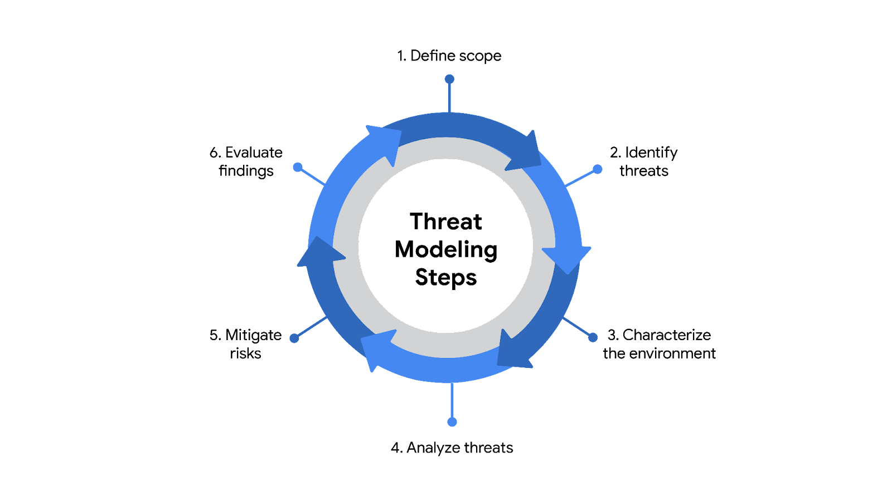

# Threat Modeling, Vulnerability Management And Application Security

Note này chuyển hóa các note `_inbox/Vulnerabilities & Attacks/common-vulnerabilities-exposures.md`, `sql-injection.md`, `threat-modeling.md`, `owasp.md` và `pen-test.md` thành một khung học về risk-driven security.

## Threat Modeling

Threat modeling là cách nhìn hệ thống như một người phòng thủ: xác định asset, entry point, data flow, trust boundary, threat actor, điểm yếu và control phù hợp.

Một flow dễ nhớ:

1. Define scope: hệ thống/app/process nào đang được phân tích.
2. Inventory assets: dữ liệu, service, identity, dependency, third-party.
3. Identify threats: ai có thể tấn công và bằng vector nào.
4. Model attack paths: attack tree, data flow, trust boundary.
5. Analyze controls: hiện có control nào, gap ở đâu.
6. Prioritize risk: impact, likelihood, exploitability, exposure.
7. Mitigate and document: reduce, avoid, transfer hoặc accept risk.

## Threat Modeling Frameworks

| Framework | Khi hữu ích |
|---|---|
| `STRIDE` | phân tích threat theo Spoofing, Tampering, Repudiation, Information disclosure, Denial of service, Elevation of privilege |
| `PASTA` | risk-centric, nối mục tiêu business với mô phỏng tấn công và impact |
| `Trike` | tập trung permission model và risk/security requirement |
| `VAST` | scale threat modeling cho nhiều team/app, thường gắn automation/platform |

5 câu hỏi thực dụng:

- Chúng ta đang xây/vận hành cái gì?
- Điều gì có thể sai?
- Chúng ta đang làm gì để giảm rủi ro?
- Còn gap nào chưa xử lý?
- Bằng chứng nào cho thấy control hoạt động?

## CVE, NVD Và CVSS

| Khái niệm | Ý nghĩa |
|---|---|
| `CVE` | mã định danh công khai cho vulnerability/exposure đã biết |
| `CNA` | tổ chức có quyền gán CVE theo phạm vi được ủy quyền |
| `NVD` | database của NIST enrich CVE bằng metadata, CVSS, reference |
| `CVSS` | hệ thống chấm điểm severity, thường 0-10 |

CVSS giúp ưu tiên, nhưng không nên là yếu tố duy nhất. Một CVSS trung bình trên internet-facing asset quan trọng có thể cấp bách hơn CVSS cao nằm trong hệ thống không reachable.

Guardrail khi đọc advisory:

- kiểm tra product, edition, module và version thực tế trước khi mở incident hoặc rollout patch;
- không nâng cấp mù quáng nếu target version cũng nằm trong dải affected hoặc chưa tương thích với workload;
- ưu tiên xác minh exposure: internet-facing, authenticated-only, internal-only, có compensating control hay không;
- lưu evidence về quyết định risk acceptance nếu chưa thể remediate ngay.

## Vulnerability Management

Quy trình bền vững:

1. Identify: discovery asset, scan, manual review, dependency audit.
2. Analyze: xác nhận vulnerability, loại false positive, hiểu root cause.
3. Assess risk: impact, exploitability, exposure, asset criticality, compensating control.
4. Remediate: patch, config change, remove exposure, add control hoặc accept risk có owner.
5. Verify: scan lại, kiểm tra config/log, cập nhật ticket/evidence.

Các kiểu scan:

| Kiểu scan | Dùng khi |
|---|---|
| External | nhìn từ internet/perimeter |
| Internal | đánh giá hệ thống nội bộ và lateral movement risk |
| Authenticated | kiểm tra sâu patch/config khi có credential |
| Unauthenticated | mô phỏng attacker chưa có quyền |
| Limited | tập trung scope nhỏ như firewall/app cụ thể |
| Comprehensive | kiểm tra diện rộng, nên có discovery và change window |

Zero-day, RCE và privilege escalation cần được xử lý theo blast radius, không chỉ theo tên gọi:

- `Zero-day`: chưa có patch hoặc chưa có detection ổn định; cần compensating control như isolate, disable feature, WAF/IPS rule tạm, hardening và monitoring tăng cường.
- `Remote code execution`: attacker có thể chạy code từ xa; ưu tiên kiểm tra exposure, service account, outbound path và lateral movement.
- `Privilege escalation`: quyền thấp thành quyền cao hơn hoặc vượt boundary ngang; cần review IAM/RBAC, sudo, kernel/runtime patch, service account và audit log.
- `Untargeted attack`: scan/exploit diện rộng; asset public cũ, default credential và unpatched service là mục tiêu dễ bị quét tự động.

Vulnerability assessment khác pentest ở mục tiêu: assessment tìm và ưu tiên lỗ hổng; pentest có ủy quyền chứng minh exploitability và impact bằng khai thác có kiểm soát. Cả hai đều cần scope, owner, maintenance window khi có rủi ro và báo cáo remediation có thể verify lại.

## Secure Software Procurement And Updates

Software security bắt đầu từ nguồn cài đặt:

- firmware lấy từ vendor/hardware platform được phê duyệt;
- OS package lấy từ repository đã trust và có key management rõ;
- application lấy từ vendor, registry, artifact repository hoặc app store chính thức;
- mobile/desktop app cần review developer, permission, signing và business need;
- third-party package cần SBOM/dependency review nếu đi vào production path.

Guardrails:

- Không cài binary/script từ forum, link chat hoặc storage cá nhân vào server production.
- Verify hash/signature khi vendor cung cấp, nhưng phải lấy checksum/signing key qua kênh tin cậy.
- Với firmware/OS/application update, kiểm tra compatibility, maintenance window, rollback và backup trước khi rollout.
- Theo dõi lifecycle/EOL; phần mềm hết support là risk, không chỉ là technical debt.
- Enterprise app store hoặc internal package repository cần owner, review, signing, malware scan và audit trail.

## OWASP Top 10 Mental Model

OWASP Top 10 là bản đồ lỗi appsec phổ biến, không phải checklist thay thế threat modeling.

| Nhóm lỗi | Câu hỏi cần hỏi |
|---|---|
| Broken Access Control | user có xem/sửa/xóa được dữ liệu không thuộc quyền không |
| Cryptographic Failures | dữ liệu nhạy cảm có bị lộ do thiếu/yếu mã hóa không |
| Injection | input có bị biến thành command/query/code không |
| Insecure Design | design có thiếu control ngay từ đầu không |
| Security Misconfiguration | default config, debug, open permission có tồn tại không |
| Vulnerable Components | dependency/runtime/base image có lỗi đã biết không |
| Auth Failures | login/session/reset password có yếu không |
| Integrity Failures | build/update/supply chain có bị chèn code không |
| Logging Failures | sự kiện quan trọng có được log/alert không |
| SSRF | app có bị ép gọi endpoint nội bộ/metadata service không |

## SQL Injection

SQL injection xảy ra khi input của user bị ghép vào query theo cách khiến database thực thi ý đồ của attacker.

Các dạng thường gặp:

- in-band: attacker thấy kết quả trực tiếp;
- inferential/blind: suy luận qua timing, error hoặc behavior;
- out-of-band: dùng kênh khác như DNS/HTTP callback để lấy dữ liệu.

Control:

- dùng prepared statement/parameterized query;
- validate input theo allowlist;
- không dùng string concatenation cho query;
- least privilege cho database user;
- log lỗi an toàn, không lộ schema/secret;
- test bằng SAST/DAST và review code ở boundary nhận input.

## XSS

XSS chèn JavaScript/HTML vào context trình duyệt của người dùng.

| Loại | Mô tả |
|---|---|
| Reflected XSS | payload đi qua request và phản hồi ngay |
| Stored XSS | payload được lưu ở server rồi phát cho nhiều user |
| DOM-based XSS | payload được xử lý ở client-side DOM |

Control:

- output encoding theo context HTML/JS/URL;
- sanitize HTML nếu cho phép rich text;
- Content Security Policy khi phù hợp;
- cookie `HttpOnly`, `Secure`, `SameSite`;
- tránh render raw user input.

## Buffer Overflow

Buffer overflow xảy ra khi chương trình ghi nhiều dữ liệu hơn vùng nhớ được cấp. Dữ liệu tràn có thể làm crash process, ghi đè control data hoặc trong trường hợp nghiêm trọng cho phép attacker điều khiển luồng thực thi.

Control:

- kiểm tra boundary và input length ở mọi parser/boundary nhận dữ liệu không tin cậy;
- dùng language/library an toàn bộ nhớ khi có thể;
- bật compiler/runtime hardening như stack canary, ASLR, DEP/NX, PIE và RELRO theo platform;
- fuzzing cho parser, protocol handler và file format phức tạp;
- chạy service với least privilege để giảm blast radius nếu exploit thành công;
- theo dõi crash bất thường, coredump và exploit signal trong EDR/SIEM.

## Penetration Testing

Pen test là hoạt động tấn công giả lập có ủy quyền để chứng minh exploitability và impact. Nó khác vulnerability assessment ở chỗ có bước khai thác có kiểm soát.

| Kiểu | Mô tả |
|---|---|
| White-box / open-box | tester có thông tin hệ thống đầy đủ |
| Black-box / closed-box | tester gần như không có thông tin, mô phỏng external attacker |
| Gray-box / partial knowledge | tester có quyền/thông tin hạn chế |
| Red team | mô phỏng attacker để kiểm tra phòng thủ end-to-end |
| Blue team | phòng thủ, phát hiện, phản ứng |
| Purple team | phối hợp red/blue để cải thiện detection/control |

Quy tắc an toàn: luôn có scope, authorization, rules of engagement, contact khẩn cấp, giới hạn phá hoại, backup/rollback và báo cáo remediation rõ.

## Related Pages

- [Threat Actors, Malware And Attack Patterns](./03-threat-actors-malware-and-attack-patterns.md)
- [Attack Surface Management](./05-attack-surface-management.md)
- [Security Monitoring, SIEM And IoC](../04-security-operations/01-security-monitoring-siem-ioc-and-detection.md)
- [IDS/IPS](../02-os-and-network-security/IDS-IPS%20%28Snort,%20Suricata%29.md)
- [Trivy, Falco, Kyverno](../03-container-and-cloud-security/Trivy,%20Falco,%20Kyverno.md)
