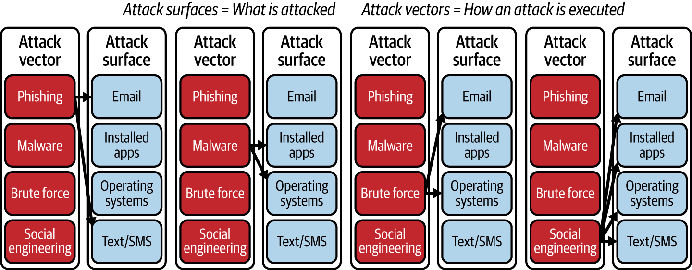
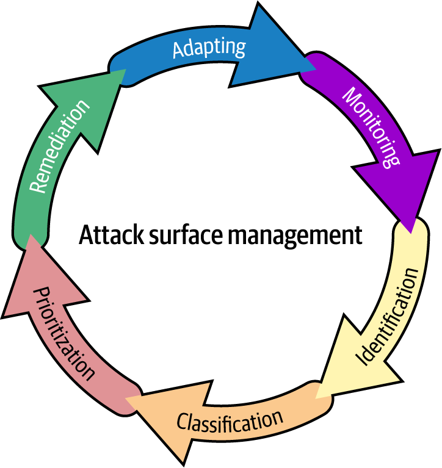

# Attack Surface Management

Attack Surface Management (ASM) la mot chuong trinh lien tuc de tim, hieu, uu tien va giam cac diem phoi lo trong he thong. Muc tieu cua ASM khong phai "patch tat ca moi thu", ma la tra loi 4 cau hoi quan trong:

1. To chuc dang co nhung asset nao thuc su ton tai?
2. Asset nao dang bi lo ra ngoai, de bi lam dung, hoac de bi di chuyen ngang?
3. Asset nao quan trong nhat voi business, du lieu va van hanh?
4. Nen dung nguon luc han che vao dau de giam risk that su?

ASM phu hop voi moi truong cloud, hybrid, SaaS, CI/CD, API, workforce tu xa va he thong co nhieu thay doi. Day la lop keo asset inventory, vulnerability management, threat modeling va incident response lai voi business context.

## Mental Model

- `attack surface` = noi bi tan cong, bi truy cap trai phep, bi lay du lieu, hoac bi lam dung tai nguyen.
- `attack vector` = cach attacker di vao cac diem do.
- `organizational attack surface` = tong hop tat ca asset ky thuat, identity, du lieu, quy trinh va con nguoi co the tro thanh diem vao.

Attack surface khong chi la server va firewall. Trong production, no thuong bao gom:

- internet-facing service, domain, API, VPN, remote access;
- cloud account, IAM role, SaaS tenant, CI runner, artifact registry;
- endpoint, smartphone, BYOD, laptop cua nha thau;
- shadow IT, third-party integration, supply chain, support portal;
- du lieu nhay cam, secret, token, backup, shared storage;
- con nguoi va quy trinh, vi social engineering va misuse access thuong la diem vao re nhat.

## Attack Surface Va Attack Vector

Attack surface va attack vector lien quan chat, nhung khong dong nghia:

- `attack surface` la muc tieu hoac diem phoi lo;
- `attack vector` la ky thuat, duong di, hoac cong cu ma attacker dung de khai thac diem do.

Vi du thuc te:

- email inbox la attack surface; phishing la attack vector;
- internet-facing API la attack surface; credential stuffing, SSRF hoac exploit logic la attack vector;
- overly permissive access rights la attack surface; privilege misuse la attack vector.

Neu giam duoc attack surface, so duong tan cong kha thi cung giam theo. Day la ly do ASM uu tien loai bo exposure, thu gon surface, dong bo identity va xoa asset khong can thiet, thay vi chi them detection.

## ASM Khac Gi Vulnerability Management

Vulnerability management tra loi: "he thong nay co loi gi?"  
ASM tra loi: "loi nao, tren asset nao, lo ra den dau, quan trong voi business den muc nao, va co nen xu ly ngay khong?"

Khac biet chinh:

| Chu de | Vulnerability management | ASM |
|---|---|---|
| Trong tam | Finding va remediation | Toan bo risk posture cua attack surface |
| Dau vao | Scan result, CVE, config issue | Asset, exposure, business context, threat trend, ownership |
| Tinh chat | De bi tro thanh backlog patch | Chuong trinh uu tien dua tren risk that |
| Pham vi | System, app, network cu the | Cloud, SaaS, API, identity, data, people, supply chain |

Trong production, team chi dua vao CVSS thuong se gap 2 loi:

- patch rat nhieu finding tren asset noi bo sap retire, trong khi public API quan trong van mo;
- khong thay duoc relationship giua asset, du lieu, quyen truy cap va tac dong business.

ASM dung de dat finding vao dung ngu canh.

## Vong Doi ASM

ASM la vong lap lien tuc, khong phai du an mot lan.

### 1. Identification

Tim va lap baseline cho tat ca asset co lien quan:

- known asset trong CMDB, cloud inventory, IaC state;
- unknown asset nhu shadow IT, zombie VM, abandoned DNS, bucket, old VPN, old repo;
- dynamic asset nhu ephemeral instance, container, runner, temporary environment.

Muc tieu cua buoc nay la coverage, khong phai chi accuracy tren phan da biet.

### 2. Classification

Gan ngu canh cho asset:

- asset dung cho business flow nao;
- asset chua loai du lieu nao;
- co compliance nao bat buoc khong;
- asset internet-facing hay chi noi bo;
- asset do team nao so huu;
- neu bi compromise thi blast radius den dau.

Can tach ro `asset classification` va `data classification`. Mot asset co the khong phai crown jewel, nhung neu no xu ly secret, PII, PHI hoac payment data thi muc bao ve phai tang len.

### 3. Prioritization

Khong phai moi exposure deu ngang nhau. Uu tien phai dua tren:

- exploitability;
- muc do phoi lo;
- criticality cua asset;
- gia tri du lieu;
- kha nang di chuyen ngang;
- control dang co;
- cost cua downtime hoac breach.

Nguyen tac don gian: mot finding vua phai tren asset internet-facing quan trong thuong dang xu ly hon nhieu critical finding tren asset noi bo sap xoa bo.

### 4. Remediation

Chon bien phap giam risk phu hop:

- patch;
- sua config;
- dong port / giam public exposure;
- xoa asset khong can thiet;
- rotate secret;
- bo sung MFA, RBAC, segmentation, WAF, EDR, monitoring;
- accept risk co owner va thoi han ro rang neu chua remediate ngay duoc.

### 5. Monitoring

Theo doi lien tuc de bat:

- asset moi;
- thay doi exposure;
- drift giua desired state va actual state;
- vulnerability moi xuat hien;
- dau hieu exploit, anomaly, hoac attacker behavior.

### 6. Adapting

Moi thay doi lon deu co the doi attack surface:

- cloud migration;
- them SaaS;
- mo API cho doi tac;
- M&A;
- rollout CI/CD moi;
- them chi nhanh, vendor, endpoint, mobile app.

ASM co gia tri khi security controls, policy va workflow cung duoc cap nhat theo thay doi do.

## Workflow ASM Trong Moi Truong Production

Mot workflow thuc dung:

1. Chot scope theo domain hoac business flow, vi du `internet-facing customer APIs` hoac `engineering SaaS and CI/CD`.
2. Gom inventory tu cloud, DNS, cert, IAM, CMDB, vuln scanner, EDR, SaaS admin console, IaC state.
3. Danh dau asset khong ro owner, asset public, asset chua sensitive data, asset co quyen cao.
4. Map duong tan cong kha thi: credential theft, misconfiguration, exposed admin path, third-party trust, hardcoded secret, stale tunnel, public bucket.
5. Prioritize theo business impact va exploitability, khong chi theo severity scanner.
6. Chot remediation owner, due date, validation step va rollback plan.
7. Dua lai vao vong monitoring de bat drift va asset moi.

## Production Guardrails

### Truoc Khi Mo Rong Hoac Danh Gia Scope

- Xac nhan nguon inventory nao dang tin cay, nguon nao hay thieu asset.
- Xac nhan owner cua tung asset quan trong; asset vo chu la red flag.
- Kiem tra boundary truy cap cua team security de khong vo tinh pha segregation of duties.

### Truoc Khi Remediate

- Kiem tra business dependency va maintenance window.
- Neu thay doi firewall, IAM, route, WAF, DNS, SSO, secret hoac CI/CD, phai co rollback ro rang.
- Uu tien dry-run, audit mode, canary, hoac scope hep truoc khi rollout rong.

### Validation Sau Khi Remediate

- Asset co con lo ra ngoai khong.
- Control moi co hoat dong khong: log, alert, policy hit, denied event.
- Business flow chinh co bi anh huong khong.
- Backlog finding co duoc cap nhat owner, SLA va trang thai khong.

### Rui Ro Thuong Gap

- Bo sot shadow IT va third-party integration.
- Chi nhin control plane ma khong nhin data plane, vi du policy da doi nhung endpoint public van reachable.
- Tap trung vao crown jewel nhung bo qua baseline hygiene tren toan bo he thong.
- Giao ASM thanh bai scan dinh ky thay vi capability lien tuc.

## Vi Sao ASM Quan Trong

ASM giai quyet mot so bai toan ma tool rieng le khong giai quyet tot:

- `Visibility`: nhieu cloud, SaaS, API, container, endpoint, partner system khien buc tranh bi cat khuc.
- `Shadow IT`: asset ton tai nhung khong nam trong quy trinh mua sam hay van hanh chuan.
- `Risk prioritization`: qua nhieu finding, nhung budget va nhan luc co han.
- `Incident response`: can biet asset nao, du lieu nao, va duong ingress nao dang anh huong.
- `M&A`: doanh nghiep nhan them asset va trust boundary moi ma khong the tin mo dinh.
- `Rapid change`: CI/CD, cloud, script marketing, temp environment, contractor access lam attack surface dao dong lien tuc.

## Attacker's Perspective

ASM yeu cau doi goc nhin tu "bao ve moi thu" sang "neu toi la attacker, toi se vao bang duong nao de lay nhieu gia tri nhat voi it effort nhat?"

Cac diem attacker thuong uu tien truoc:

- human target de phishing;
- exposed service co auth yeu hoac default config;
- secret hardcoded, token ton dong, permissive IAM role;
- old system chua patch va khong con owner;
- trusted integration co the bi lam dung;
- asset khong duoc monitor nen de dung lam foothold.

Goc nhin nay giup team phong thu chuyen tu reactive sang proactive.

## Dau Hieu To Chuc Dang Quan Ly Attack Surface Kem

- khong tra loi nhanh duoc asset nao dang public tren internet;
- khong biet asset nao chua du lieu nhay cam va ai so huu;
- finding backlog lon nhung team khong ro nen xu ly cai gi truoc;
- sau moi incident moi phat hien them asset "bi quen";
- cloud, SaaS, CI/CD va endpoint dung tool rieng, khong co buc tranh hop nhat;
- thay doi he thong xong khong co vong verify exposure.

## Related Pages

- [Threat Modeling, Vulnerability Management And Application Security](./04-threat-modeling-vulnerability-management-and-application-security.md)
- [Attack Surface Categories And Exposure Patterns](./06-attack-surface-categories-and-exposure-patterns.md)
- [Attack Surface Risk Management And Prioritization](./07-attack-surface-risk-management-and-prioritization.md)
- [Asset Inventory, Classification, And Discovery For ASM](./08-asset-inventory-classification-and-discovery-for-asm.md)
- [Attack Surface Analysis And Mapping](./11-attack-surface-analysis-and-mapping.md)
- [ASM Remediation, Validation And Reporting](./12-asm-remediation-validation-and-reporting.md)
- [Attack Surface Minimization Strategies](./13-attack-surface-minimization-strategies.md)
- [Continuous Monitoring And Adaptive ASM](./14-continuous-monitoring-and-adaptive-asm.md)
- [Emerging ASM Risks: AI, Quantum And Edge](./15-emerging-asm-risks-ai-quantum-and-edge.md)
- [Threat Actors, Malware And Attack Patterns](./03-threat-actors-malware-and-attack-patterns.md)
- [CI/CD Threat Model And Attack Surface](../../03-cicd-devops-integration/03-automation-pipeline-security/04-ci-cd-threat-model-and-attack-surface.md)
- [Linux Hardening Baseline](../02-os-and-network-security/linux-hardening-baseline.md)
