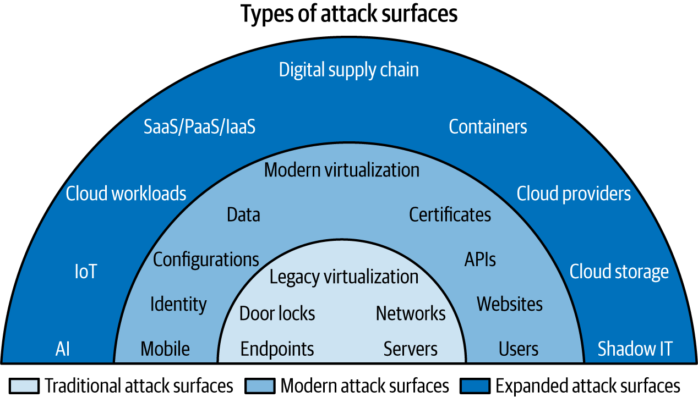

# Attack Surface Categories And Exposure Patterns

Attack surface cua to chuc khong tang len theo mot chieu. No mo rong theo tung lop cong nghe, tung mo hinh van hanh, va tung trust relationship moi. Vi vay, team security khong nen nhin attack surface nhu mot danh sach asset dai vo tan, ma nen nhin no theo nhom exposure pattern.

Note nay dung de tra loi 2 cau hoi:

1. To chuc dang co nhung nhom attack surface nao?
2. Moi nhom thuong bi mo rong theo kieu nao va can uu tien check gi dau tien?

## Mental Model

Co the nhin attack surface theo 3 lop:

- `traditional`: endpoint, server, network, thiet bi vat ly, legacy virtualization.
- `modern`: website, API, certificates, identity, data, configuration, cloud-hosted app.
- `expanded`: cloud provider, cloud workload, container, SaaS, supply chain, IoT, BYOD, AI, shadow IT.

Phan loai nay huu ich vi moi lop co kieu risk khac nhau:

- lop truyen thong thuong loi o lifecycle, patching, documentation, segmentation;
- lop hien dai thuong loi o exposed interface, identity, data flow, misconfiguration;
- lop mo rong thuong loi o ownership, integration, trust boundary, pace of change.

## Traditional Surfaces

### Endpoints, Servers, Networks

Day van la nen tang cua nhieu he thong production:

- workstation va laptop cua nguoi dung;
- server vat ly hoac VM;
- router, switch, firewall, VPN gateway;
- physical access system, smart lock, camera, building control.

Exposure pattern thuong gap:

- asset cu khong con owner ro rang;
- patch level lech nhau giua cac nhom he thong;
- network trust qua rong, lateral movement de dang;
- thieu inventory, thieu documentation, thay doi khong duoc cap nhat.

First checks:

- asset co owner va lifecycle khong;
- asset co con duoc support va patching khong;
- co internet-facing hay reachable tu network khac khong;
- co log, alert va backup/restore validation khong.

### Legacy Systems

Legacy system la attack surface rat de bi danh gia thap, vi no "van dang chay". Rui ro thuong nam o:

- unsupported OS, runtime, language, firmware;
- source code, package, open-source component cu;
- knowledge gap vi team cu da roi di;
- dependency khong duoc document;
- business process van phu thuoc nhieu vao he thong cu.

Production guardrail:

- khong xem legacy system chi la "van de operations"; no la security debt co blast radius that.
- neu chua thay the duoc, can co compensating control ro rang: segmentation, privileged access control, jump host, monitoring, backup tested, change freeze hop ly.
- retirement plan phai la mot phan cua ASM, khong phai viec de sau.

### Legacy Virtualization

VM va hypervisor da mo rong attack surface tu lau:

- VM sprawl lam asset ton tai nhung khong ai quan ly;
- management plane cua hypervisor tro thanh diem vao gia tri cao;
- risk khong chi o guest VM, ma o isolation, shared resource va admin credential.

First checks:

- ai co quyen tao VM, snapshot, attach disk, mount ISO;
- co inventory va owner cho tung VM khong;
- management plane co MFA, audit va network restriction khong;
- co quy trinh xoa VM, template va old snapshot khong.

## Modern Surfaces

### Websites And APIs

Website va API la entry point ro rang nhat cho phan lon he thong so:

- public web app;
- partner API;
- admin portal;
- internal web service ma attacker co the dat chan toi sau khi compromise tai khoan noi bo.

Exposure pattern thuong gap:

- input/output validation kem;
- SSRF, auth bypass, secret leakage, overexposed admin endpoint;
- web server misconfiguration;
- public endpoint noi thang vao backend nhay cam.

First checks:

- endpoint nao dang public va endpoint nao dung de admin;
- authn/authz co tach ro user role va service role khong;
- rate limit, WAF, logging, alerting da co chua;
- API co duoc inventory va versioning khong.

### Certificates And Trust Chain

Certificate thuong bi bo qua vi no "chi la TLS", nhung thuc te la trust surface:

- private key lo la mat trust;
- certificate het han la outage;
- CA bi compromise hoac issuance control yeu la supply chain risk.

First checks:

- private key luu o dau, rotate the nao;
- co inventory certificate va alert expiry khong;
- trust chain co duoc review cho service noi bo, public site va mTLS khong.

### Identity, Users, And Access Across Platforms

Identity la attack surface trung tam trong moi truong hybrid:

- user account;
- admin account;
- service account;
- API credential;
- federated identity giua cloud, SaaS, on-prem.

Exposure pattern thuong gap:

- mot nguoi co nhieu account nhung khong co buc tranh tong;
- onboarding/offboarding/role change cham;
- "everyone group" hoac role qua rong;
- privileged account khong duoc monitor.

First checks:

- co centralized identity governance hay it nhat la review dinh ky khong;
- account nao co high privilege, non-human identity, stale credential;
- MFA, PAM, JIT access, deprovisioning tu dong da co chua.

### Data And Configuration

Data va configuration la 2 lop rat hay bi compromise gian tiep:

- data bi lo do bucket, share, database, backup, analytics export;
- configuration bi loi do golden image, IaC module, startup script, security group, route, policy.

Configuration management giup giam attack surface neu:

- module duoc harden truoc;
- change duoc review;
- dependency duoc cap nhat;
- drift duoc phat hien som.

Neu khong, no nhan ban sai sot o quy mo lon.

First checks:

- ai duoc sua template/module/pipeline;
- config co secret hardcoded khong;
- co drift detection, policy check, image refresh cadence khong.

## Expanded Surfaces

### Cloud Providers, Workloads, Storage, And SaaS

Cloud khong chi la "server dat o noi khac". No mo them nhieu surface moi:

- control plane API;
- public object storage;
- IAM role va trust policy;
- workload runtime;
- SaaS tenant va third-party integration.

Exposure pattern thuong gap:

- hieu sai shared responsibility;
- overprovisioned resource va denial-of-wallet;
- public storage hoac permissive IAM;
- tenant config lech, integration key lo, audit khong du.

First checks:

- asset nao public, asset nao xu ly du lieu nhay cam;
- IAM path co overpermission khong;
- bucket, queue, function, workload co default-deny hop ly khong;
- SaaS co owner, retention, audit log, backup/export va deprovisioning process khong.

### Containers

Container la convenience surface va cung la attack surface:

- image cu, image khong ro provenance;
- secret nam trong image hoac env;
- breakout tu container ra host;
- orchestrator, registry, runtime va admission policy deu la bieu hien cua surface.

First checks:

- image provenance, scanning, SBOM, signed artifact;
- runtime privilege, host mount, network policy, secret handling;
- ai co quyen push image, deploy workload, sua admission/config.

### Supply Chain

Supply chain khong chi la package manager. No bao gom:

- software library;
- artifact repository;
- auto-update cua ung dung third-party;
- certificate authority;
- managed transfer tool;
- hardware/firmware vendor;
- outsourcing va partner integration.

Exposure pattern thuong gap:

- trust mac dinh vao upstream;
- auto-update khong co validation;
- thieu SBOM, attestation, provenance;
- breach o vendor keo theo breach o khach hang.

First checks:

- co inventory dependency va third-party critical khong;
- co quy trinh danh gia update truoc khi deploy rong khong;
- co contract, audit report, notification path cho vendor incident khong.

### IoT, BYOD, And Mobile

Day la nhom surface de ton tai ngoai boundary IT co truyen thong:

- firmware update hiem hoi hoac khong ton tai;
- user tu quan ly device;
- ket noi qua Wi-Fi cong cong, home network, rogue AP;
- application va OS rat da dang.

First checks:

- device nao duoc phep vao tai nguyen cong ty;
- co MDM, posture check, certificate-based access, network segmentation khong;
- co policy chan hoan toan neu cost secure cao hon gia tri business khong.

### AI Models, Pipelines, UIs, And APIs

AI them mot nhom surface moi, khong chi o model:

- training data;
- model artifact;
- prompt interface;
- API;
- pipeline nap/xuat du lieu;
- hạ tang GPU/compute va storage phuc vu huan luyen.

Exposure pattern thuong gap:

- data poisoning;
- model inversion, membership inference;
- prompt-based evasion/jailbreak;
- pipeline cho phep nap du lieu doc hai hoac rut du lieu nhay cam;
- control chi nam o UI nhung API thi mo hon.

First checks:

- ai duoc dua du lieu vao model/pipeline;
- API co auth, rate limit, logging, sandboxing khong;
- co rollback duoc model/training run khi phat hien du lieu doc hay khong.

## Shadow IT Va Ownership Gap

Shadow IT khong phai mot nhom cong nghe rieng; no la pattern xuat hien o moi nhom ben tren:

- VM do team tu tao;
- SaaS do phong ban mua rieng;
- old DNS, old repo, old bucket;
- script marketing, contractor portal, temporary environment;
- AI tool free-tier duoc dung voi du lieu noi bo.

Trong ASM, asset vo chu la asset nguy hiem. Neu khong tra loi duoc `ai so huu`, `du lieu gi di qua do`, `khi nao xoa`, thi asset do nen duoc dua vao danh sach uu tien cao.

## Cues De Phan Loai Nhanh Trong ASM

| Nhom surface | Cau hoi phan loai nhanh | Dau hieu risk cao |
|---|---|---|
| Legacy / traditional | He thong nay con duoc support va co owner khong? | unsupported, thieu doc, khong backup test |
| Web / API | Co public hay reachable qua trust path nao? | auth yeu, SSRF, admin endpoint lo |
| Identity | Tai khoan nay la human hay non-human, quyen den dau? | privilege rong, stale access, offboarding cham |
| Cloud / SaaS | Ai chiu trach nhiem control nao? | public storage, permissive IAM, thieu audit |
| Container | Image va runtime co provenance va hardening khong? | unsigned image, host mount, secret lo |
| Supply chain | Muc do phu thuoc vao ben thu ba den dau? | auto-update mu, khong SBOM, khong vendor review |
| Mobile / IoT | Device co duoc quan ly va segment khong? | no patch path, public Wi-Fi, firmware cu |
| AI | Du lieu, model, UI, API va pipeline da tach control chua? | poisoning, jailbreak, data extraction |

## Related Pages

- [Attack Surface Management](./05-attack-surface-management.md)
- [Attack Surface Analysis And Mapping](./11-attack-surface-analysis-and-mapping.md)
- [Threat Modeling, Vulnerability Management And Application Security](./04-threat-modeling-vulnerability-management-and-application-security.md)
- [Identity, Authentication And Authorization](../01-access-control/01-identity-authentication-authorization.md)
- [CI/CD Threat Model And Attack Surface](../../03-cicd-devops-integration/03-automation-pipeline-security/04-ci-cd-threat-model-and-attack-surface.md)
- [Trivy, Falco, Kyverno](../03-container-and-cloud-security/Trivy,%20Falco,%20Kyverno.md)
