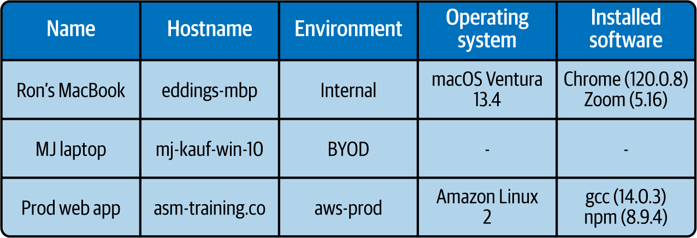
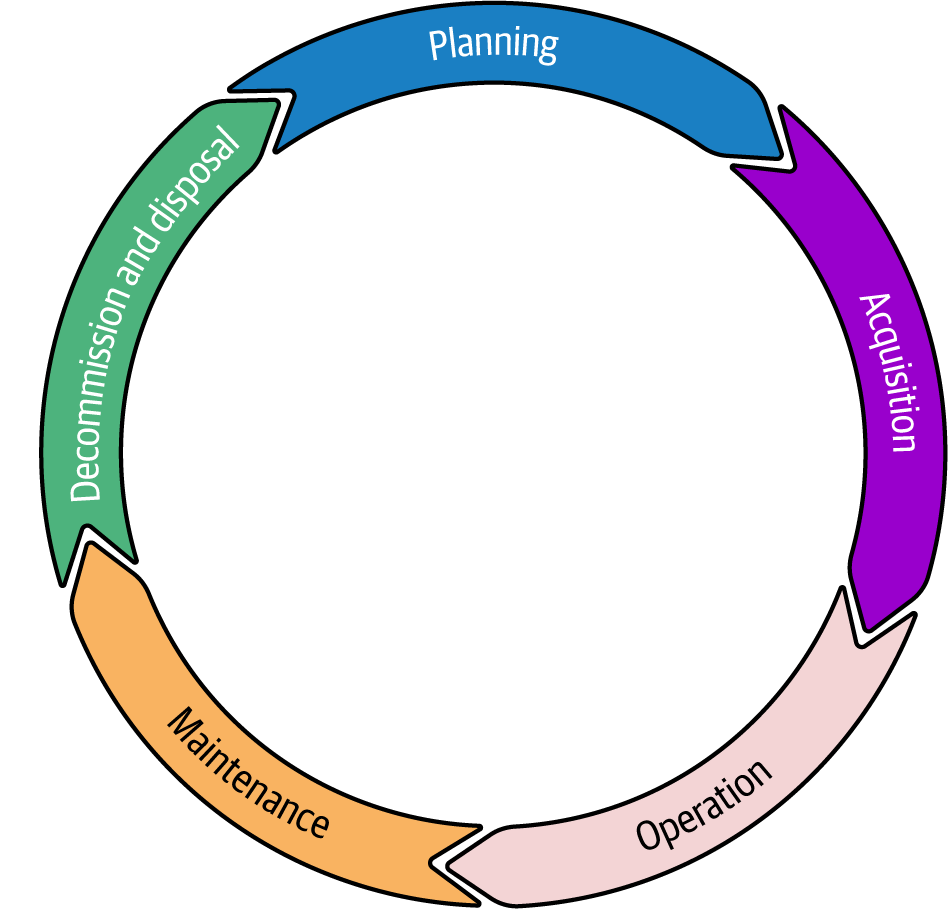

# Asset Inventory, Classification, And Discovery For ASM

Trong Attack Surface Management, asset inventory khong phai phan viec hanh chinh. No la nen tang de biet to chuc dang co gi, asset nao dang bi lo, asset nao quan trong, va cho nao dang ton tai shadow IT ma nobody owns.

## Mental Model

Inventory trong ASM can tra loi 5 cau hoi:

1. Asset nay la gi?
2. Ai so huu no?
3. No xu ly du lieu gi va phuc vu business flow nao?
4. No dang lo ra ngoai o dau va phu thuoc vao nhung gi?
5. Neu bi compromise hoac bien mat, impact thuc te la gi?

Neu khong tra loi duoc 5 cau hoi nay, team security se co danh sach asset nhung van khong co buc tranh attack surface.

## Asset Trong ASM Nghia La Gi

Asset khong chi la server hay laptop. Trong ASM, asset nen duoc hieu rong:

- hardware: server, workstation, mobile device, router, switch, printer, IoT;
- software: application, OS, container image, database, SaaS tenant;
- virtual/digital: VM, cloud service, certificate, domain, repository, storage bucket;
- data: customer data, payroll, financial records, IP, backup;
- con nguoi va truy cap: employee, contractor, vendor, guest, service account;
- intangible ho tro van hanh: workflow, process, business-led tooling, du lieu duoc tao ra tu cac he thong do.

Dieu quan trong o day la "thu gi co gia tri, co quyen truy cap, hoac co the tro thanh diem vao" deu co the can nam trong inventory.

## Tai Sao Inventory La Nen Tang Cua ASM

Team nao cung biet cau "khong bao ve duoc cai minh khong biet minh co". Trong ASM, cau nay can duoc day them mot buoc:

- khong classification thi khong biet asset nao high value;
- khong categorization thi khong biet asset nao can uu tien bao ve truoc;
- khong ownership thi khong ai remediate;
- khong dependency map thi khong thay blast radius.

Inventory tot giup:

- giam blind spot;
- uu tien remediation dung theo business context;
- phat hien shadow IT, orphaned asset, stale VM, old DNS, old bucket;
- cap du lieu cho incident response, compliance, va capacity planning.

Trong mot `ISMS` thuc dung, asset inventory la control nen tang chu khong phai phu luc. ISMS can biet he thong nao ton tai, ai so huu, du lieu nao nam o dau, policy nao ap dung, kiem thu nao duoc phep va khi incident xay ra thi doi nao chiu trach nhiem. Neu mot server, SaaS tenant, repository, certificate hoac backup khong nam trong inventory, kha nang cao no cung khong co patch owner, log owner, retention owner hoac incident owner.

## Classification Va Categorization Khac Nhau

Hai khai niem nay de bi tron lan:

- `classification` = xep asset theo dac tinh va gia tri;
- `categorization` = xep asset theo muc uu tien bao ve va tac dong van hanh.

Vi du:

- mot ung dung chua PII duoc classify la high value;
- nhung neu no la front-door cua customer transaction thi category cua no co the la mission-critical;
- backup server co the khong tac dong hang ngay lon bang production app, nhung trong DR no lai la asset can duoc uu tien theo mot kieu khac.

Nhin dung 2 lop nay giup team tranh 2 loi:

- chi nhin data sensitivity ma bo qua vai tro van hanh;
- chi nhin business criticality truoc mat ma bo qua data/compliance risk.

## Thuoc Tinh Toi Thieu Moi Asset Nen Co

Mot inventory thuc dung cho ASM nen co toi thieu:

- ten asset;
- owner ky thuat va owner business;
- environment: `prod`, `staging`, `internal`, `BYOD`, `aws-prod`, `corp-saas`...;
- loai asset;
- data sensitivity;
- muc do exposure: public, internal, segmented, vendor-only;
- dependency chinh;
- lifecycle state: active, deprecated, temporary, orphaned, pending retirement;
- patch/update posture;
- credential hoac identity lien quan;
- log/monitoring status.

Spreadsheet co the dung cho buoc khoi dong rat nho, nhung khong nen la single source of truth cho moi truong production phuc tap.

## Manual Inventory Co Gia Tri O Dau Va Dut O Dau

Manual inventory huu ich khi:

- to chuc con rat nho;
- dang bat dau mapping tai san lan dau;
- can bootstrap cho discovery sau nay.

Nhung no that bai nhanh khi:

- asset thay doi lien tuc;
- co cloud, SaaS, remote worker, BYOD;
- co nhieu owner;
- can theo doi relationship va dependency;
- can audit history va control ai duoc sua inventory.

### Han Che Chinh Cua Spreadsheet-Style Inventory

- du lieu stale ngay sau khi ghi xong;
- human error cao;
- kho map dependency;
- kho enforce authz va audit trail;
- de lo metadata nhay cam neu file bi chia se sai;
- khong theo kip ephemeral asset.

Production guardrail:

- khong dua hostname, IP, role privileged, secret-like metadata nhay cam vao file share rong ma khong co access control;
- neu van phai dung spreadsheet tam thoi, coi no la bootstrap artifact de migrate sang he thong phu hop hon.

## Inventory Solution Patterns

### ITAM

Hop khi to chuc can theo doi lifecycle cua hardware/software tap trung.

Manh:

- trung tam hoa asset tracking;
- co reporting va analytics;
- hop voi governance va procurement flow.

Yeu:

- setup va maintain phuc tap;
- khong phai luc nao cung gan chat voi security context va dynamic cloud state.

### CMDB

Hop khi can biet configuration item va dependency map.

Manh:

- nhin thay relationship giua service, host, app, network;
- huu ich cho blast radius, change review, incident response.

Yeu:

- can process discipline cao;
- neu update khong kip thi CMDB tro thanh "bao tang cua nhung gi tung dung".

### Cloud-Native Asset Tooling

Hop khi asset doi nhanh, ephemeral, multi-account, multi-region.

Manh:

- theo kip instance, workload, bucket, function, IAM object;
- de lay signal tu control plane.

Yeu:

- thuong chi nhin thay cloud slice, khong thay full on-prem hoac shadow asset ngoai platform;
- van can ghep voi inventory khac de co buc tranh tong.

### Custom Or Hybrid Approach

Thuc te nhieu to chuc se dung:

- ITAM hoac CMDB lam inventory backbone;
- cloud inventory cho asset dong;
- EDR/MDM cho endpoint;
- vuln scanner, IAM review, DNS/certificate inventory, SaaS admin console de enrich.

Nguyen tac la: mot inventory duy nhat hiem khi du. Quan trong la co asset identity va ownership mapping du tot de ghep nhieu nguon thanh mot buc tranh ASM.

## Asset Discovery

Discovery la qua trinh tim ra asset, khong chi ghi lai asset da biet.

Discovery can bao phu:

- on-prem;
- remote asset;
- cloud;
- SaaS;
- virtual asset;
- digital artifact;
- undocumented network device;
- business-led tooling.

### Manual Discovery

Thuong gom:

- di kiem ke vat ly;
- review rack, office, branch, storeroom;
- phong van team;
- review subnet, DNS, access point, switch port;
- kiem tra laptop, mobile, temporary server, VM test.

No van can thiet trong mot so tinh huong:

- asset ngoai tam nhin cua tool;
- merger, site audit, hoac datacenter cleanup;
- xac minh lai inventory sau su co.

Nhung no khong du de van hanh lien tuc.

### Discovery Signals Nen Gom

- cloud account inventory;
- CMDB / ITAM;
- DHCP, DNS, certificate logs;
- EDR / MDM / endpoint management;
- vulnerability scanner;
- IAM / IdP / PAM;
- SaaS admin console;
- IaC state, CI/CD pipeline, artifact registry;
- network scan va passive discovery.

## Shadow IT Va Untracked Asset

Shadow IT khong chi la ung dung "linh tinh". Do la phan attack surface khong nam trong quy trinh chinh thuc:

- SaaS mua rieng boi phong ban;
- personal device dung cho cong viec;
- unsupported software duoc cai tam roi bo quen;
- old printer, old server, old Wi-Fi AP con cam mang;
- unregistered VM tao cho test;
- old Dropbox / Google Drive / consumer collaboration tool;
- cloud bucket, account, hoac project team tu lap.

Day la mot trong nhung blind spot nguy hiem nhat vi:

- khong ai patch;
- khong ai monitor;
- khong ai offboard;
- khong ai biet du lieu nao dang nam o do.

### Vi Sao Shadow IT Xuat Hien

Thuong la vi nhu cau business nhanh hon he thong chinh thuc:

- approved tool qua cham hoac qua kho dung;
- team can agility;
- procurement qua nang;
- security gatekeeping tao dong luc "lam dai tam".

Neu chi chan ma khong sua root cause, shadow IT se quay lai duoi hinh thuc khac.

## Asset Enrichment

Inventory moi chi tra loi "co gi". Asset enrichment tra loi them "asset nay quan trong the nao, duoc dung ra sao, va no keo theo risk gi".

Asset enrichment thuong gom nhieu lop du lieu bo sung:

- asset type detail;
- configuration data;
- data classification;
- usage information;
- location va environment;
- interdependencies;
- security posture;
- life cycle status;
- licensing va support coverage.

Muc tieu khong phai de co dataset dep, ma de bien inventory thanh du lieu co the uu tien hoa cho ASM.

### Asset Type Details

Can ghi du thong tin dinh danh va thong so co ban:

- model, serial, SKU, cloud resource id;
- loai asset va vai tro van hanh;
- OS, runtime, version, network role;
- service name hoac business capability no phuc vu.

Khong co lop nay thi rat kho:

- doi chieu finding;
- thay the tai san;
- lap ke hoach refresh;
- phan biet asset quan trong voi asset phu tro.

### Configuration Data

Configuration data la phan rat hay bi bo qua trong inventory nhung lai la no chua security context:

- software version;
- network configuration;
- plugin/extension;
- encryption setting;
- identity/trust setting;
- allowed ingress/egress path.

Gia tri ASM cua config data:

- map duoc version voi CVE/finding;
- thay misconfiguration lap lai tren nhieu asset;
- review duoc drift giua standard va actual state;
- biet thay doi nao co the gay blast radius.

### Data Classification

Asset nao xu ly du lieu gi se quyet dinh muc bao ve cua asset do. Data classification thuong nen map toi:

- public;
- internal;
- confidential;
- highly confidential / regulated.

Trong thuc te, ten category co the khac nhau, nhung can nhat quan va tied voi policy:

- ai duoc truy cap;
- can ma hoa den muc nao;
- retention/backup ra sao;
- co duoc dua len SaaS, BYOD, dev environment hay khong.

Production guardrail:

- asset chua PII, PHI, payment data, secret, hoac sensitive IP khong duoc chi danh dau "quan trong" theo cam tinh. No can data class ro de policy co the thi hanh duoc.

### Usage Information

Usage information giup thay:

- asset nao thuc su phuc vu peak business load;
- asset nao gan het capacity;
- asset nao co pattern bat thuong;
- asset nao ton tai nhung it hoac khong duoc dung.

No huu ich cho ASM vi:

- service usage cao co the la de bi resource exhaustion hon;
- asset it dung nhung van internet-facing thuong la ung vien retire;
- usage anomaly co the la signal cua compromise hoac misuse.

### Location And Environment

Location khong chi la "dat o dau" ma con la context risk:

- on-prem, branch, colo, public cloud, partner site;
- public-facing subnet, internal segment, management network;
- prod, non-prod, BYOD, contractor-managed.

Y nghia cua lop nay:

- danh gia risk vat ly va legal/regulatory;
- xac dinh ai co quyen va trach nhiem tai moi boundary;
- phan biet data sovereignty va DR requirement.

### Interdependencies

Asset hiem khi dung mot minh. Can biet:

- app phu thuoc database nao;
- system nao phu thuoc IdP, DNS, queue, object store;
- service nao la supporting path cua crown jewel.

Interdependency map giup:

- danh gia blast radius;
- sap xep remediation queue dung thu tu;
- tranh sua mot asset ma vo tinh lam hong service lien quan.

### Security Posture

Moi asset nen co tom tat security posture:

- patch state;
- hardening state;
- endpoint/security tool dang cai;
- incident history;
- compliance gap;
- log/alert coverage.

Day la lop du lieu giup phan biet:

- asset gia tri cao nhung duoc bao ve tot;
- asset gia tri vua phai nhung posture rat yeu;
- asset nen retire thay vi tiep tuc patch.

### Life Cycle Status

Life cycle status la asset dang o giai doan nao: plan, acquire, deploy, operate, maintain, upgrade, deprecate, retire, dispose.

Vi sao no quan trong voi ASM:

- asset gan end-of-support se tang risk vi khong con patch;
- temporary system ton tai qua lau thuong tro thanh orphaned asset;
- decommission khong sach se de lai data, credential, DNS, hoac route.

Production guardrail:

- moi asset temporary phai co expiry owner;
- asset retirement can co checklist xoa data, revoke credential, cap nhat inventory, va verify khong con reachable.

### Software Licensing And Support Coverage

License tracking khong chi de tranh audit finding. No con lien quan den ASM:

- biet service co support contract khi incident xay ra khong;
- biet asset nao dang chay software khong con duoc vendor ho tro;
- biet open-source license nao co rang buoc legal/operational.

Support readiness la mot phan cua resilience. Asset critical ma khong ro escalation path vendor la red flag.

### Compliance Audit Evidence

Inventory va enrichment tot se bien audit thanh bai toan truy xuat, khong phai truy lung:

- asset nay o dau;
- chua du lieu gi;
- ai so huu;
- control nao dang bat;
- thay doi va maintenance history la gi.

No giup team:

- phat hien gap compliance truoc audit;
- chuan bi bang chung nhanh hon;
- tranh tinh trang policy co, nhung khong biet asset nao phai ap dung.

## Inventory, Enrichment, Va Business Strategy

Gia tri thuc te cua inventory khong nam o danh sach asset, ma o cho no cho phep business ra quyet dinh tot hon:

- uu tien asset mission-critical;
- biet asset nao dang giam ROI vi underused hoac sap EOL;
- quyet dinh cho DR, hardening, support contract, va refresh;
- map duoc risk ky thuat ve tac dong business.

Neu inventory/enrichment tot, vulnerability management se bớt mang tinh checklist va tro thanh impact-driven prioritization.

## Workflow Inventory Va Discovery Cho Production ASM

1. Chot scope discovery theo domain: endpoint, cloud, SaaS, website/API, office/branch.
2. Gom nhieu nguon signal thay vi tin mot inventory duy nhat.
3. Match asset theo identity chung: hostname, serial, cloud resource id, cert CN/SAN, account id, owner, DNS name.
4. Enrich asset bang owner, criticality, data class, exposure, lifecycle, dependency.
5. Danh dau asset vo chu, asset public, asset stale, asset unsupported, asset temporary ton tai qua han.
6. Dua cac asset co risk cao vao queue remediation hoac confirm-retire.
7. Dat cadence de refresh discovery, khong coi inventory la du an mot lan.

## Production Guardrails

### Truoc Khi Chon Inventory Tool

- xac dinh scale va toc do thay doi cua asset landscape;
- xac dinh can on-prem + cloud + SaaS hay chi mot phan;
- xac dinh ai se cap nhat va ai se tin du lieu do.

### Truoc Khi Dua Inventory Vao Van Hanh

- khong track asset ma khong co owner field;
- khong track critical asset ma khong co lifecycle state;
- khong dua thong tin qua nhay cam vao inventory mo rong ma khong co RBAC.

### Validation Can Lam Dinh Ky

- ty le asset co owner;
- ty le asset co environment va criticality;
- so asset stale / orphaned / unsupported;
- so asset public ma khong co justification ro;
- so shadow asset duoc hop thuc hoa hoac retire sau moi chu ky review.

## Dau Hieu Inventory Dang Yeu

- moi incident moi phat hien them asset "khong biet ton tai";
- khong map duoc app nay phu thuoc vao service nao;
- khong biet ai so huu bucket/domain/VM cu;
- CMDB co record nhung khong khop thuc te;
- team security va team van hanh nhin thay 2 danh sach asset khac nhau;
- inventory khong bat kip remote worker, cloud, SaaS, BYOD.

## Related Pages

- [Attack Surface Management](./05-attack-surface-management.md)
- [Attack Surface Categories And Exposure Patterns](./06-attack-surface-categories-and-exposure-patterns.md)
- [Attack Surface Risk Management And Prioritization](./07-attack-surface-risk-management-and-prioritization.md)
- [Automated Asset Discovery And Visibility Patterns](./09-automated-asset-discovery-and-visibility-patterns.md)
- [Ansible Inventory Patterns](../../07-configuration-management/01-ansible/04-inventory-patterns.md)
