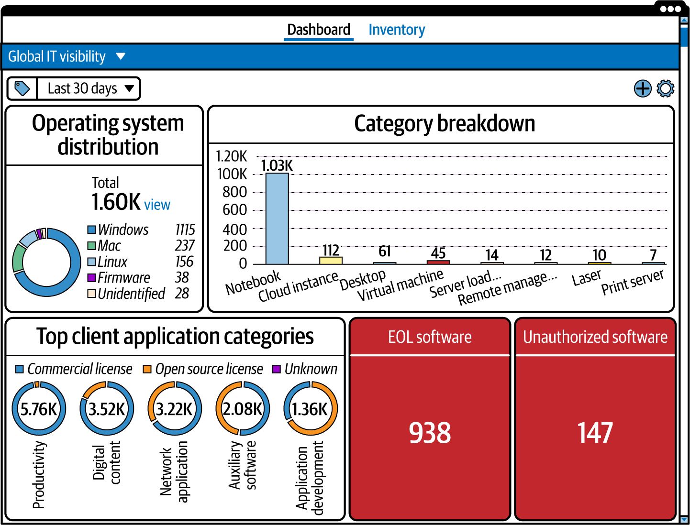

# Automated Asset Discovery And Visibility Patterns

Khi attack surface trai dai qua on-prem, cloud, SaaS, API, BYOD, va ephemeral workload, manual discovery se thua ngay tu diem xuat phat. Automated asset discovery khong phai nice-to-have; no la cach duy tri visibility co the van hanh duoc.

## Mental Model

Automated discovery giai 3 bai toan cung luc:

1. Tim asset ma inventory thu cong bo sot.
2. Cap nhat thay doi nhanh hon kha nang con nguoi theo kip.
3. Cung cap signal de asset inventory tro thanh living system thay vi bang tinh chet.

Muc tieu khong chi la "scan ra nhieu thu". Muc tieu la duy tri continuous visibility du de:

- biet asset nao moi xuat hien;
- biet asset nao bien mat;
- biet asset nao dang drift, misconfigured, hay unsupported;
- biet asset nao la shadow IT can xu ly.

## Vi Sao Phai Tu Dong Hoa Discovery

### Enterprise Qua Rong Va Qua Da Dang

Ke ca doanh nghiep nho cung da co:

- laptop va mobile device;
- cloud account;
- SaaS;
- VM;
- API;
- branch office hoac remote worker.

So asset va toc do thay doi khien manual discovery khong con kha thi. Automated tooling giup scan va hop nhat signal tren nhieu environment ma khong can di "dem may" bang tay.

### Growth And Change Khong Con Cham

Truoc day, mua them server la mot su kien. Bay gio:

- VM co the duoc tao/xoa trong vai phut;
- container co the duoc restart hang nghin lan;
- cloud resource co the scale theo load;
- dev team co the tu self-service tao moi truong moi.

Inventory thu cong se stale ngay lap tuc.

### Global And Hybrid Operations

Asset co the o:

- office;
- datacenter;
- cloud region;
- remote laptop;
- third-party managed environment.

Automated discovery giup giu cung mot muc do visibility tren tat ca boundary do.

## Cloud Va IaC Lam Discovery Khac Hoan Toan

Cloud khong phai chi la "server dat o noi khac". No co:

- control plane API;
- managed service;
- serverless;
- object store;
- ephemeral instance;
- automation boi IaC va CI/CD.

IaC co the nhan ban configuration rat nhanh. Neu config sai, sai sot cung duoc nhan ban rat nhanh. Vi vay, discovery trong moi truong cloud phai:

- gan voi provider API;
- phat hien asset gan nhu real-time;
- biet root definition va cac instance duoc spin up tu no;
- nhin thay config context, khong chi ten resource.

Production guardrail:

- periodic scan kieu on-prem thuong khong du cho cloud dong;
- can continuous monitoring hoac it nhat la high-frequency refresh voi event/API integration.

## Shadow IT Va Unsanctioned Service Detection

Automation co gia tri lon nhat o cho nay. Shadow IT co the den tu:

- SaaS mua bang credit card;
- cloud project do team tu tao;
- unsupported software;
- data store nam ngoai backup/governance;
- demo system va temp environment bi bo quen.

Automated tooling giup:

- phat hien service moi;
- so khop voi billing/procurement;
- xac dinh ai dang dung;
- danh gia integrate, retire, hay thay bang sanctioned alternative.

No khong tu dong giai quyet shadow IT, nhung no bien "khong biet ton tai" thanh "co du lieu de quyet dinh".

## Cac Nhom Automated Discovery Pho Bien

### Network Scanning

Day la nhom co ban nhat:

- quet subnet;
- tim host dang song;
- lay port, service, OS fingerprint, software version.

Hop khi:

- can baseline host va rogue device;
- can visibility tren on-prem network;
- can tim exposed service va phien ban phan mem.

Han che:

- gap segmentation;
- kho thay SaaS, serverless, logical cloud service;
- snapshot-based neu khong co continuous feed.

### Cloud Analysis

Tool cloud-native lam viec qua provider API de thay:

- VM, container, function, managed database, bucket, queue;
- config va policy;
- monitoring gap;
- cost/utilization signal.

Hop khi:

- moi truong dynamic, multi-account, multi-region;
- can posture, inventory, va cloud-specific context.

Han che:

- thuong manh o cloud nhung khong bao phu toan bo on-prem;
- can quyet dinh he thong nao la source of truth neu nhieu tool cung track.

### API Discovery

API la asset de bi bo sot. Automated API discovery giup:

- catalog API dang ton tai;
- map dependency va communication path;
- thay API version cu, deprecated, hoac khong duoc governance;
- tim exposed endpoint va unauthorized access path.

Gia tri ASM cua no nam o cho API thuong la duong vao cua data plane nhung inventory truyen thong khong nhin thay ro.

### Data Discovery

Data discovery tap trung vao noi du lieu nhay cam dang nam:

- database;
- email;
- document store;
- cloud storage;
- external share;
- old archive va forgotten repository.

Nhom nay giup:

- phat hien hidden data store;
- classify du lieu;
- map data voi asset va control;
- ho tro governance, compliance, va breach impact analysis.

## Thach Thuc Cua Automated Discovery

Automation khong phai than duoc.

### Identification Challenge

Tool co the:

- nham asset tuong tu nhau;
- duplicate record;
- bo sot nuance cua hybrid environment;
- tao data silo neu nhieu tool khong interoperate.

Vi vay can:

- matching rule ro rang;
- asset identity mapping;
- quy tac dedup;
- human review cho nhom asset nhay cam.

### Categorization Challenge

Asset hien dai thuong da chuc nang:

- firewall co the dong thoi la remote access gate, web security layer, va cloud edge control;
- SASE hay managed platform co the gom nhieu service model trong mot.

Tool cung phai linh hoat theo category scheme cua to chuc, khong ep to chuc vo category cung.

### Human Oversight Van Bat Buoc

Automated discovery rat gioi o viec tim va cap nhat. Nhung no khong tu minh hieu:

- owner business la ai;
- asset quan trong voi quy trinh nao;
- dependency nao la "back door" vao crown jewel;
- risk nao nen chap nhan hay retire.

Do do, mo hinh dung la `automation + human verification`, khong phai mot trong hai.

## Feature Nao Thuong Mang Lai ROI Ro Nhat

### Search Va Filter Tot

Tool co gia tri khi team tra loi nhanh duoc:

- asset nao thuoc `aws-prod`;
- asset nao unsupported;
- asset nao public-facing;
- asset nao dang khong monitored;
- asset nao cua mot owner hoac mot region cu the.

Search tot giam thoi gian incident, audit, va triage.

### Data Presentation

Dashboard va visualization tot giup team thay:

- category breakdown;
- asset distribution;
- EOL software;
- unauthorized software;
- nhom asset can uu tien review.

Dashboard tot phai giup ra quyet dinh, khong chi dep.

### Analytics And Reporting

Asset system co gia tri cao khi no cho thay:

- trend theo thoi gian;
- asset moi/xoa/mat monitoring;
- compliance posture;
- risk concentration theo environment, owner, hay asset class.

Report tu dong huu ich cho audit, governance, va planning.

### Advanced Integration

Gia tri tang manh khi tool tich hop voi:

- SIEM;
- ticket/workflow;
- cloud CSPM/CNAPP;
- CMDB/ITAM;
- billing/cost data;
- IdP/IAM;
- vuln scanner.

May hoc/AI co the huu ich cho anomaly, nhung khong nen la ly do mua tool neu can ban search, dedup, va visibility con chua on.

## Cach Chon Tool Thuc Dung

Hoi 6 cau nay truoc:

1. Tool co nhin duoc hybrid stack cua minh khong?
2. Tool co theo kip cloud/IaC/ephemeral asset khong?
3. Tool co phat hien SaaS va shadow IT du tot khong?
4. Tool co export/integrate de khong tao them data silo khong?
5. Team co van hanh duoc no khong, hay no se tro thanh mot "inventory tool nobody trusts"?
6. Tool co giup rut ngan thoi gian triage, incident, audit, hoac patch prioritization mot cach do duoc khong?

## Production Guardrails

### Truoc Khi Trien Khai

- chot single source of truth hoac it nhat chot he thong tong hop du lieu cuoi cung;
- define identity key va quy tac dedup;
- xac dinh cadence refresh theo tung loai asset.

### Sau Khi Trien Khai

- theo doi coverage gap theo environment;
- review asset bi classify sai;
- review asset moi public-facing;
- review asset khong co owner;
- test xem incident team va audit team co tim duoc thong tin can trong thoi gian hop ly khong.

### Nhung Dau Hieu Tool Dang Khong Deliver

- nhieu duplicate record;
- cloud asset thay doi nhung inventory cap nhat cham;
- team van phai quay lai spreadsheet cho incident;
- shadow IT van chi lo ra sau khi billing hoac incident xuat hien;
- dashboard dep nhung khong tra loi duoc asset nao can xu ly ngay.

## Related Pages

- [Asset Inventory, Classification, And Discovery For ASM](./08-asset-inventory-classification-and-discovery-for-asm.md)
- [Attack Surface Management](./05-attack-surface-management.md)
- [Attack Surface Risk Management And Prioritization](./07-attack-surface-risk-management-and-prioritization.md)
- [CI/CD Threat Model And Attack Surface](../../03-cicd-devops-integration/03-automation-pipeline-security/04-ci-cd-threat-model-and-attack-surface.md)
