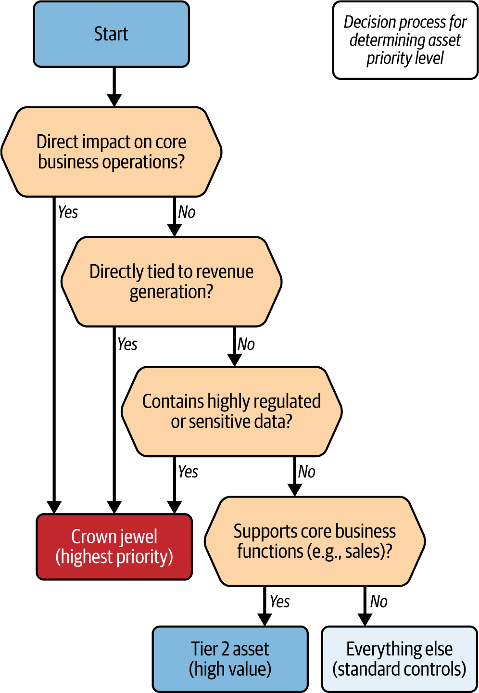
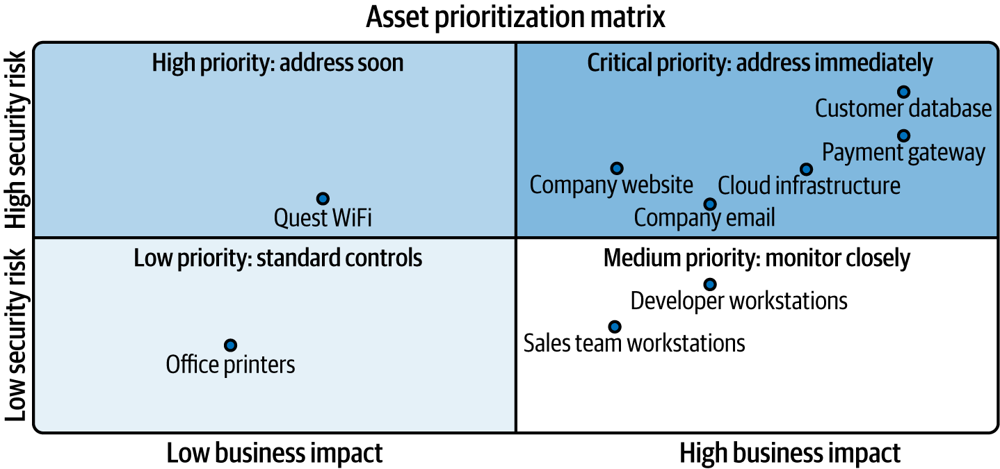

# Asset Prioritization And Crown Jewel Analysis

Asset prioritization trong ASM la buoc bien inventory thanh thu tu hanh dong. Neu khong uu tien, team se doi xu moi asset nhu nhau, dan den 2 loi pho bien: bao ve qua muc cac asset it quan trong va bo thieu control cho asset co impact that.

## Mental Model

Uu tien asset khong chi la hoi "he thong nao quan trong". Can ket hop:

- gia tri voi business;
- operational impact;
- data sensitivity;
- security risk;
- regulatory/compliance requirement;
- kha nang gay blast radius sang asset khac;
- nguon luc thuc te cua team.

ASM dung prioritization de tra loi:

1. Asset nao can protection cao nhat?
2. Asset nao can remediation truoc?
3. Asset nao chi can standard controls?
4. Asset nao can theo doi vi co the tang priority khi business thay doi?

## Prioritization Khac Gi Risk Management

Risk management tra loi "risk nao can xu ly va xu ly bang cach nao". Asset prioritization tra loi "asset nao can duoc dat len truoc trong chuong trinh ASM".

Hai phan nay lien quan chat:

- inventory cho biet asset ton tai;
- prioritization xep asset theo gia tri va impact;
- risk assessment xep threat/finding theo kha nang va hau qua;
- remediation bien thu tu do thanh cong viec co owner.

## Tieu Chi Uu Tien Asset

### Value To The Organization

Asset co gia tri cao khi no:

- truc tiep tao doanh thu;
- duy tri kha nang cung cap san pham/dich vu;
- giam cost hoac tranh downtime lon;
- ho tro chien luoc dai han nhu modernization, R&D, market expansion;
- bao ve uy tin va trust voi khach hang.

Gia tri khong phai luc nao cung la revenue truc tiep. Mot IdP, DNS, CI/CD platform, payment gateway, ERP, hoac internal messaging system co the khong "ban hang", nhung fail thi business dung lai.

### Operational Impact

Can danh gia asset do anh huong the nao den:

- core operation;
- employee productivity;
- customer-facing service;
- safety;
- disaster recovery;
- regulatory operation.

Asset co downtime sensitivity cao can duoc uu tien hon asset co the tam dung ma khong anh huong nghiem trong.

### Data Sensitivity

Asset xu ly cac loai du lieu nay thuong can uu tien cao:

- PII;
- PHI;
- payment/cardholder data;
- financial data;
- intellectual property;
- trade secret;
- strategic plan;
- legal/compliance evidence.

Data classification nen ket hop:

- criteria-based: public, internal, confidential, highly confidential;
- content-based: pattern, keyword, data type;
- context-based: ai dung, app nao xu ly, luu o dau, truyen qua boundary nao;
- regulatory-driven: GDPR, HIPAA, PCI DSS, FISMA, hoac framework tuong ung.

### Compliance Vs Risk-Based Prioritization

Compliance-based prioritization la nhung viec phai lam de dap ung luat, audit, hop dong, hoac regulation. Risk-based prioritization la nhung viec nen lam vi threat/impact that.

Trong production can ca hai:

- compliance giup tranh penalty va audit gap;
- risk-based giup tranh bo tien vao control khong giam risk dang ke.

Nguyen tac: neu mot control vua dap ung compliance vua giam risk cao, no nen duoc uu tien rat cao.

## Crown Jewels

`Crown jewels` la nhom asset ma neu mat, bi compromise, hoac ngung hoat dong thi to chuc bi anh huong nghiem trong ve business, compliance, revenue, safety, hoac strategic survival.

Vi du:

- customer database;
- payment gateway;
- identity provider;
- production control plane;
- core CI/CD and artifact signing path;
- regulated medical/patient system;
- intellectual property repository;
- key manufacturing control system.

## Cach Xac Dinh Crown Jewels

Hoi cac cau sau theo thu tu:

1. Asset co tac dong truc tiep den core business operation khong?
2. Asset co gan truc tiep voi revenue generation khong?
3. Asset co chua du lieu highly regulated hoac highly sensitive khong?
4. Asset co la dependency cua nhieu he thong khac khong?
5. Asset co kho thay the hoac can skill/knowledge hiem khong?
6. Asset co anh huong den stakeholder trust, legal standing, hoac strategic roadmap khong?

Neu cau tra loi "co" o nhieu muc, asset do nen vao crown jewel candidate list.

## Tiering Model

### Crown Jewel / Tier 1

Can:

- strongest access control;
- enhanced monitoring;
- explicit owner;
- tested backup/restore;
- incident playbook rieng;
- change review chat;
- dependency map;
- periodic executive-level review.

### Tier 2 / High Value

Asset khong giet chet business ngay lap tuc nhung compromise van gay disruption dang ke.

Vi du:

- secondary operational system;
- backup repository;
- noncritical IP;
- support system cho core workflow;
- system can restore sau Tier 1 trong DR.

Can:

- standard encryption;
- access review;
- regular audit;
- backup/restore policy;
- monitoring phu hop voi impact.

### Everything Else / Standard Controls

Nhom nay khong duoc bo mac. No can baseline hygiene:

- patching;
- hardening baseline;
- logging co ban;
- least privilege;
- lifecycle state;
- retirement process.

Loi thuong gap la chi bao ve crown jewels nhung de "back door" o supporting systems. Attacker thuong vao tu noi duoc bao ve kem roi di ngang toi asset quan trong.

## Prioritization Matrix

Matrix giup noi ro logic uu tien voi stakeholder:

- truc business impact;
- truc security risk;
- threshold de quyet dinh action.

Cach dung:

1. Chon criteria: business impact, security risk, regulatory impact, replacement cost, exploitability.
2. Gan weight cho tung criteria theo risk appetite cua to chuc.
3. Cham diem asset theo thang nhat quan, vi du 1-5.
4. Xac dinh threshold: critical, high, medium, low.
5. Review voi owner cua business unit de tranh thieu context.
6. Lap lai dinh ky hoac khi business/threat landscape thay doi.

## Dynamic Prioritization

Asset priority khong co dinh. No thay doi khi:

- co merger/acquisition;
- app chuyen tu internal sang public-facing;
- data classification thay doi;
- co CVE/exploit moi;
- business process moi phu thuoc vao asset;
- asset sap end-of-life;
- regulatory requirement moi xuat hien.

Vi vay, prioritization model nen co feedback loop:

- refresh data tu inventory;
- cap nhat threat/finding;
- review owner va business impact;
- dieu chinh tier va controls;
- ghi ly do thay doi.

## Business Unit Feedback

Security team khong the tu minh biet het gia tri asset. Can feedback tu:

- business owner;
- operations;
- compliance/legal;
- finance;
- product/application owner;
- incident response;
- architecture/platform team.

Feedback nay giup phan biet:

- asset co ve nho nhung tac dong lon;
- asset dung it nhung la recovery path;
- asset khong critical hom nay nhung quan trong cho roadmap;
- support system co the la duong vao crown jewel.

## Production Guardrails

### Truoc Khi Chot Tier

- Doi chieu voi inventory va dependency map.
- Xac nhan owner cua asset va business function.
- Kiem tra data classification va compliance scope.
- Kiem tra exposure: public, internal, vendor, privileged path.

### Truoc Khi Tang Control Cho Tier 1

- Danh gia impact cua thay doi len availability va user flow.
- Co rollback cho IAM, network, WAF, encryption, backup, SSO, policy changes.
- Validate bang read-only/dry-run neu co the.

### Review Dinh Ky

- review crown jewels it nhat theo chu ky risk/compliance cua to chuc;
- review ngay sau M&A, major migration, breach, cloud rearchitecture, hoac product launch;
- remove asset khoi Tier 1 khi no khong con business critical de tranh lang phi control.

## Dau Hieu Prioritization Dang Sai

- danh sach crown jewels qua dai den muc khong the bao ve khac biet;
- asset critical khong co owner;
- Tier 1 khong co backup/restore tested;
- team chi uu tien CVSS ma khong nhin business impact;
- support systems bi xem nhe du chung la duong vao asset quan trong;
- stakeholder khong hieu vi sao asset nay duoc uu tien hon asset khac.

## Related Pages

- [Attack Surface Risk Management And Prioritization](./07-attack-surface-risk-management-and-prioritization.md)
- [Attack Surface Analysis And Mapping](./11-attack-surface-analysis-and-mapping.md)
- [Asset Inventory, Classification, And Discovery For ASM](./08-asset-inventory-classification-and-discovery-for-asm.md)
- [Automated Asset Discovery And Visibility Patterns](./09-automated-asset-discovery-and-visibility-patterns.md)
- [Attack Surface Management](./05-attack-surface-management.md)
- [Incident Response Overview](../incident-response-overview.md)
