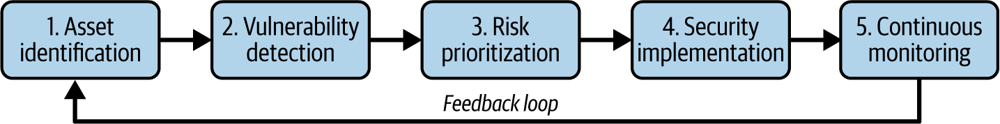
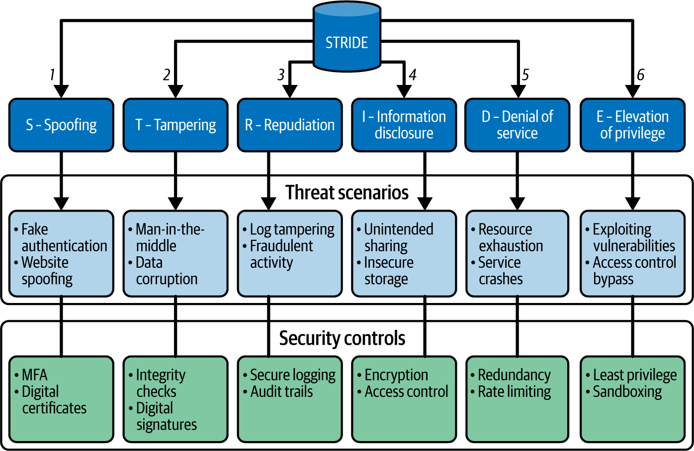

# Attack Surface Analysis And Mapping

Attack Surface Analysis (ASA) la workflow do, map va danh gia attack surface de biet asset nao dang phoi lo, vulnerability nao co exploit path that, va control nao can duoc uu tien. Neu ASM la chuong trinh lien tuc, ASA la lop phan tich giup ASM ra quyet dinh bang du lieu.

## Mental Model

ASA tra loi 5 cau hoi:

1. Asset nao ton tai trong scope?
2. Asset nao co the bi truy cap tu internal, external, vendor, identity path, hoac automation path?
3. Diem yeu nao dang ton tai tren cac asset do?
4. Diem yeu nao co impact cao nhat khi dat vao business context?
5. Control nao can implement, verify va monitor lien tuc?

ASA khong chi la scan vulnerability. No can ket hop:

- asset inventory;
- exposure mapping;
- vulnerability detection;
- IAM va privilege review;
- threat modeling;
- business impact;
- continuous monitoring.

## Continuous ASA Cycle

ASA nen chay nhu mot feedback loop, khong phai assessment mot lan.

Y nghia cua tung buoc:

1. `Asset identification`: gom hardware, software, cloud resource, SaaS tenant, API, identity, vendor integration, data store.
2. `Vulnerability detection`: ket hop automated scanner, config review, manual review, pen test va threat intel.
3. `Risk prioritization`: xep uu tien theo exploitability, exposure, business impact, data sensitivity, control hien co.
4. `Security implementation`: patch, config hardening, segmentation, WAF, IAM change, encryption, monitoring, vendor requirement.
5. `Continuous monitoring`: bat asset moi, drift, exposure moi, stale account, new CVE, anomaly va incident signal.

Feedback loop la diem quan trong: control da implement phai quay lai inventory va monitoring de xac nhan attack surface that su giam.

## Internal Vs External Attack Surface

### Internal Attack Surface

Internal surface gom cac diem reachable tu ben trong network, identity boundary, hoac sau khi attacker da co foothold:

- workstation, server, database, file share;
- router, switch, firewall, VPN concentrator;
- internal API, admin portal, CI/CD runner;
- human account, privileged account, service account;
- automation script, bot, deployment token;
- physical data center, server room, branch office.

Internal ASA nen uu tien:

- segmentation va isolation giua zone nhay cam;
- RBAC, least privilege, MFA, PAM/JIT access cho privileged path;
- account lifecycle: provisioning, role change, deprovisioning, stale access;
- non-human identity: service account, API key, CI token, bot account;
- encryption cho traffic noi bo quan trong, khong mac dinh "internal la an toan";
- IDS/NDR/logging de phat hien lateral movement;
- physical access control, visitor log, camera, environmental control.

### External Attack Surface

External surface gom cac diem reachable tu internet, partner network, SaaS, vendor, hoac public infrastructure:

- public web app va API;
- DNS, domain registration, email system;
- cloud endpoint, public bucket, load balancer, CDN, object storage;
- VPN, remote access, bastion;
- third-party SaaS va managed service;
- public code repo, artifact registry, support portal.

External ASA nen uu tien:

- cloud/SaaS configuration: public access, encryption, audit log, IAM, incident response path;
- API security: authn/authz, OAuth/OIDC scope, rate limit, input validation, endpoint inventory;
- web app security: patching, DAST/SAST, WAF, session handling, access control, DDoS readiness;
- perimeter defense: firewall, IPS, VPN encryption, SIEM log ingestion, border filtering;
- public infrastructure: DNSSEC khi phu hop, registrar lock, DNS audit, certificate inventory;
- email security: SPF, DKIM, DMARC, phishing monitoring;
- vendor risk: onboarding assessment, contract security clause, audit evidence, breach notification, offboarding.

### Overlap Areas

Mot so surface vua internal vua external:

- `IAM`: compromise IdP co the mo ca cloud, SaaS, VPN va internal app.
- `vulnerability management`: mot CVE noi bo co the thanh external risk neu asset bi expose qua reverse proxy, VPN, tunnel, hoac partner path.
- `third-party access`: vendor account co the vao internal system nhung bi compromise tu ngoai.
- `automation`: CI/CD token, webhook, bot va service account thuong vuot qua boundary truyen thong.

Vi vay khong nen quan ly ASA theo silo "network team", "cloud team", "app team". Can map relationship giua asset, identity, data va trust boundary.

## Attack Surface Mapping

Attack surface mapping la viec ve lai cac entry point va dependency de nhin thay attacker co the di qua dau.

Ban map nen co it nhat:

- asset va owner;
- exposure type: public, internal, vendor, privileged, automation;
- data classification;
- identity path: user, admin, service account, token, federation;
- network path: ingress, egress, tunnel, peering, VPN, load balancer;
- dependency: database, queue, storage, IdP, DNS, CI/CD, third-party;
- control: WAF, firewall, MFA, RBAC, encryption, backup, monitoring;
- finding va remediation state.

Dung map de tra loi:

- neu web app public bi compromise, attacker co the pivot toi database nao;
- neu CI token lo, pipeline co the deploy hoac doc secret nao;
- neu DNS/domain bi chiem, customer-facing service nao bi anh huong;
- neu IdP gap su co, service nao mat auth hoac mat access.

## Tools For ASA

Tool khong thay the workflow, nhung giup scale ASA:

| Tool type | Gia tri | Canh bao |
|---|---|---|
| Automated scanner | Tim vulnerability tren network, host, web app, dependency | Co false positive; can owner va context |
| Configuration management / CSPM | Bat misconfiguration va drift | Khong thay the threat modeling |
| Threat intelligence platform | Bo sung exploited-in-the-wild, attacker TTP, campaign signal | Can loc theo context cua to chuc |
| Penetration testing tool | Chung minh exploitability va attack path | Phai co scope, authorization, rules of engagement |
| Visualization / graph tool | Map asset, relation, exposure, blast radius | Map sai/qua cu co the tao cam giac an toan gia |

## Threat Modeling Integration

Threat modeling bien attack surface map thanh attack scenario:

- attacker la ai;
- muc tieu la gi;
- entry point nao kha thi;
- trust boundary nao co the bi vuot qua;
- control nao dang chan duong tan cong;
- telemetry nao chung minh control dang hoat dong.

ASM cung cap inventory va exposure duoc cap nhat. Threat modeling cung cap cach suy nghi ve attack path va control. Ket hop hai cai giup security team khong chi biet "co gi dang mo", ma biet "duong nao dang nguy hiem nhat".

### Threat Modeling Framework Fit

Khong co framework nao phu hop moi tinh huong. Chon framework theo decision can ra:

| Framework | Dung khi | Output tot nen co |
|---|---|---|
| `STRIDE` | Dang design hoac review app/system, data flow, trust boundary | Threat category, scenario, control, test/verification |
| `DREAD` | Can scoring don gian de triage threat hoac finding | Priority list co ly do, khong xem diem so la tuyet doi |
| `PASTA` | Can noi business objective, crown jewel va attack simulation | Business impact, attack scenario, mitigation roadmap |
| `MITRE ATT&CK` | SOC, detection engineering, purple team, incident response | Mapping TTP voi telemetry, detection rule, response playbook |

Nguyen tac production: framework chi co gia tri khi no tao duoc action, owner, evidence va validation. Neu threat model khong lam thay doi backlog, control, alert, test case, hoac risk acceptance, no dang bi dung nhu tai lieu trang tri.

## Production Workflow

1. Chot scope theo business flow hoac surface domain, vi du `public customer APIs`, `cloud identity paths`, hoac `vendor remote access`.
2. Lay inventory tu CMDB, cloud API, DNS, certificate inventory, IdP/IAM, vuln scanner, EDR, SaaS admin console, IaC state.
3. Danh dau asset public, privileged, sensitive-data, no-owner, stale, hoac unsupported.
4. Map internal/external path va trust boundary.
5. Chay vulnerability/config review bang tool phu hop.
6. Ket hop threat modeling de xac dinh attack path co impact that.
7. Prioritize finding theo exposure, exploitability, business impact va control gap.
8. Remediate co owner, due date, validation signal va rollback plan.
9. Dua surface vao continuous monitoring de bat drift va asset moi.

## Production Guardrails

### Truoc Khi Scan Hoac Test

- Xac dinh scope ro rang: CIDR, domain, cloud account, tenant, app, vendor path.
- Co approval va contact khan cap neu assessment co the anh huong production.
- Uu tien read-only API, passive discovery, rate limit va maintenance window khi can.
- Khong dua secret, token, customer data hoac private evidence vao KB/report khong duoc bao ve.

### Truoc Khi Remediate

- Kiem tra dependency va business flow bi anh huong.
- Voi IAM, firewall, WAF, route, DNS, TLS, VPN, SSO, CI/CD policy: phai co rollback ro.
- Uu tien dry-run/audit mode/canary neu tool ho tro.
- Ghi owner va thoi han cho risk acceptance tam thoi.

### Validation Sau Remediation

- Re-scan hoac verify read-only de xac nhan exposure giam.
- Kiem tra log/alert co signal dung.
- Test user flow hoac API health check quan trong.
- Cap nhat asset map, ticket, exception va runbook lien quan.

## Dau Hieu ASA Dang Sai

- map chi gom server, bo qua identity, SaaS, CI/CD, DNS va vendor.
- scan ra nhieu finding nhung khong noi duoc voi business impact.
- external va internal assessment khong chia se du lieu.
- tool dashboard dep nhung khong co owner remediation.
- khong co feedback loop sau khi control duoc implement.
- threat modeling chi lam luc design, khong dung inventory production moi nhat.

## Related Pages

- [Attack Surface Management](./05-attack-surface-management.md)
- [Attack Surface Categories And Exposure Patterns](./06-attack-surface-categories-and-exposure-patterns.md)
- [Attack Surface Risk Management And Prioritization](./07-attack-surface-risk-management-and-prioritization.md)
- [ASM Remediation, Validation And Reporting](./12-asm-remediation-validation-and-reporting.md)
- [Asset Prioritization And Crown Jewel Analysis](./10-asset-prioritization-and-crown-jewel-analysis.md)
- [Threat Modeling, Vulnerability Management And Application Security](./04-threat-modeling-vulnerability-management-and-application-security.md)
- [Identity, Authentication And Authorization](../01-access-control/01-identity-authentication-authorization.md)
