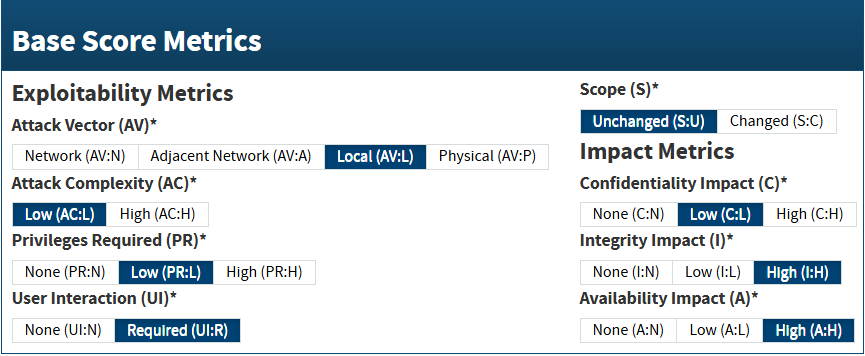
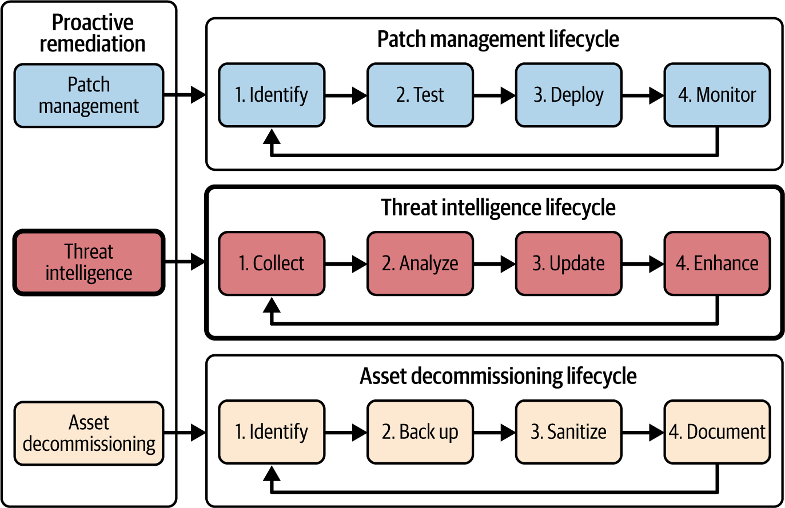

# ASM Remediation, Validation And Reporting

Remediation trong ASM la qua trinh bien finding va risk priority thanh hanh dong co owner, co rollback, co validation va co bang chung. Muc tieu khong phai "sua tat ca", ma la giam attack surface theo thu tu co impact that voi business.

## Mental Model

Mot finding chi nen vao remediation queue khi co du ngu canh:

- asset nao bi anh huong;
- asset do quan trong den dau;
- exposure la internal, external, vendor hay automation path;
- exploitability co that khong;
- patch hoac fix co san khong;
- co compensating control tam thoi khong;
- thay doi co the gay downtime, data loss, compliance gap hay user impact khong.

Trong production, remediation la decision workflow:

```text
assess -> prioritize -> choose action -> implement -> validate -> document -> monitor
```

## Assess Remediation Need

Khong nen dua moi vulnerability vao cung mot quy trinh. Bat dau bang 4 nhom tin hieu:

1. `severity`: CVSS/CVE, exploitability, attack complexity, privilege required, user interaction, impact.
2. `business impact`: downtime, revenue, compliance, customer trust, data exposure, safety.
3. `environment context`: asset criticality, exposure, segmentation, compensating control, owner, dependency.
4. `fix feasibility`: patch availability, workaround, maintenance window, rollback, resource required.

CVSS la dau vao tot, nhung khong du de quyet dinh. Mot CVSS cao tren asset khong reachable co the thap hon mot CVSS trung binh tren public API xu ly du lieu nhay cam.



## Impact Assessment

Danh gia impact can nhin rong hon technical severity:

| Impact area | Cau hoi can hoi |
|---|---|
| Business continuity | Service nao dung? Dependency nao bi keo theo? RTO/RPO bi anh huong khong? |
| Financial | Downtime, IR cost, regulatory fine, customer churn, lost productivity la bao nhieu? |
| Resource | Team nao phai doi lich? Project nao bi tre? Tool/license nao can them? |
| Data security | PII, PHI, payment, secret, IP, financial data co bi lo/sua/xoa khong? |
| Technical blast radius | Vulnerability co tao foothold, privilege escalation, lateral movement hay persistence khong? |
| Stakeholder trust | Customer, partner, regulator, executive co can duoc thong bao khong? |

Impact that thuong nam o dependency va blast radius, khong nam trong score scanner.

## Prioritize Findings

Nen uu tien remediation khi nhieu tin hieu cung xau:

- exploit public hoac exploitation-in-the-wild;
- public-facing hoac reachable qua trusted path;
- khong can credential hoac can privilege thap;
- co RCE, auth bypass, privilege escalation, data exfiltration;
- asset la crown jewel, dependency cua crown jewel, hoac chua du lieu sensitive;
- patch/fix co san va rollback kha thi;
- finding dang bi threat intel lien he voi campaign/industry cua to chuc.

### Discoverability

`Discoverability` la muc attacker co the tim thay asset hoac weakness de khai thac.

Tang priority neu asset:

- xuat hien trong DNS, certificate transparency, search engine, Shodan/Censys;
- co public bucket, exposed API, open admin endpoint;
- nam trong cloud account co misconfiguration de scan;
- co internal access qua flat network hoac weak segmentation;
- co stale account/token hoac service account khong owner.

Giam discoverability khong thay the patching, nhung co the la compensating control tam thoi.

### Attacker Priority

Attacker khong tan cong ngau nhien. Ho thuong uu tien:

- du lieu co gia tri ban lai hoac extort;
- regulated organization co pressure phap ly/compliance;
- brand lon de tao tieng vang;
- he thong co previous breach hoac public weakness;
- industry dang bi campaign nham den;
- asset co exploit kit hoac proof-of-concept cong khai.

Threat intelligence co gia tri khi duoc filter theo industry, technology stack, geography, crown jewels va telemetry cua to chuc.

## Cost-Benefit And Remediation Complexity

Remediation phai can bang giua risk reduction va operational cost.

Tinh den:

- labor, license, third-party service;
- downtime va performance impact;
- opportunity cost vi team bi keo khoi du an khac;
- testing/staging effort;
- rollback complexity;
- long-term maintenance cost cua compensating control.

Neu fix qua rui ro trong ngan han, co the dung compensating control:

- segmentation hoac network restriction;
- WAF/IPS rule;
- disable feature hoac endpoint;
- MFA/JIT access;
- increased monitoring;
- rate limit;
- temporary isolation.

Compensating control phai co owner va expiry/review date. Neu khong, workaround tam thoi se thanh security debt dai han.

## Remediation Strategies

### Proactive Remediation

Proactive remediation giam attack surface truoc khi incident xay ra. Ba tru cot hay gap:



#### Patch Management

Patch lifecycle an toan:

1. Identify asset va vulnerability scope.
2. Test patch trong lab/staging hoac canary group.
3. Deploy theo phase, uu tien asset risk cao.
4. Monitor health, log, user flow va scanner result.
5. Rollback neu co regression nghiem trong.

Khong patch blind tren production critical path neu chua co backup, maintenance window, owner va validation.

#### Threat Intelligence

Threat intel nen di vao remediation queue khi no tra loi:

- threat actor/campaign nao lien quan;
- TTP nao dang duoc dung;
- vulnerability/asset nao trong to chuc match;
- control nao can tang priority;
- detection nao can bo sung.

#### Asset Decommissioning

Decommissioning la remediation manh vi no xoa attack surface thay vi chi harden.

Workflow an toan:

1. Identify asset, owner, dependency, data, compliance retention.
2. Backup/export du lieu can giu va verify restore/readability.
3. Revoke credential, token, DNS, route, firewall rule, IAM policy, monitoring target.
4. Sanitize storage hoac destroy theo policy.
5. Document thoi gian, owner, evidence, exception.

Canh bao: wipe, destroy, format, delete volume, revoke DNS/route/IAM tren production la thao tac nguy hiem. Luon co read-only inventory, backup verified, approval va rollback path truoc khi thuc hien.

### Reactive Remediation

Reactive remediation dung khi threat da duoc phat hien hoac incident dang dien ra:

- isolate endpoint/subnet/workload;
- disable account hoac revoke token nghi compromise;
- block IoC tam thoi tren firewall/WAF/proxy/EDR;
- segment vulnerable asset de ngan lateral movement;
- patch/root-cause fix sau khi giu evidence can thiet;
- restore tu backup sach neu can;
- monitor heightened logging sau containment.

Reactive remediation phai gan voi incident response plan: role, escalation, communication, forensic evidence, containment, eradication, recovery va lessons learned.

## Validation Of Remediation

Remediation chua xong neu chua validate.

Validation nen co:

- re-scan vulnerability hoac config;
- verify patch version/config state;
- SAST/DAST/unit/integration test voi app;
- pen test lai neu finding co exploit path quan trong;
- log/alert signal cho control moi;
- business flow smoke test;
- user/customer impact check;
- monitoring cho collateral damage.

### Feedback Loop

Lay feedback tu:

- system/application owner;
- SOC/IR team;
- business owner;
- compliance/legal;
- affected users/customers neu can.

Feedback giup phat hien control gay friction, remediation chua diet root cause, hoac risk acceptance can cap nhat.

### Monitoring For Collateral Damage

Sau remediation, theo doi:

- error rate, latency, saturation, restart loop;
- denied auth/authorization bat thuong;
- traffic drop hoac route/DNS issue;
- new alert pattern;
- customer ticket;
- scanner finding moi do config change tao ra.

Co rollback khi signal cho thay security fix dang pha availability hoac data integrity.

## Documentation And Reporting

### Remediation Report

Bao cao remediation nen gom:

- summary cua issue;
- affected asset va owner;
- severity, exploitability, impact, business context;
- decision: fix, compensate, accept, decommission;
- action da thuc hien;
- timeline;
- evidence validation;
- unresolved issue;
- follow-up action va due date.

### Change Documentation

Moi thay doi can ghi:

- what changed;
- why changed;
- who approved;
- who executed;
- when changed;
- rollback plan;
- validation result;
- ticket/change ID neu co.

Tai lieu nay la audit trail, khong phai hinh thuc. No giup incident review, compliance evidence va future troubleshooting.

### Reporting To Leadership

Leadership khong can raw scanner export. Ho can:

- risk da giam bao nhieu;
- asset/crown jewel nao duoc bao ve tot hon;
- residual risk nao can accept hoac fund;
- SLA/SLO remediation co dat khong;
- blocker nao can quyet dinh;
- trend backlog va recurrence.

Technical team can appendix chi tiet hon: CVE, affected version, command/output da sanitize, config diff, test evidence, log signal.

## Production Guardrails

- Khong remediate theo score thuan tuy; luon dat vao exposure va business context.
- Khong dung compensating control vo thoi han.
- Khong de temporary firewall/WAF block thanh permanent workaround neu root cause van con.
- Khong de decommission bo sot DNS, cert, secret, backup, route, monitoring, owner record.
- Khong dua secret, token, customer data, private logs vao remediation report khong duoc bao ve.
- Voi thay doi nguy hiem nhu delete, wipe, revoke broad IAM, patch mass rollout, force restart, network isolation: bat dau bang read-only/dry-run/canary khi co the.

## Dau Hieu Remediation Dang Sai

- patch xong nhung scanner/log khong confirm.
- ticket dong nhung asset map van con exposure.
- workaround khong co owner/review date.
- decommission xong van con DNS, cert, secret, storage snapshot.
- remediation queue sap theo CVSS nhung khong giam incident risk.
- leadership nhan report nhung khong biet can phe duyet funding/risk acceptance nao.

## Related Pages

- [Attack Surface Management](./05-attack-surface-management.md)
- [Attack Surface Risk Management And Prioritization](./07-attack-surface-risk-management-and-prioritization.md)
- [Asset Prioritization And Crown Jewel Analysis](./10-asset-prioritization-and-crown-jewel-analysis.md)
- [Attack Surface Analysis And Mapping](./11-attack-surface-analysis-and-mapping.md)
- [Attack Surface Minimization Strategies](./13-attack-surface-minimization-strategies.md)
- [Threat Modeling, Vulnerability Management And Application Security](./04-threat-modeling-vulnerability-management-and-application-security.md)
- [Incident Response Overview](../incident-response-overview.md)
