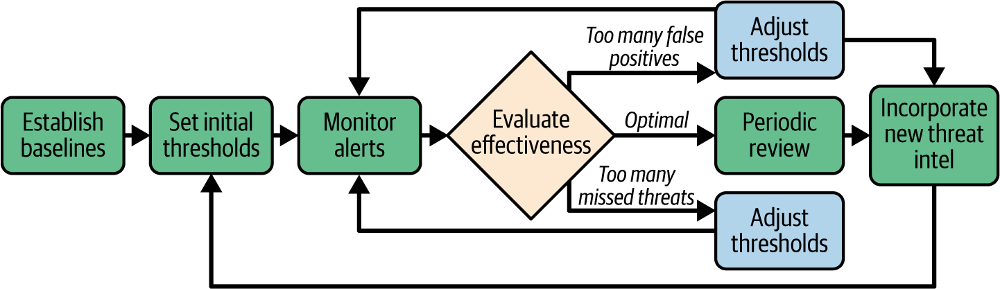

# Continuous Monitoring And Adaptive ASM

Continuous monitoring trong ASM la nang luc theo doi attack surface khi moi truong thay doi lien tuc: cloud, SaaS, API, container, remote work, vendor, AI workload, M&A va threat landscape moi. Muc tieu la phat hien exposure moi, drift, alert co y nghia va dua feedback vao remediation nhanh.

## Mental Model

ASM khong dung o inventory va remediation. Sau moi thay doi, can tra loi:

- asset moi nao vua xuat hien;
- exposure nao vua mo ra;
- identity/token/service account nao thay doi;
- config nao drift khoi baseline;
- alert nao la real threat, alert nao la noise;
- remediation nao that su giam risk;
- playbook nao can cap nhat sau incident.

Continuous monitoring tot gom 4 vong lap:

1. `visibility`: gom log, finding, asset, identity, traffic, cloud event, API activity.
2. `detection`: baseline, threshold, rule, anomaly detection, threat intel.
3. `response`: triage, escalation, containment, SOAR/playbook, IR handoff.
4. `improvement`: post-incident review, threshold tuning, SLA/MTTR review, control update.

## Dynamic Digital Ecosystem

Attack surface dao dong vi business va cong nghe thay doi:

- hybrid va multicloud lam asset, policy, IAM va log nam o nhieu provider;
- microservices va API lam entry point tang nhanh;
- container va Kubernetes tao workload ephemeral kho monitor bang tool static;
- third-party API va SaaS them trust boundary moi;
- AI/ML them model, training data, inference API, prompt surface va poisoning risk;
- M&A, restructure, remote work va market expansion tao asset, user, vendor, compliance scope moi.

Monitoring phai nhin thay ca control plane va data plane. Vi du cloud policy co ve dung, nhung bucket/API/load balancer van public trong data plane thi risk van con.

## Alert Thresholds

Alert threshold qua nhay se tao false positive va alert fatigue. Threshold qua long se bo sot threat. Can bat dau bang baseline hanh vi binh thuong:

- login time va location;
- data access volume;
- API request rate;
- network traffic pattern;
- privileged action;
- cloud API call;
- endpoint process behavior;
- business seasonality.

### Calibration Loop

1. Establish baseline.
2. Set initial thresholds.
3. Monitor alert quality.
4. Evaluate effectiveness:
   - qua nhieu false positive -> dieu chinh de giam noise;
   - qua nhieu missed threat -> tang sensitivity hoac them context;
   - optimal -> periodic review.
5. Incorporate new threat intelligence.
6. Lap lai sau incident, migration, product launch, M&A, hoac thay doi business pattern.

### Context-Aware Alerts

Alert co gia tri khi co context:

- user role: admin khac standard user;
- asset criticality: crown jewel can threshold chat hon;
- time: off-hours activity co y nghia khac business-hours activity;
- location/device: unfamiliar country, ASN, device posture;
- sequence: failed login + privilege change + data transfer nguy hiem hon tung event rieng le;
- environment: cloud workload ephemeral khac on-prem server co dinh;
- threat intel: IP/domain/TTP dang active trong industry.

Dung alert layering de ket hop nhieu anomaly nho thanh incident co do tin cay cao.

## False Positives And Missed Threats

False positive ton:

- analyst time;
- compute/log storage;
- alert fatigue;
- cham response voi threat that;
- mat niem tin vao monitoring.

Missed threat ton hon:

- attacker co dwell time dai;
- data exfiltration khong bi chan;
- ransomware/privilege escalation lan rong;
- compliance va disclosure impact.

Can track ca 2 metric:

- false positive rate;
- missed detection / detection gap found in incident review.

## Integration With Incident Response

Monitoring phai gan voi incident response, khong chi tao dashboard.

Can co:

- incident-driven threshold do IR team cung thiet ke;
- alert severity: informational, warning, critical;
- escalation rule ro: ai nhan alert nao, qua kenh nao, trong bao lau;
- secure real-time communication channel;
- unified dashboard cho monitoring va IR;
- SOAR/ticket integration;
- playbook va SOP cho alert lap lai;
- bidirectional feedback sau incident.

Useful KPI:

- MTTD;
- MTTR;
- escalation accuracy;
- false positive rate;
- SLA breach count;
- time from alert to containment.

## Breach Simulations

Simulation giup kiem tra monitoring va IR truoc khi incident that xay ra.

Nen test:

- phishing va credential compromise;
- lateral movement;
- ransomware;
- DDoS;
- data exfiltration;
- cloud IAM misuse;
- insider threat;
- API abuse.

Moi simulation can co:

- objective ro: test detection, escalation, response time, communication hay playbook;
- success metric;
- role cua monitoring, IR, IT, legal, communication;
- secure communication path;
- log/evidence collection;
- automation behavior review;
- lessons learned va action item.

Canh bao: simulation co the anh huong production neu lam sai. Luon co scope, approval, contact khan cap va rollback/stop condition.

## Rapid Response And Mitigation

Monitoring tot phai rut ngan thoi gian di tu signal sang action:

1. `Detection`: xac minh alert va context.
2. `Containment`: isolate endpoint/subnet/workload, revoke token, block IoC.
3. `Eradication`: loai root cause, malware, persistence, misconfiguration.
4. `Recovery`: restore service, verify integrity, monitor heightened logging.
5. `Review`: root cause, detection gap, playbook update, training/control change.

High-risk automated actions nhu isolate production segment, disable admin account, revoke broad IAM role, block payment/API traffic can human approval hoac fail-safe, tru khi playbook da duoc test ky.

## Periodic Reviews And Audits

Monitoring va vulnerability management can review dinh ky de tranh stale control.

### Vulnerability Scan Cadence

Scan cadence nen dua tren risk:

- public-facing va crown jewel: frequent/continuous;
- internal critical system: regular va sau major change;
- low-risk asset: periodic;
- cloud/container/API: continuous hoac event-driven neu co the.

Can theo doi:

- scanner coverage;
- false positive/false negative rate;
- definition/plugin freshness;
- scan authentication quality;
- asset missing from scope;
- SLA mapping theo severity va asset tier.

### Remediation Efficacy

Metric nen dung:

- MTTR theo severity va asset tier;
- vulnerability recurrence rate;
- SLA compliance;
- residual risk sau remediation;
- patch deployment success rate;
- exception age;
- backlog aging;
- repeat root cause.

Neu vulnerability lap lai sau khi patch, can xem lai root cause: config drift, unsupported dependency, weak ownership, bad image pipeline, hoac deployment rollback mang loi cu tro lai.

### Reassessing Asset Priorities

Asset priority can cap nhat khi:

- asset xu ly du lieu nhay cam moi;
- AI/ML workload them training data/model/API moi;
- legacy system gan voi critical flow;
- acquisition them environment chua mature;
- threat intel cho thay industry dang bi nham den;
- endpoint, IoT, cloud resource, API hoac vendor integration mo exposure moi.

## Feedback Loops And Continuous Improvement

Feedback loop nen lay input tu:

- SOC/monitoring team;
- incident response;
- platform/cloud team;
- application/development;
- IT operations;
- compliance/legal;
- business owner.

Nen co:

- post-incident review co action item;
- centralized incident repository;
- trend analysis tu historical alerts/incidents;
- policy/runbook update;
- detection rule tuning;
- cross-team review cadence;
- shared metric nhu vulnerability reduction, MTTD, MTTR, SLA compliance.

Lesson learned chi co gia tri khi duoc dua vao playbook, control, training, alert logic hoac architecture decision.

## Automation And AI

Automation/AI huu ich cho:

- 24/7 monitoring;
- log processing va enrichment;
- anomaly detection;
- behavior baseline;
- alert scoring;
- threat intel correlation;
- automated triage;
- SOAR workflow;
- compliance drift detection;
- predictive remediation.

Nhung automation co rui ro:

- false positive/false negative;
- blind spot voi attack multi-stage cham;
- bias hoac training data kem;
- model drift;
- attacker mimic behavior hop le;
- automated action gay outage.

### Human Oversight

Dung automation de scale, nhung giu human review cho:

- action co blast radius cao;
- alert lien quan crown jewel;
- legal/compliance/customer impact;
- detection moi chua duoc test;
- model output thieu giai thich;
- anomaly can business context.

Production guardrail: automated containment phai co scope, allowlist/denylist ro, audit log, rollback va kill switch.

## Production Guardrails

- Khong bat alert moi neu khong co owner, severity mapping va playbook.
- Khong de threshold static trong moi truong cloud/container/API thay doi nhanh.
- Khong dua log chua secret, token, PII hoac customer data vao tool public.
- Khong cho automation revoke/disable/isolate resource critical neu chua co approval model va rollback.
- Khong danh gia AI monitoring chi bang demo; can test false positive, missed detection, model drift va data quality.
- Sau M&A, migration, product launch, incident lon: review lai inventory, thresholds, playbooks va asset priority.

## Dau Hieu Monitoring Dang Sai

- dashboard nhieu nhung khong co action owner.
- alert severity khong dua tren asset criticality.
- false positive cao lam analyst bo qua alert.
- IR phat hien threat ma monitoring khong co signal nao.
- SOAR tu dong action nhung khong co audit/rollback.
- cloud/container asset xuat hien va bien mat ma inventory khong ghi nhan.
- post-incident review khong cap nhat rule, playbook, policy hoac training.

## Related Pages

- [Attack Surface Management](./05-attack-surface-management.md)
- [Attack Surface Analysis And Mapping](./11-attack-surface-analysis-and-mapping.md)
- [ASM Remediation, Validation And Reporting](./12-asm-remediation-validation-and-reporting.md)
- [Attack Surface Minimization Strategies](./13-attack-surface-minimization-strategies.md)
- [Emerging ASM Risks: AI, Quantum And Edge](./15-emerging-asm-risks-ai-quantum-and-edge.md)
- [Security Monitoring, SIEM And IoC](../04-security-operations/01-security-monitoring-siem-ioc-and-detection.md)
- [Incident Response Overview](../incident-response-overview.md)
- [Asset Prioritization And Crown Jewel Analysis](./10-asset-prioritization-and-crown-jewel-analysis.md)
