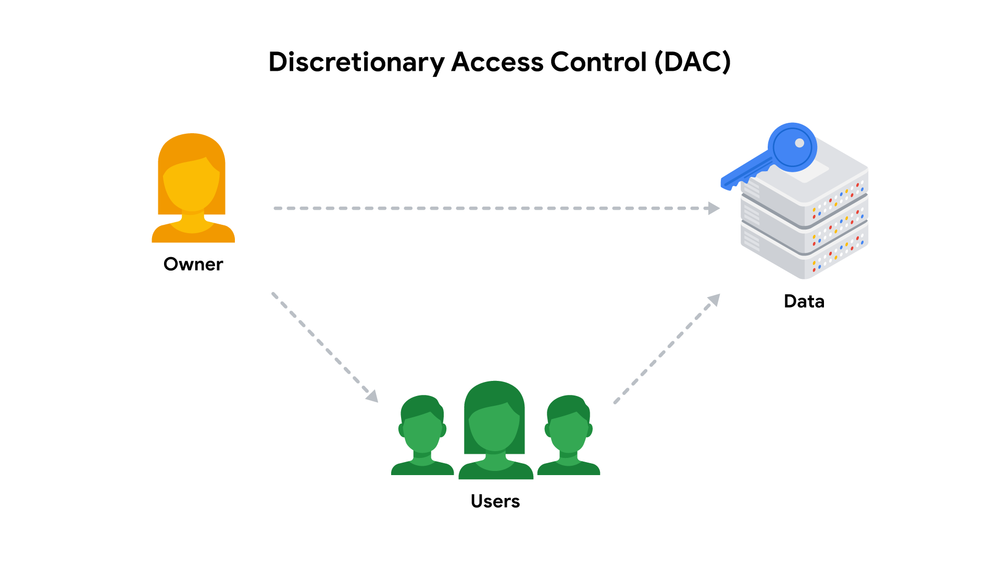
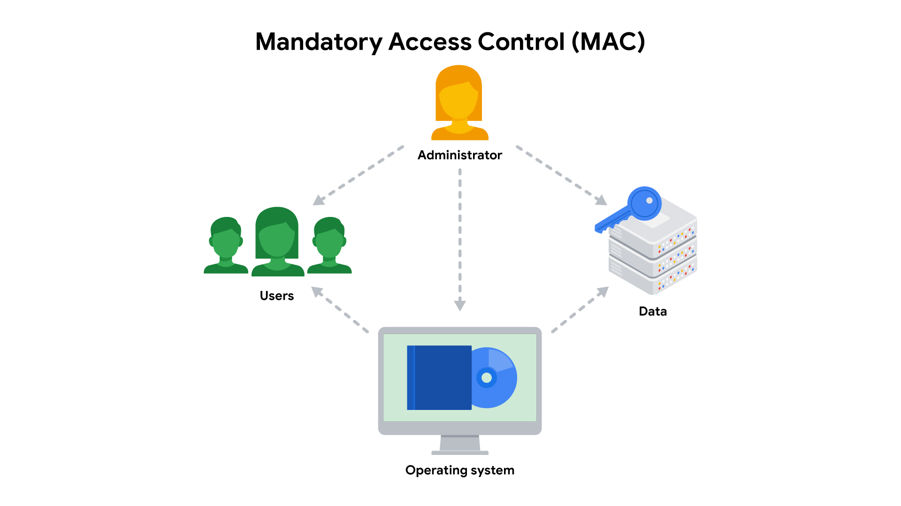
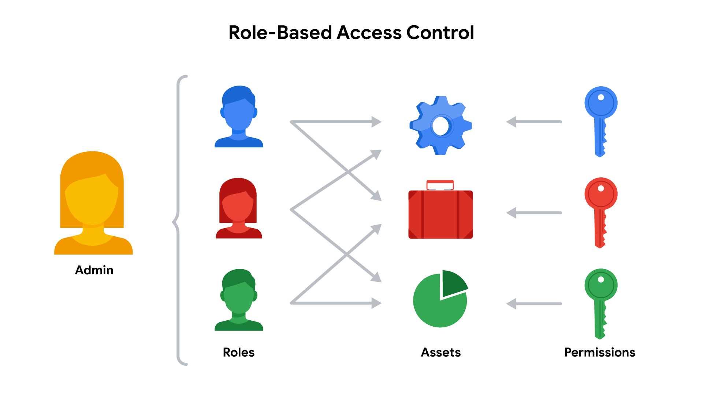

# Identity, Authentication And Authorization

Note này chuyển hóa các note rời rạc trong `_inbox/Authentication & Authorization/` thành một mental model gọn về `IAM`, `AAA`, `authentication`, `authorization`, `accounting`, `SSO`, `MFA`, token và session.

## Mental Model

Access control trả lời ba câu hỏi:

| Câu hỏi | Thuật ngữ | Ý nghĩa vận hành |
|---|---|---|
| Bạn là ai? | Authentication | xác minh identity bằng password, key, token, certificate, MFA hoặc biometric |
| Bạn được làm gì? | Authorization | quyết định quyền trên resource, action và điều kiện cụ thể |
| Bạn đã làm gì? | Accounting / Audit | ghi lại login, session, API call, thay đổi quyền và hành vi đáng ngờ |

Trong hệ thống production, ba lớp này phải đi cùng nhau. Xác thực mạnh nhưng phân quyền rộng vẫn nguy hiểm; phân quyền chặt nhưng không có audit thì khó điều tra; audit nhiều nhưng không có owner xử lý alert thì chỉ tạo nhiễu.

## Authentication

Authentication thường dựa trên các yếu tố:

| Factor | Ví dụ | Rủi ro |
|---|---|---|
| Something you know | password, PIN, security question | reuse, phishing, brute force, leak |
| Something you have | hardware key, OTP app, certificate, device | mất thiết bị, SIM swap, token theft |
| Something you are | fingerprint, face recognition | khó xoay vòng nếu bị lộ, phụ thuộc thiết bị |

Best practice:

- Không coi password là lớp bảo vệ duy nhất cho tài khoản quan trọng.
- Bật `MFA` cho admin, cloud account, VPN, Git, CI/CD và secret manager.
- Ưu tiên phishing-resistant MFA như hardware security key nếu môi trường yêu cầu bảo mật cao.
- Theo dõi failed login, impossible travel, login từ ASN/quốc gia lạ và device mới.

## Password, Recovery Và Account Takeover

Password policy tốt không chỉ là bắt ký tự đặc biệt. Với user thật, độ dài, tính duy nhất và khả năng không phải ghi nhớ nhiều password quan trọng hơn checklist phức tạp khó dùng.

Guardrails:

- Ưu tiên passphrase dài hoặc password ngẫu nhiên do password manager tạo.
- Không dùng lại password giữa nhiều service; credential stuffing thường thành công vì reuse.
- Không chia sẻ password qua email, chat, ticket hoặc cuộc gọi hỗ trợ.
- Bắt đổi password ngay khi có bằng chứng leak, nghi phishing hoặc service liên quan bị breach; không ép rotate quá thường xuyên nếu không có tín hiệu rủi ro vì dễ tạo pattern yếu.
- Chặn password phổ biến/đã lộ nếu hệ thống có khả năng kiểm tra an toàn.

Security question nên được xem như một dạng secret yếu. Câu trả lời thật thường có thể đoán từ mạng xã hội, dữ liệu public hoặc OSINT. Nếu bắt buộc dùng, tạo câu trả lời ngẫu nhiên và lưu trong password manager như một secret riêng.

Password manager giảm password reuse nhưng biến vault thành tài sản cực kỳ nhạy cảm:

- Master password phải dài, độc nhất và có MFA nếu vault hỗ trợ.
- Có recovery plan rõ, nhưng recovery method không được yếu hơn vault chính.
- Với vault cloud, kiểm tra export/backup, device đã đăng nhập, chính sách revoke và log truy cập.
- Với vault offline, kiểm tra backup file vault và key/passphrase; mất vault hoặc master password có thể làm mất khả năng khôi phục.

Email account thường là recovery root của nhiều dịch vụ. Nếu email bị chiếm, attacker có thể reset password hàng loạt. Vì vậy email chính cần MFA, recovery email/phone được kiểm soát, alert forwarding rule bất thường và review đăng nhập định kỳ.

Server không bao giờ nên lưu password plaintext. Mô hình đúng là lưu password hash bằng thuật toán dành cho password storage, có salt duy nhất cho từng user và có cơ chế nâng cấp hash khi policy thay đổi. Nếu database credential bị leak, phải xem đây là incident: reset session/token, rotate password bị ảnh hưởng, rà soát credential stuffing và thông báo theo policy pháp lý/privacy.

## Authentication Protocol Guardrails

Authentication trong distributed system không chỉ là kiểm tra password. Protocol phải chống replay, reflection attack, token theft và man-in-the-middle.

Mental model an toàn:

- Dùng nonce/challenge để chứng minh peer đang sống trong phiên hiện tại, không chỉ phát lại message cũ.
- Xác thực identity và integrity cùng nhau; nếu message có thể bị sửa giữa đường thì authentication không còn nhiều giá trị.
- Tách long-lived credential khỏi session key ngắn hạn; session key nên hết hạn và revoke được.
- Dùng TLS 1.3, SSH, Kerberos, OIDC/OAuth flow chuẩn hoặc mTLS thay vì tự thiết kế challenge-response.
- Với service-to-service auth, log rõ `subject`, `issuer`, `audience`, `scope`, `resource`, `expiry` và decision deny/allow.

Pre-check trước khi thay đổi auth flow production:

1. Xác định client nào bị ảnh hưởng và có cơ chế rollback không.
2. Kiểm tra token/certificate lifetime, clock skew và dependency NTP.
3. Test failure mode: expired token, revoked key, wrong audience, missing scope, replayed request.
4. Bật canary hoặc rollout theo nhóm nhỏ trước khi áp dụng toàn bộ.

## SSO Và Federation

`SSO` giúp người dùng đăng nhập một lần để truy cập nhiều service. Giá trị chính là giảm password fatigue, tập trung lifecycle user và đơn giản hóa kiểm soát truy cập.

Các thành phần thường gặp:

- `Identity Provider` như Azure AD/Entra ID, Okta, Keycloak, Google Workspace.
- `Service Provider` là ứng dụng nhận assertion/token.
- `SAML`, `OIDC` hoặc `OAuth 2.0` cho flow federation/authorization.
- `LDAP` hoặc directory nội bộ cho môi trường on-prem.

Điểm cần nhớ: SSO làm identity tập trung hơn, nhưng cũng biến identity provider thành điểm cực kỳ nhạy cảm. Nếu tài khoản IdP bị chiếm, blast radius có thể rất lớn. Vì vậy SSO cần đi kèm MFA, conditional access, logging, alert và break-glass account được kiểm soát.

Khi dùng social login hoặc third-party SSO cho ứng dụng SaaS, kiểm tra kỹ scope và consent. Một ứng dụng chỉ cần xác thực danh tính không nên xin quyền đọc mailbox, danh bạ, file hoặc toàn bộ profile nếu không có lý do rõ. Delegation nên dùng token có scope hẹp và revoke được, không yêu cầu user đưa password gốc cho ứng dụng bên thứ ba.

MFA không phải mọi loại đều có sức chống chịu giống nhau. SMS/email OTP tốt hơn password đơn lẻ nhưng vẫn phụ thuộc SIM, mailbox và khả năng bị phishing. TOTP app tốt hơn cho nhiều use case phổ thông, còn hardware security key/WebAuthn phù hợp hơn cho admin, cloud root, CI/CD, source control và hệ thống có rủi ro cao. Biometric nên được xem là factor mở khóa thiết bị hoặc tăng tiện dụng, không phải secret có thể rotate dễ dàng khi bị lộ.

## Directory Services, LDAP Và AD

Directory service lưu identity, group, device, service account hoặc resource dưới dạng entry có attribute. LDAP là protocol phổ biến để đọc/tìm kiếm directory; Active Directory dùng directory model tương tự và bổ sung domain, forest, Kerberos, Group Policy, DNS dependency và replication.

Khác biệt cần nhớ:

| Cơ chế | Mục tiêu |
|---|---|
| Naming system | Lookup một tên/key cụ thể ra record hoặc address. |
| Directory service | Search entity theo attribute như user, group, email, OU, role. |
| LDAP Distinguished Name | Path logic của entry trong directory information tree. |
| Global catalog/index | Tăng tốc search xuyên domain/tree nhưng trở thành dependency nhạy cảm. |

Production guardrails:

- Thiết kế OU/group theo ownership và lifecycle, không chỉ theo sơ đồ tổ chức tạm thời.
- Index các attribute được search thường xuyên; search rộng không index có thể gây tải lớn lên domain controller/directory server.
- Dùng LDAPS hoặc StartTLS; không bind bằng plaintext qua mạng không tin cậy.
- Service account dùng LDAP bind phải có quyền tối thiểu, rotate secret và không hardcode trong repo.
- Monitor replication delay, failed bind, account lockout, group membership change và quyền admin directory.
- Với AD, DNS là dependency lõi; lỗi DNS có thể làm login, Kerberos và domain join thất bại dù DC vẫn chạy.

## Authorization

Authorization nên dựa trên `least privilege`: chỉ cấp quyền cần thiết, trong khoảng thời gian cần thiết, trên resource cần thiết.

Các nguyên tắc quan trọng:

- `least privilege`: tránh quyền rộng kiểu `admin`, `*:*`, `cluster-admin` nếu không cần.
- `separation of duties`: người tạo thay đổi không nên là người duy nhất phê duyệt và kiểm thử thay đổi đó.
- `just-in-time access`: cấp quyền tạm thời cho thao tác nhạy cảm.
- `role review`: quyền phải được review định kỳ, đặc biệt khi user đổi team hoặc nghỉ việc.

Một authorization system nên có `reference monitor`: mọi request nhạy cảm đi qua một điểm kiểm tra quyền nhất quán, không bị bypass bởi đường nội bộ, batch job hoặc admin endpoint. Decision nên dựa trên bộ ba `subject`, `action`, `object/resource`, cộng thêm context như tenant, environment, time, device, network hoặc approval state.

## IAM Lifecycle

`IAM` không chỉ là màn hình tạo user. Nó là vòng đời identity:

1. `Provisioning`: tạo user/service account, gán group/role ban đầu.
2. `Authentication`: xác minh user/workload.
3. `Authorization`: gán policy/role theo trách nhiệm.
4. `Monitoring`: ghi log login, token, API call, privilege change.
5. `Review`: rà soát quyền định kỳ.
6. `Deprovisioning`: thu hồi quyền khi không còn nhu cầu.

Điểm dễ sai nhất là deprovisioning. Tài khoản cũ, access key cũ, token CI/CD cũ và service account không owner là nguồn rủi ro rất phổ biến.

## Access Control Models

| Model | Khi nào dùng | Ghi chú |
|---|---|---|
| `DAC` | file sharing, owner tự cấp quyền | linh hoạt nhưng dễ cấp quá tay |
| `MAC` | môi trường nhạy cảm, policy tập trung | chặt, ít linh hoạt, ví dụ SELinux/AppArmor |
| `RBAC` | doanh nghiệp, Kubernetes, cloud IAM, app nội bộ | dễ vận hành nếu role được thiết kế tốt |
| `ABAC` | cần điều kiện động theo tag, device, time, location | mạnh nhưng policy khó đọc nếu lạm dụng |

## ACL, Capability Va ABAC

Hai cách nhìn phổ biến khi triển khai quyền:

| Cách tiếp cận | Mental model | Rủi ro |
|---|---|---|
| `ACL` | resource giữ danh sách subject nào được làm gì | dễ audit theo resource nhưng có thể khó theo dấu toàn bộ quyền của một subject |
| `Capability` | subject giữ token/quyền để thao tác trên resource | phù hợp delegation nhưng token bị lộ có thể trở thành bearer secret |

`ABAC` mở rộng quyết định quyền bằng attribute của user, object, environment và request. Nó mạnh khi cần policy động như tag, classification, device posture, location, time window hoặc break-glass approval. Đổi lại, ABAC dễ trở nên khó đọc nếu thiếu naming convention, policy test và logging decision.

Guardrails:

- Policy deny/allow phải test được bằng request mẫu.
- Mỗi policy nên có owner, mục đích, ngày review và ví dụ expected decision.
- Capability/token phải có scope hẹp, expiry ngắn, audience rõ và revoke path.
- Khi model hóa DAC/MAC/RBAC bằng ABAC, cần test cả operation phụ như create, copy, move, inherit, delegate và delete; lỗi thường nằm ở operation phụ chứ không phải read/write chính.

## Delegation Va OAuth

Delegation là việc một subject cho application/process khác hành động thay mình với quyền bằng hoặc hẹp hơn quyền gốc. Không nên giao credential gốc cho ứng dụng; credential gốc khó revoke, khó giới hạn scope và làm blast radius quá rộng.

Mô hình production tốt hơn:

- Resource owner xác nhận quyền muốn ủy quyền.
- Authorization server phát access token hoặc certificate có scope, audience và expiry rõ.
- Client lưu token như secret, truyền qua kênh bảo mật và không ghi vào log.
- Resource server validate token, scope, expiry, issuer và audience trước khi cho thao tác.
- Refresh token, nếu có, phải bảo vệ nghiêm ngặt hơn access token vì lifetime thường dài hơn.

OAuth/OIDC guardrails:

- Dùng authorization code flow với PKCE cho public client.
- Không dùng implicit flow cho hệ thống mới.
- Token phải có scope tối thiểu; tránh scope rộng kiểu full mailbox/full account nếu use case chỉ cần read.
- Có endpoint revoke/session logout và playbook xử lý token compromise.
- Validate redirect URI chính xác; wildcard redirect là lỗi có blast radius lớn.

## Decentralized Authorization

Khi authorization vượt qua nhiều tổ chức hoặc administrative domain, một authorization server tập trung có thể trở thành bottleneck về availability, trust và admin scalability. Có thể dùng graph-based authorization hoặc attestation chain: mỗi cạnh biểu diễn một lần delegation/permission grant, subject chứng minh quyền bằng đường dẫn từ owner đến chính nó.

Yêu cầu tối thiểu nếu phân quyền phi tập trung:

- Storage cho attestation nên có tính append-only, proof of inclusion/non-existence và chống equivocation.
- Mỗi attestation cần issuer, subject, resource, permission, expiry, delegation constraint và signature.
- Dữ liệu quyền có thể nhạy cảm; không phải mọi delegation đều nên công khai.
- Verifier phải kiểm tra toàn bộ chain, expiry, revocation và restriction ở từng bước, không chỉ kiểm tra chữ ký cuối.
- Audit phải trả lời được ai đã cấp quyền, quyền đi qua chain nào, quyền còn hiệu lực không và revoke ở đâu.

## Tokens, Sessions Và API Access

Token và session giúp hệ thống không phải gửi lại password trong mọi request, nhưng chúng trở thành bearer secret: ai giữ token thường có quyền hành động như chủ token.

Checklist an toàn:

- Dùng `HTTPS` cho mọi flow có credential/token.
- Không log token, cookie, Authorization header.
- Đặt session timeout hợp lý và revoke được khi nghi compromise.
- Dùng scope/claim hẹp cho API token.
- Xoay token dài hạn, ưu tiên token ngắn hạn hoặc workload identity.
- Với cookie session, bật `HttpOnly`, `Secure`, `SameSite` phù hợp.

## Accounting Và Access Logs

Access log nên trả lời được:

- user/service account nào đăng nhập;
- đăng nhập từ đâu, bằng phương thức nào;
- token/session nào được tạo hoặc revoke;
- action nào được thực hiện trên resource nào;
- policy/role/group nào bị thay đổi;
- có failed login, brute force, session hijacking hoặc privilege escalation không.

Log chỉ có giá trị khi được gửi về nơi tập trung, bảo vệ khỏi sửa/xóa, có retention phù hợp và có rule phát hiện hành vi bất thường.

## Related Pages

- [Các Mô Hình Kiểm Soát Truy Cập](../00-fundamentals/C%C3%A1c%20M%C3%B4%20H%C3%ACnh%20Ki%E1%BB%83m%20So%C3%A1t%20Truy%20C%E1%BA%ADp.md)
- [Cơ Chế Kiểm Soát Truy Cập Cấp Thấp](../00-fundamentals/C%C6%A1%20Ch%E1%BA%BF%20Ki%E1%BB%83m%20So%C3%A1t%20Truy%20C%E1%BA%ADp%20C%E1%BA%A5p%20Th%E1%BA%A5p.md)
- [IAM best practices](../03-container-and-cloud-security/IAM%20best%20practices.md)
- [Security Monitoring, SIEM And IoC](../04-security-operations/01-security-monitoring-siem-ioc-and-detection.md)
