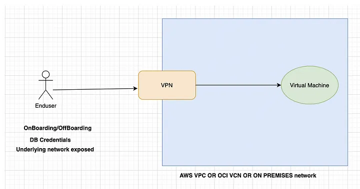
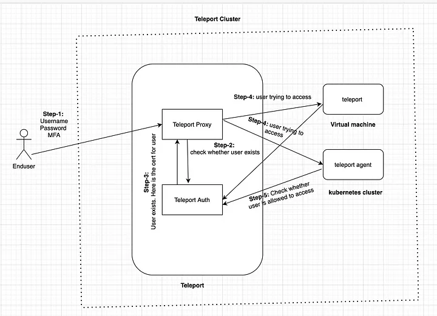

# Teleport HA Access Pattern

## Overview

Teleport là access plane dùng để truy cập server, Kubernetes cluster, database và các target nội bộ thông qua certificate ngắn hạn, RBAC, audit log và session recording. Điểm khác biệt chính so với mô hình VPN/bastion truyền thống là người dùng không cần được phát trực tiếp private key, kubeconfig hoặc database credential dài hạn.

Trong môi trường HA, Teleport nên được nhìn như một lớp truy cập tập trung nằm trước các target private. Proxy nhận kết nối từ user, Auth xử lý identity/authorization/certificate, còn agent trên target join vào cluster Teleport để nhận và kiểm soát truy cập.

## Vấn Đề Của Mô Hình VPN/Bastion

Mô hình người dùng kết nối VPN rồi truy cập thẳng VM/database/Kubernetes cluster có một số điểm yếu vận hành:

- Onboarding/offboarding phức tạp: khi nhân sự vào hoặc rời tổ chức, phải cấp hoặc thu hồi VPN credential, SSH key, database credential và kubeconfig ở nhiều nơi.
- Secret bị phát tán: người dùng cuối thường phải giữ private key, PEM file, kubeconfig hoặc password thật.
- Underlying network bị mở rộng ra user: sau khi vào VPN, user có thể nhìn thấy nhiều phần của private network hơn mức cần thiết.
- Audit khó tập trung: log truy cập phân tán ở bastion, server, database và Kubernetes API.

## Teleport Giải Quyết Như Thế Nào

Teleport đưa user đi qua một access proxy thay vì mở toàn bộ network. User xác thực với Teleport bằng username/password, SSO hoặc MFA; sau đó Teleport cấp short-lived certificate theo role. Target không cần nhận secret dài hạn từ user, mà kiểm tra quyền qua Teleport Auth.

Các lợi ích vận hành chính:

- Cấp quyền và thu hồi quyền theo user/role thay vì phát key thủ công.
- Dùng credential ngắn hạn, giảm rủi ro key bị lộ lâu dài.
- Tập trung audit log và session recording.
- Hỗ trợ just-in-time access và kiểm soát theo thời gian/role.
- Giảm nhu cầu expose private network trực tiếp cho user.

## Luồng Truy Cập

Luồng logic:

1. User đăng nhập vào Teleport Proxy bằng username/password và MFA hoặc identity provider.
2. Proxy chuyển yêu cầu xác thực sang Teleport Auth.
3. Auth xác thực user, kiểm tra role và phát certificate ngắn hạn.
4. User dùng certificate này để truy cập target như VM, Kubernetes cluster hoặc database.
5. Target/agent kiểm tra quyền với Auth trước khi cho phép session.

Trong tài liệu Teleport, các target đã join vào Teleport thường được gọi chung là nodes hoặc resources. Với Kubernetes/database/application access, resource không nhất thiết là một VM đơn lẻ, nhưng nguyên tắc vẫn giống nhau: truy cập đi qua Teleport và được kiểm soát bằng identity, role và audit.

## Ghi Chú Khi Thiết Kế HA

Khi triển khai Teleport cho môi trường quan trọng, tránh coi một node Teleport đơn lẻ là điểm trung tâm không được phép lỗi. Thiết kế HA thường cần:

- Nhiều Teleport Proxy phía sau load balancer.
- Nhiều Teleport Auth node, dùng backend phù hợp để duy trì state và audit.
- DNS/TLS rõ ràng cho endpoint người dùng truy cập.
- Backup cấu hình, CA material, audit log và backend state.
- Monitoring cho Proxy/Auth health, certificate issuance, failed login, session recording và backend latency.

Không nên lưu static credential thật trong tài liệu vận hành. Nếu cần ví dụ, dùng placeholder như `<PASSWORD>`, `<TOKEN>`, `<CLUSTER_NAME>` hoặc `<USER>`.

## Related Pages

- [SSH security, 2FA, bastion host](./SSH%20security,%202FA,%20bastion%20host.md)
- [IAM best practices](../03-container-and-cloud-security/IAM%20best%20practices.md)
- [Secrets management](<../03-container-and-cloud-security/Secrets management (Vault, SSM Parameter Store).md>)
