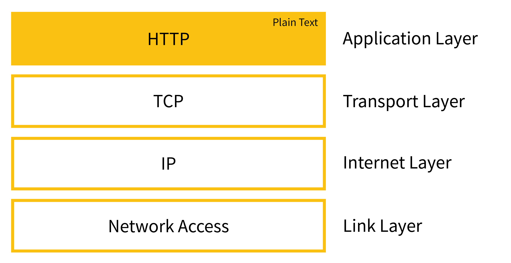
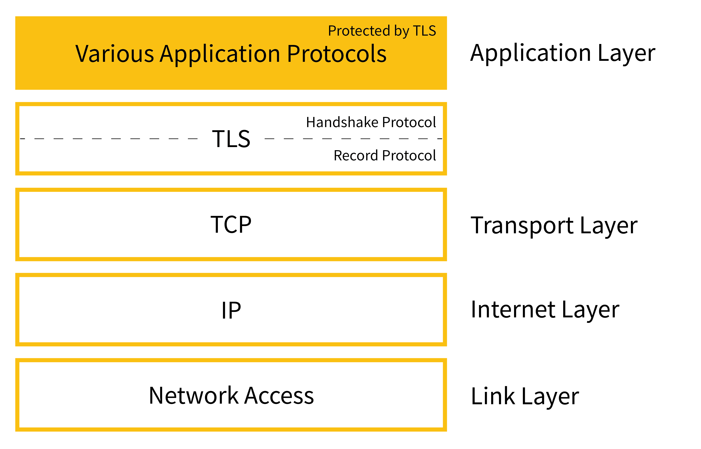
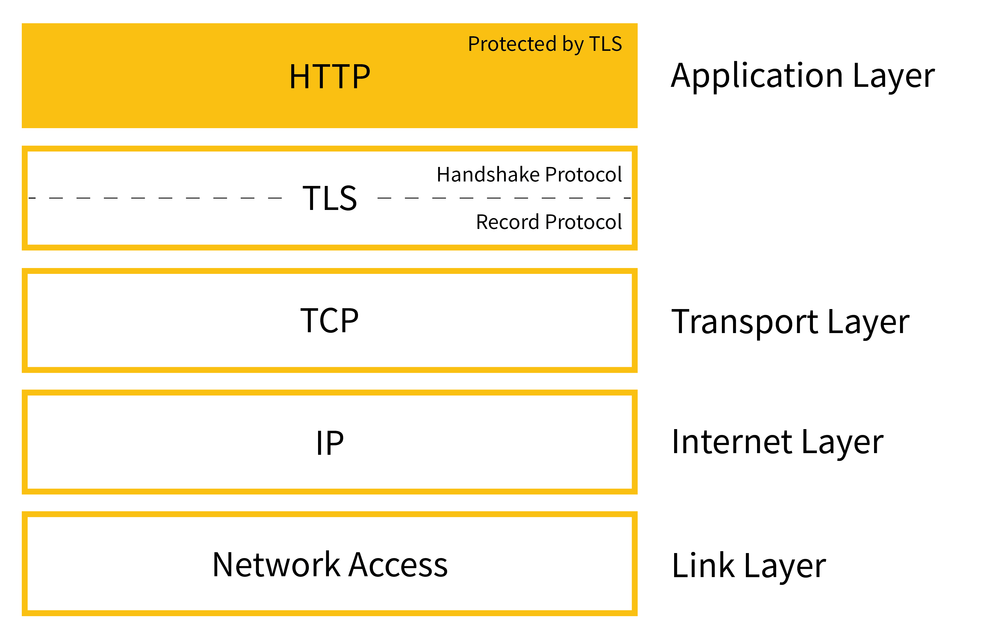
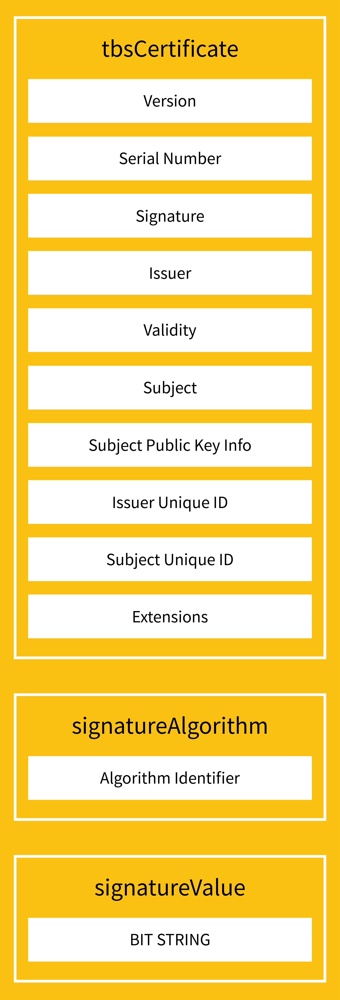

# Firewall SSL Inspection And Certificates

## Overview

Firewall SSL inspection dựa trên certificate trust. Khi firewall giải mã TLS để kiểm tra nội dung, endpoint phải tin CA/certificate do tổ chức kiểm soát; nếu không, người dùng sẽ gặp cảnh báo certificate hoặc kết nối bị chặn.

Note này chuyển hóa từ inbox `Digital-_Certificates_in_FortiGate.docx` ở mức nguyên lý và vận hành an toàn. Các bước GUI/vendor-specific cần kiểm tra theo tài liệu Fortinet chính thức trước khi áp dụng production.

Firewall là boundary control: nó ép traffic đi qua một điểm kiểm tra chính sách trước khi vào hoặc ra khỏi một vùng mạng. Firewall không thay thế authentication, authorization, endpoint hardening hoặc application logging; nếu attacker đã có account hợp lệ hoặc đi qua kênh được allow, firewall chỉ còn là một phần tín hiệu để điều tra.

## Firewall Boundary Model

Các kiểu firewall/gateway thường gặp:

| Kiểu | Kiểm tra | Dùng khi |
|---|---|---|
| Packet-filtering gateway | header như source/destination IP, port, protocol, direction | lọc traffic theo network boundary, segment, subnet, VLAN |
| Stateful firewall | packet header cộng với trạng thái connection | kiểm soát flow vào/ra và giảm rule phức tạp cho return traffic |
| Application-level gateway | nội dung/protocol layer 7 | kiểm soát mail, HTTP, proxy, DLP, malware scanning, policy theo ứng dụng |
| Proxy gateway | đứng trước application cụ thể và thay mặt client/server | web proxy, outbound control, SSL inspection, egress filtering |

Guardrails:

- Rule phải có owner, mục đích, ticket/change reference và ngày review.
- Ưu tiên deny-by-default ở boundary quan trọng, sau đó allow theo service cần thiết.
- Kiểm tra cả inbound và outbound; egress quá rộng làm tăng rủi ro command-and-control và exfiltration.
- Với nhiều LAN/segment, tránh rule `any-to-any` để chữa cháy dài hạn.
- Firewall thay đổi production nên có pre-check route/policy hit, backup config, window rollback và validation bằng traffic thực tế có kiểm soát.

## Certificate Basics

Digital certificate gắn public key với một subject như domain, user, device hoặc service. Certificate thường theo chuẩn X.509 và có các trường quan trọng:

- Subject: đối tượng certificate đại diện.
- Issuer: CA phát hành.
- Validity: thời gian hiệu lực.
- Subject Alternative Name: danh sách hostname/domain hợp lệ.
- Key usage / extended key usage: mục đích sử dụng key.
- Signature: chữ ký của issuer để client xác minh trust chain.

## Certificate Lifecycle

```text
generate key pair
  -> create CSR
  -> submit to CA
  -> CA validates and signs
  -> install certificate and chain
  -> monitor expiry/revocation
  -> renew/rotate before expiry
```

Private key phải được bảo vệ. Nếu private key lộ, certificate cần revoke/replace.

## HTTPS, TLS Va Browser Validation

HTTP gửi application data trực tiếp qua transport layer, nên nội dung có thể bị đọc hoặc sửa bởi actor nằm trên đường truyền.



TLS thêm handshake, certificate validation, key exchange và record protection giữa application protocol và TCP. HTTPS thực chất là HTTP chạy qua TLS.





Khi browser hoặc client CLI kết nối HTTPS, các check quan trọng gồm:

- certificate chain phải đi từ leaf đến intermediate/root CA được trust;
- hostname trong URL phải khớp `Subject Alternative Name`; với IP URL thì SAN cần có IP address đúng, không chỉ DNS name;
- `notBefore`/`notAfter` phải phù hợp thời gian hiện tại của client;
- certificate không bị revoke theo CRL/OCSP nếu client/policy kiểm tra revocation;
- signature và key usage/extended key usage phải hợp lệ cho server authentication;
- protocol/cipher suite không nằm trong danh sách đã cấm theo policy.



Production guardrail: đừng hướng dẫn user bấm bypass browser warning như một cách xử lý lâu dài. Bypass chỉ có thể là ngoại lệ tạm thời trong lab hoặc break-glass đã phê duyệt; trong production phải sửa chain, SAN, trust store, expiry, revocation hoặc policy inspection.

## Public, Internal Va Self-Signed Certificates

Chon certificate theo trust boundary:

| Loai | Dung khi | Rui ro chinh |
|---|---|---|
| Public CA / ACME | website/API public | domain validation, renewal failure, rate limit CA |
| Internal CA | service noi bo, enterprise PKI, mTLS | endpoint phai trust CA noi bo, CA key can bao ve nghiem ngat |
| Self-signed | lab/dev/bootstrap | client warning, thoi quen bypass validation, kho quan ly trust rong |

Voi public endpoint, renewal monitoring quan trong nhu initial issuance. Voi internal CA, quy trinh phan phoi root/intermediate CA va revoke/replace khi key bi lo phai ro rang.

## SSL Inspection Modes

Hai kiểu thường gặp:

- Certificate inspection: firewall đọc metadata trong TLS handshake/certificate/SNI nhưng không giải mã nội dung payload.
- Full SSL inspection / deep inspection: firewall đứng giữa phiên TLS, giải mã rồi mã hóa lại lưu lượng để kiểm tra nội dung.

Full inspection mạnh hơn về visibility nhưng rủi ro và tác động lớn hơn:

- endpoint phải trust CA của firewall/tổ chức
- có thể ảnh hưởng ứng dụng dùng certificate pinning
- cần chính sách exemption cho site nhạy cảm hoặc ứng dụng không tương thích
- tăng tải CPU/throughput trên firewall
- tăng yêu cầu bảo vệ private key và audit

## Trust Chain, CRL Và Revocation

Client xác minh certificate bằng trust chain từ leaf certificate đến intermediate/root CA tin cậy. Nếu chain thiếu intermediate hoặc hostname không khớp SAN, trình duyệt/app sẽ cảnh báo.

Revocation kiểm tra certificate còn được tin cậy không:

- CRL: danh sách certificate bị thu hồi.
- OCSP: kiểm tra trạng thái certificate theo request.

Trong môi trường firewall inspection, cần đảm bảo endpoint nhận đúng root/intermediate CA nội bộ và có quy trình revoke khi CA/key bị compromise.

## Operational Checklist

- Xác định rõ policy nào cần full inspection và policy nào chỉ cần certificate inspection.
- Phân phối internal CA certificate bằng kênh quản trị tập trung như GPO/MDM/config management.
- Test với nhóm nhỏ trước khi rollout rộng.
- Theo dõi lỗi certificate warning, handshake failure, app breakage và throughput firewall.
- Tạo exemption có kiểm soát cho certificate pinning, banking/healthcare hoặc traffic có yêu cầu pháp lý riêng.
- Theo dõi expiry của CA, intermediate và firewall server certificate.
- Bảo vệ private key, backup config và audit ai có quyền export/import certificate.

## Troubleshooting

Triệu chứng thường gặp:

- Browser báo certificate không tin cậy: endpoint chưa trust CA nội bộ hoặc chain sai.
- Hostname mismatch: SAN/CN không khớp domain truy cập.
- App không kết nối sau khi bật full inspection: có thể do certificate pinning hoặc TLS feature không tương thích.
- Chỉ một số site lỗi: kiểm tra policy match, exemption, SNI, category và CRL/OCSP reachability.

Checks an toàn:

```bash
openssl s_client -connect example.com:443 -servername example.com -showcerts
```

Them checks cho expiry va hostname:

```bash
curl -vk https://example.com
openssl x509 -in server.crt -noout -subject -issuer -dates -ext subjectAltName
```

## Rủi Ro

Full SSL inspection là thay đổi security-sensitive. Nếu triển khai sai, nó có thể làm gián đoạn ứng dụng, tạo cảnh báo người dùng, hoặc làm tăng blast radius nếu CA/private key nội bộ bị lộ. Luôn có rollback policy và pilot group trước production rollout.

## Trang Liên Quan

- [Privacy, Compliance, Cryptography And Data Protection](../00-fundamentals/02-privacy-compliance-cryptography-and-data-protection.md)
- [Identity, Authentication And Authorization](../01-access-control/01-identity-authentication-authorization.md)
- [Network Monitoring And Packet Analysis](./network-monitoring-and-packet-analysis.md)
- [Ansible TLS Certificate Automation](../../07-configuration-management/01-ansible/08-tls-certificate-automation.md)
