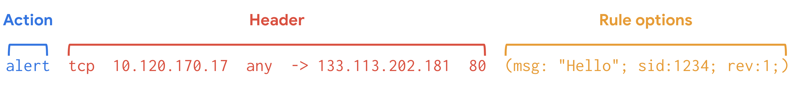

# IDS/IPS

## Overview

IDS (Intrusion Detection System) và IPS (Intrusion Prevention System) dùng để phát hiện hoặc chặn hành vi bất thường trong network hoặc host. IDS chủ yếu quan sát và cảnh báo; IPS nằm trên đường traffic và có thể drop/reset/block khi rule khớp.

Trong thực tế, IDS/IPS không thay thế firewall, SIEM hay packet capture. Nó là một lớp tín hiệu: giúp phát hiện pattern đã biết, policy violation hoặc hành vi nghi vấn để đội SOC/NOC điều tra tiếp.

## IDS Vs IPS

| Loại | Vai trò | Rủi ro vận hành |
|---|---|---|
| IDS | phát hiện và alert | ít ảnh hưởng traffic nhưng có thể tạo nhiều false positive |
| IPS | phát hiện và chặn | có thể chặn nhầm traffic hợp lệ nếu rule/tuning kém |

## Signature-Based Vs Anomaly-Based Detection

Hai hướng detection chính:

| Cách tiếp cận | Mental model | Điểm mạnh | Rủi ro |
|---|---|---|---|
| `SIDS` / signature-based | so event/packet với pattern tấn công đã biết | dễ giải thích, phù hợp rule exploit/malware đã có IoC | yếu với zero-day, biến thể mới hoặc traffic bị chia nhỏ/ẩn trong flow hợp lệ |
| `AIDS` / anomaly-based | học baseline hành vi bình thường rồi báo lệch chuẩn | phát hiện được hành vi mới hoặc chưa có signature | cần dữ liệu huấn luyện tốt, dễ false positive hoặc false negative nếu baseline sai |

Trong production, mục tiêu không phải bật thật nhiều rule. Mục tiêu là tín hiệu đủ chính xác để xử lý được:

- False negative nguy hiểm vì attack đi qua mà không ai biết.
- False positive quá nhiều làm analyst bỏ qua alert hoặc disable rule rộng.
- Rule nên gắn với asset criticality, exposure, exploitability và playbook xử lý.
- Trước khi bật IPS/drop, chạy IDS/alert với traffic thật để đo false positive.
- Khi dùng anomaly detection, phải có giai đoạn học baseline và quy trình cập nhật khi workload thay đổi hợp lệ.

## Common Signals

- Scan port hoặc service discovery.
- Malware callback hoặc command and control.
- Exploit signature.
- DNS query bất thường.
- Protocol mismatch, ví dụ HTTP trên port lạ.
- Data exfiltration pattern nếu rule và visibility đủ tốt.

## Tools

| Tool | Ghi chú |
|---|---|
| Snort | IDS/IPS lâu đời, signature-based, ecosystem rule rộng |
| Suricata | IDS/IPS hiện đại, multi-thread, hỗ trợ rule kiểu Snort và metadata phong phú |
| Zeek | network security monitoring thiên về phân tích protocol/event hơn là chặn |

## Suricata Operational Model

Suricata co the chay theo ba goc nhin:

| Mode | Dung de |
|---|---|
| IDS | quan sat network traffic va tao alert |
| IPS | dat inline de drop/reject/pass traffic theo rule |
| NSM | tao event/log/packet capture phu hop cho investigation va threat hunting |

Rule/signature cua Suricata thuong co ba phan:

- `action`: `alert`, `pass`, `drop`, `reject`;
- `header`: protocol, source/destination IP, port va direction;
- `options`: message, content match, flow, classtype, sid, rev va metadata khac.

Khi viet custom rule, nen test tren traffic mau hoac pcap truoc khi dua vao production. Rule tot khong chi match duoc attack, ma con giam false positive trong ngu canh ha tang cu the.

## Suricata Logs

| Log | Vai tro |
|---|---|
| `eve.json` | log JSON giau metadata, phu hop parse va ingest vao SIEM |
| `fast.log` | alert toi gian, legacy/basic alerting, khong ly tuong cho IR sau |

`eve.json` thuong co `flow_id` de correlate event trong cung network flow. Khi dieu tra, uu tien `eve.json` voi DNS/proxy/firewall/endpoint log de rap timeline.

## Operations Notes

- Bắt đầu ở chế độ IDS/alert trước khi bật IPS/drop.
- Tách rule theo severity và asset criticality.
- Review false positive theo từng application, không disable cả rule group quá rộng nếu chưa hiểu tác động.
- Lưu packet/log mẫu cho incident nhưng phải xử lý như dữ liệu nhạy cảm.
- Kết hợp với SIEM để correlate alert với DNS, proxy, authentication và cloud audit log.

## Related Pages

- [Network Monitoring And Packet Analysis](./network-monitoring-and-packet-analysis.md)
- [Security Monitoring, SIEM And IoC](../04-security-operations/01-security-monitoring-siem-ioc-and-detection.md)
