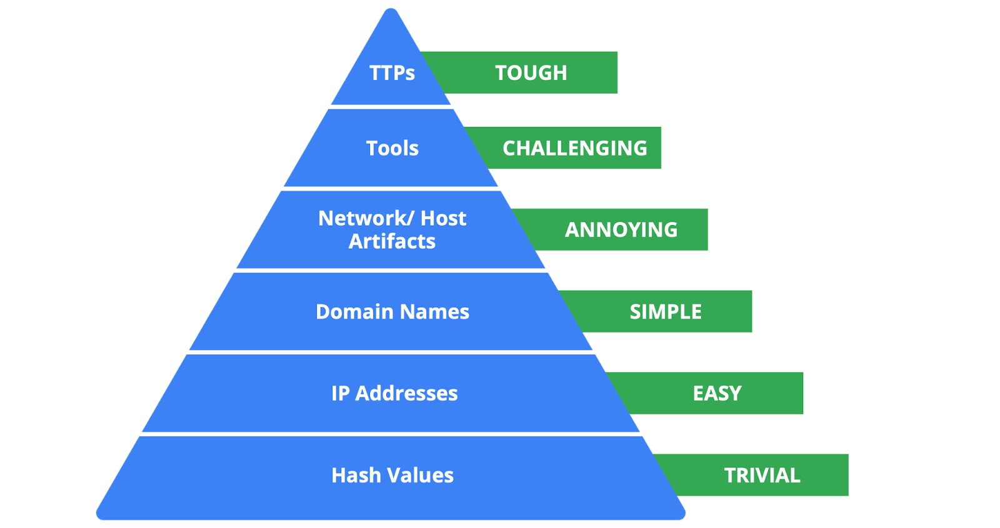
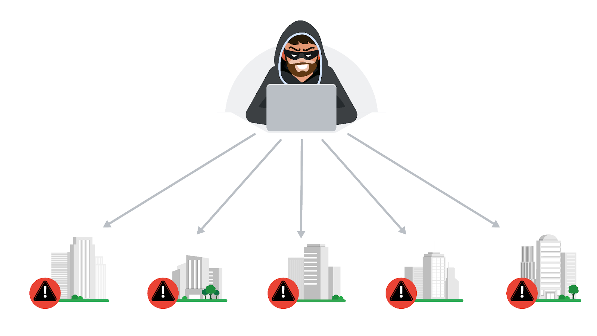
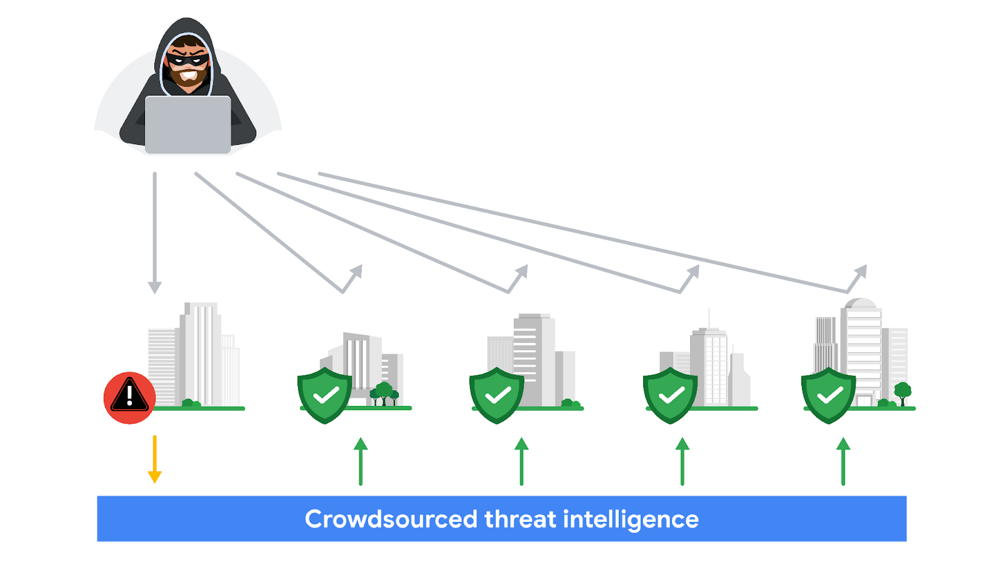
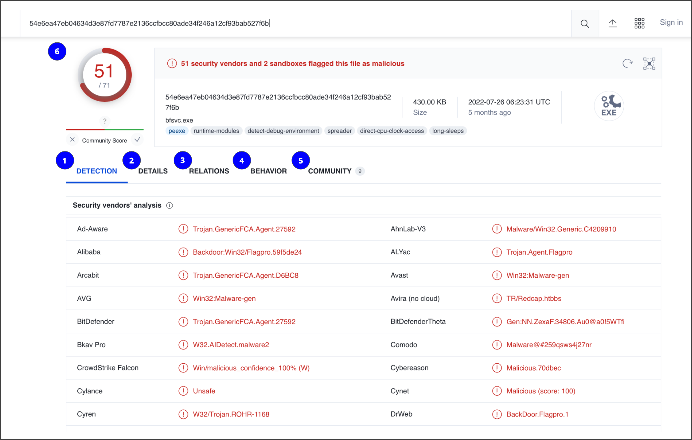

# Security Monitoring, SIEM, IoC And Detection

Note này gom các note `_inbox/Base/definitions.md`, `_inbox/Security Tools & Technologies/siem-tool.md`, `indicators-of-compromist.md`, `detection-tool.md` và `detection-analyze-incident.md` thành một note vận hành SOC/SecOps.

## Monitoring Pipeline

Security monitoring biến event rời rạc thành tín hiệu có thể điều tra.

```text
log sources -> collection -> parsing/normalization -> enrichment -> detection rules -> alert -> triage -> incident response
```

Nếu thiếu log source hoặc parse sai, SIEM đẹp đến đâu cũng không thấy được tấn công. Nếu alert không có playbook/owner, detection chỉ tạo backlog.

## Log Sources

| Log source | Tín hiệu quan trọng |
|---|---|
| Authentication logs | login success/fail, MFA, password reset, impossible travel |
| Endpoint logs | process, file, registry, PowerShell, EDR detection |
| Network logs | firewall, proxy, DNS, NetFlow, IDS/IPS |
| Cloud logs | IAM/API call, object access, security finding |
| Application logs | auth flow, authorization deny, business action, error |
| Security tools | antivirus, EDR, WAF, IDS/IPS, vulnerability scanner |

Log nên trả lời được 5W: `who`, `what`, `when`, `where`, `why/how`.

## Log Management

Best practice:

- Thu log có chủ đích, tránh overlogging gây nhiễu và tốn storage.
- Đồng bộ thời gian bằng NTP để timeline đáng tin.
- Centralize log để attacker khó xóa dấu vết cục bộ.
- Bảo vệ log bằng access control, retention, immutability nếu cần.
- Mask hoặc kiểm soát dữ liệu nhạy cảm trong log.
- Định nghĩa retention theo điều tra, compliance và chi phí.

## SIEM

`SIEM` thu thập, chuẩn hóa, lưu trữ và phân tích log/event để hỗ trợ detection và investigation.

Quy trình SIEM:

1. Collect and aggregate: nhận log từ server, firewall, cloud, app, EDR.
2. Normalize: chuyển nhiều format về field/schema chung.
3. Enrich: thêm context như asset owner, geo, threat intel, user group.
4. Detect: chạy rule/correlation/analytics.
5. Alert: tạo case cho analyst.
6. Investigate: pivot qua timeline, entity, log source và evidence.

Ví dụ tool: Elastic, Splunk, QRadar, LogRhythm, Exabeam, Chronicle, OSSIM.

## IDS, IPS, EDR Và Detection Tooling

| Tool | Vai trò |
|---|---|
| IDS | quan sát traffic/system activity và alert |
| IPS | phát hiện và có thể block/drop/reset |
| EDR | quan sát endpoint behavior, process, file, memory, command line |
| SIEM | gom log, correlate, alert và hỗ trợ case investigation |
| TIP | quản lý threat intelligence, IoC feed, enrichment |

Các trạng thái detection:

- `true positive`: alert đúng, có threat.
- `true negative`: không alert và không có threat.
- `false positive`: alert nhầm.
- `false negative`: có threat nhưng không alert.

Mục tiêu không phải là "zero false positive", mà là alert đủ chính xác, có context, có ưu tiên và xử lý được.

## Collaborative Intrusion Detection

Trong distributed system lớn, không có một điểm quan sát nào nhìn thấy toàn bộ attack path. `Collaborative IDS` gom tín hiệu từ nhiều sensor: network tap, firewall, endpoint, application log, cloud audit log, DNS/proxy và identity provider.

Mô hình tổ chức:

- Sensor thu thập event và có thể chạy phân tích cục bộ.
- Community gom nhiều sensor theo vùng mạng, workload, tenant hoặc administrative domain.
- Community head hoặc SIEM nhận event, correlate và sinh alert.
- Một sensor có thể thuộc nhiều community nếu nó nằm ở ranh giới quan trọng, ví dụ ingress, shared service hoặc identity plane.

Tradeoff vận hành:

- Centralized correlation thường cho context tốt hơn nhưng dễ bottleneck về scale, latency và ownership.
- Distributed correlation scale tốt hơn nhưng cần schema, clock sync, event ID và suppression logic thống nhất.
- Community càng lớn thường càng nhiều context, nhưng cũng tăng volume và chi phí xử lý.
- Overlap giữa community giúp giảm blind spot, nhưng có thể tạo duplicate alert nếu không có deduplication.

Metrics cần theo dõi:

| Metric | Ý nghĩa vận hành |
|---|---|
| True positive | alert đúng, cần điều tra/containment |
| False positive | alert nhầm, cần tuning hoặc enrich thêm context |
| False negative | attack không bị phát hiện, cần post-incident detection gap review |
| Precision | tỷ lệ alert hữu ích trong tổng alert đã bắn |
| Accuracy | mức đúng tổng thể của mô hình/rule trên tập event đã đánh giá |

Guardrails:

- Đồng bộ thời gian bằng NTP để correlation timeline đáng tin.
- Chuẩn hóa field `source`, `destination`, `user`, `service`, `tenant`, `trace_id`, `flow_id` nếu có.
- Có deduplication và alert grouping để tránh analyst nhận nhiều alert cho cùng một incident.
- Không upload log/packet chứa secret, PII hoặc customer data lên dịch vụ public để enrich nếu chưa được phép.
- Sau incident, cập nhật rule/use case dựa trên detection gap thay vì chỉ thêm IoC tạm thời.

## IoC Vs IoA

| Loại | Ý nghĩa | Ví dụ |
|---|---|---|
| `IoC` | dấu hiệu đã quan sát được, thường sau hoặc trong incident | hash, IP, domain, filename, registry key |
| `IoA` | hành vi cho thấy attack đang diễn ra hoặc có ý định | process tạo connection lạ, credential dumping behavior |

IoC dễ block nhưng dễ đổi. Behavior/TTP khó viết rule hơn nhưng làm attacker đau hơn khi bị phát hiện.



## Threat Intelligence Và Crowdsourcing

Threat intelligence thêm context cho alert: IP này liên quan campaign nào, hash này có family malware gì, domain này mới tạo hay không.

Nguồn thường gặp:

- industry report;
- government/vendor advisory;
- threat feed;
- VirusTotal, MalwareBazaar, urlscan.io;
- internal incident history.





Lưu ý quan trọng: không upload file/log chứa dữ liệu nội bộ, PII, secret hoặc customer data lên dịch vụ public như VirusTotal nếu chưa được phép.



## Threat Hunting

Threat hunting là tìm kiếm chủ động thay vì chờ alert. Nó phù hợp khi:

- nghi có attacker đã bypass rule;
- có threat intel mới;
- phát hiện behavior lạ nhưng chưa đủ rule;
- muốn kiểm tra hypothesis như "có credential dumping không?".

Loop gợi ý:

```text
hypothesis -> data selection -> query -> validate -> enrich -> create detection/use case -> document
```

## Cyber Deception

Cyber deception dùng decoy để tăng khả năng phát hiện, ví dụ:

- honeypot service;
- fake credential;
- canary token;
- file mồi có alert khi bị mở;
- DNS/domain mồi.

Deception tốt khi tín hiệu có độ tin cậy cao: user bình thường không nên chạm vào mồi. Tuy nhiên phải tách biệt an toàn để decoy không trở thành điểm yếu thật.

## Detection Engineering Checklist

1. Use case phát hiện threat nào?
2. Cần log source nào và field nào?
3. Rule có false positive dự kiến ở đâu?
4. Severity dựa trên asset criticality hay chỉ dựa trên event?
5. Alert có đủ context để analyst xử lý không?
6. Có runbook/playbook không?
7. Có cách test rule bằng lab hoặc event mẫu không?
8. Có owner để tuning định kỳ không?

## Related Pages

- [Incident Response Overview](../incident-response-overview.md)
- [IDS/IPS](../02-os-and-network-security/IDS-IPS%20%28Snort,%20Suricata%29.md)
- [Network Monitoring And Packet Analysis](../02-os-and-network-security/network-monitoring-and-packet-analysis.md)
- [eBPF Security And Process Injection Detection](../../01-observability-and-monitoring/06-ebpf-observability/02-ebpf-security-process-injection-detection.md)
