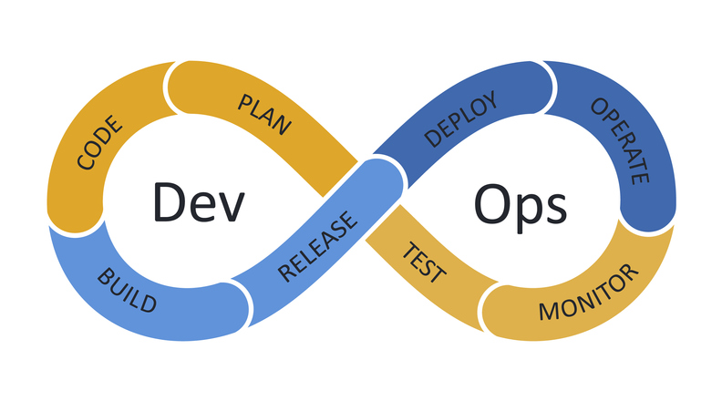
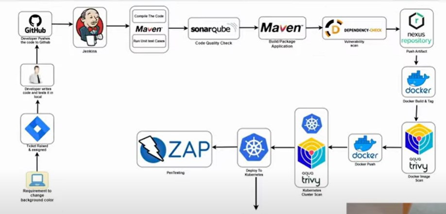

# DevOps Lifecycle, Environments And Interview Flow

## Overview

Note này chuyển hóa nhóm note thô cũ về DevOps overview, lifecycle, CI/CD, tech stack và cách trình bày project DevOps trong phỏng vấn. Trọng tâm không phải là học thuộc tên tool, mà là hiểu một flow hoàn chỉnh: từ yêu cầu business, code, build, test, security scan, artifact, image, deploy, monitor rồi quay lại cải tiến.



## Mental Model

DevOps là cách tổ chức quy trình để development và operations không bị tách rời. Một thay đổi phần mềm tốt không chỉ là code chạy được, mà phải đi qua chuỗi kiểm soát đủ tin cậy:

```text
Plan -> Code -> Build -> Test -> Release -> Deploy -> Operate -> Monitor -> Feedback
```

Vòng này lặp liên tục. Mỗi giai đoạn tạo evidence cho giai đoạn sau: ticket, commit, test report, artifact, image tag, deployment record, metric, log và incident feedback.

## Delivery Models

Các mô hình quản lý delivery không thay thế cho nhau hoàn toàn; mỗi mô hình phù hợp với một loại rủi ro và nhịp thay đổi khác nhau.

| Mô hình | Khi phù hợp | Rủi ro chính | Guardrail production |
|---|---|---|---|
| Waterfall | Requirement ổn định, scope được chốt sớm, môi trường compliance cần tài liệu upfront | Feedback đến muộn, thay đổi requirement làm trễ toàn bộ kế hoạch | Dùng milestone rõ, review kiến trúc sớm, có acceptance criteria và rollback plan trước release lớn |
| Scrum | Product cần học nhanh qua sprint ngắn, backlog có thể ưu tiên lại thường xuyên | Sprint dễ thành mini-waterfall nếu review/retro chỉ làm hình thức | Definition of Done phải gồm test, security check, docs, observability và rollback evidence |
| Kanban | Ops, support, platform backlog hoặc luồng việc có nhiều interruption | Work in progress phình to, việc gần xong bị kẹt lâu | Giới hạn WIP, đo lead time/cycle time, ưu tiên incident/security work bằng policy rõ |
| DevOps | Service cần release lặp lại, vận hành liên tục và feedback từ production | Chỉ đổi tên team/tool nhưng vẫn tách Dev và Ops về trách nhiệm | Service owner theo dõi build, deploy, runtime health, alert và incident follow-up trên cùng một flow |

Scrum thường dùng các artifact như product backlog, sprint backlog, sprint planning, daily standup, sprint review và retrospective. Product Owner chịu trách nhiệm ưu tiên giá trị sản phẩm; Scrum Master gỡ cản trở quy trình; development team chịu trách nhiệm tạo increment có thể kiểm chứng.

Kanban phù hợp với hạ tầng và SRE vì công việc thường đến từ incident, change request, security advisory, capacity và debt. Điểm cốt lõi không phải là cái bảng, mà là giới hạn WIP và nhìn rõ trạng thái flow: `To Do -> In Progress -> Review -> Done`.

Với mọi mô hình, production guardrail quan trọng hơn tên framework:

- mọi change phải trace được từ ticket/issue đến commit, artifact, deployment và validation;
- release phải có tiêu chí vào/ra rõ ràng, không chỉ "code đã merge";
- task xong phải bao gồm tài liệu vận hành, cảnh báo/metric cần theo dõi và cách rollback;
- retrospective nên tạo action item có owner, không chỉ ghi nhận cảm tính;
- automation nên giảm handoff giữa team, nhưng không được bỏ qua approval cần thiết cho rủi ro cao.

## CI, Delivery Và Deployment

| Khái niệm | Ý nghĩa thực tế |
|---|---|
| Continuous Integration | Tích hợp code thường xuyên, build và test tự động để phát hiện lỗi sớm |
| Continuous Delivery | Artifact luôn sẵn sàng release, nhưng production có thể cần approval |
| Continuous Deployment | Change đạt điều kiện sẽ tự động lên production |

CI tập trung vào chất lượng code và artifact. CD tập trung vào việc đưa artifact đó qua các môi trường một cách lặp lại được, có kiểm soát và có rollback.

Một CI stage thường có:

- checkout source code;
- install dependencies;
- compile/build;
- unit test, integration test, E2E test nếu phù hợp;
- static code analysis;
- dependency/security scan;
- package artifact;
- publish artifact hoặc container image.

## Environments

| Environment | Mục đích | Điều cần kiểm soát |
|---|---|---|
| Development | Nơi developer phát triển và thử nhanh | tốc độ feedback, dữ liệu giả lập, chi phí thấp |
| QA/Test | Kiểm thử chức năng, regression, integration | test case, test data, bug report |
| Staging/Pre-production | Mô phỏng gần production trước release | config gần thật, UAT, smoke test, rollback rehearsal |
| Production | Phục vụ user thật | availability, security, observability, change control |
| DR | Khôi phục khi production lỗi lớn | backup, replication, RTO/RPO, drill định kỳ |

Không nên coi staging chỉ là "một server test". Staging có giá trị khi nó đủ giống production để bắt lỗi cấu hình, dependency, migration và deployment flow.

## DevOps Lifecycle Theo Giai Đoạn

### Plan

Plan xác định requirement, phạm vi, rủi ro, timeline, stakeholder và tiêu chí hoàn thành. Với DevOps, plan tốt phải trả lời được: build thế nào, deploy đi đâu, rollback ra sao, cần observe gì sau khi release.

### Code

Code phase gồm phát triển, commit, branch strategy, pull request, code review, unit test và documentation. Code tốt cho DevOps phải dễ build tự động, dễ cấu hình qua environment variable và không hard-code secret.

### Build

Build tạo artifact có thể triển khai: `.jar`, `.war`, binary, package hoặc Docker image. Artifact phải có version rõ ràng để biết chính xác cái gì đang chạy ở môi trường nào.

### Test

Test không chỉ là unit test. Một pipeline trưởng thành thường có nhiều lớp:

- unit test kiểm tra logic nhỏ;
- integration test kiểm tra tương tác module/service;
- E2E test kiểm tra flow người dùng;
- performance test cho điểm nghẽn quan trọng;
- security test như dependency scan, SAST/DAST hoặc image scan.

### Release And Deploy

Release là quyết định "phiên bản nào được phép đi tiếp". Deploy là hành động đưa phiên bản đó vào môi trường đích. Các chiến lược phổ biến gồm rolling, blue/green, canary và manual approval gate.

Trong môi trường cloud linh hoạt, deploy thủ công vào từng server sẽ nhanh chóng vỡ trận vì số lượng instance thay đổi liên tục. Deployment automation nên tách rõ ba lớp:

| Lớp | Ví dụ | Câu hỏi cần trả lời |
|---|---|---|
| Executable / artifact | package, binary, container image, zip bundle | version nào đang được deploy? build từ commit nào? |
| Runtime / dependency | OS package, runtime, library, daemon | cài ở đâu, bằng script/AMI/config management hay platform managed? |
| Configuration | env var, config file, secret reference, service endpoint | cấu hình có review/rollback/audit được không? |

Một pattern tốt là tạo instance hoặc environment mới từ automation, kiểm tra health, rồi mới chuyển traffic. Cách này giúp rollback bằng cách chuyển traffic về version cũ thay vì sửa tay trên server đang chạy.

### Operate And Monitor

Operate duy trì service ổn định sau deploy: incident management, capacity, patching, backup, security, performance tuning. Monitor/observe thu thập metrics, logs, traces, alerts và feedback để biết hệ thống thật sự đang khỏe hay chỉ "process còn sống".

## Configuration Management

Configuration Management quản lý trạng thái mong muốn của hệ thống: package, config file, service, user, permission, network setting, policy. Automation như Ansible, Puppet, Chef hoặc Terraform là phương tiện để áp dụng và kiểm soát trạng thái đó.

Điểm cần nhớ:

- configuration phải được version control;
- thay đổi phải review được;
- cùng một cấu hình nên apply lặp lại mà không phá hệ thống;
- secret không nên nằm trực tiếp trong repository;
- drift cần được phát hiện và xử lý.

## Project Interview Flow



Khi giải thích một project DevOps trong phỏng vấn, nên kể theo dòng chảy có nguyên nhân:

1. Business tạo yêu cầu hoặc bug trên Jira/ticket system.
2. Developer code local, tạo commit/pull request lên Git.
3. Jenkins/GitLab CI/GitHub Actions trigger pipeline.
4. Maven/Gradle/npm build và chạy unit test.
5. SonarQube hoặc tool tương tự kiểm tra code quality, coverage, code smell.
6. Dependency scanner kiểm tra thư viện có vulnerability.
7. Artifact được publish vào Nexus/Artifactory hoặc image registry.
8. Docker build image, gắn tag theo version/git SHA/build number.
9. Image scanner như Trivy kiểm tra CVE ở base image và package.
10. Kubernetes manifest/Helm/Kustomize deploy lên staging rồi production.
11. Prometheus/Grafana/logging theo dõi sau deploy.
12. Nếu lỗi, rollback theo artifact/image tag hoặc deployment revision trước.

Điểm phỏng vấn quan trọng: đừng chỉ nói "tôi dùng Jenkins, Docker, Kubernetes". Hãy nói tool đó đứng ở đâu trong flow, input/output là gì, failure được chặn ở đâu và rollback như thế nào.

## Tool Stack Theo Nhóm

| Nhóm | Tool thường gặp | Vai trò |
|---|---|---|
| Source control | Git, GitHub, GitLab | quản lý source, PR/MR, lịch sử thay đổi |
| Build | Maven, Gradle, npm, pip | compile, test, package |
| CI/CD | Jenkins, GitLab CI, GitHub Actions | tự động hóa pipeline |
| Artifact | Nexus, Artifactory, registry | lưu artifact/image có version |
| Container | Docker, containerd | đóng gói runtime |
| Orchestration | Kubernetes | rollout, scale, self-healing |
| IaC/CM | Terraform, Ansible | provisioning và cấu hình |
| Security | SonarQube, Trivy, OWASP ZAP | code/image/app security gate |
| Observability | Prometheus, Grafana, ELK, Loki | metrics, logs, dashboard, alert |

## Related Pages

- [Pipeline stages build, test, deploy](./01-continuous-integration/02-Pipeline%20stages%20build,%20test,%20deploy.md)
- [Jenkins, GitLab CI, GitHub Actions](./01-continuous-integration/Jenkins,%20GitLab%20CI,%20GitHub%20Actions.md)
- [Image scanning](./03-automation-pipeline-security/01-Image%20scanning.md)
- [Code quality](./03-automation-pipeline-security/02-Code%20quality%20%28SonarQube%29.md)
- [BlueGreen, Canary, Rolling](./02-continuous-delivery-and-deployment/BlueGreen,%20Canary,%20Rolling.md)
