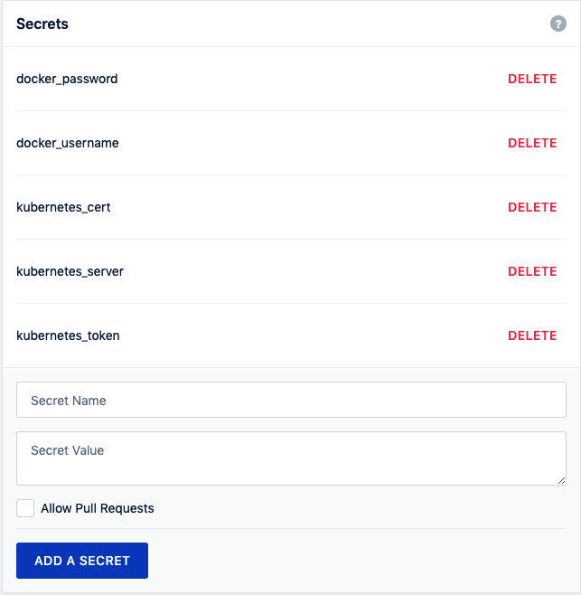

# Pipeline Stages: Build, Test, Deploy

## Overview

CI/CD pipeline là dây chuyền biến một thay đổi trong Git thành artifact có thể triển khai và một rollout có thể quan sát được. Pipeline tốt không chỉ "chạy xanh"; nó phải trả lời được:

- commit nào tạo ra artifact nào;
- test nào đã chạy trước khi deploy;
- image/tag/digest nào đang chạy ở môi trường nào;
- rollout đã được kiểm tra bằng signal nào;
- rollback hoặc roll-forward sẽ dùng artifact nào.


## Pipeline Flow

Một pipeline tối thiểu cho ứng dụng chạy trên Kubernetes thường đi theo flow:

```text
commit / pull request
-> lint / static checks
-> build application
-> unit test / integration test
-> build container image
-> scan image / dependency
-> push image to registry
-> render manifest / Helm / Kustomize
-> diff / policy check
-> deploy / sync
-> rollout status
-> smoke test / metric check
```

CI tập trung vào feedback nhanh cho developer. CD tập trung vào việc đưa artifact đã được kiểm chứng sang runtime một cách có kiểm soát. Không nên nhảy sang CD tự động nếu CI chưa có test, artifact versioning và rollback target rõ ràng.

## Delivery Contract Với Container Image

Trong pipeline dùng container, image là contract giữa dev, test, security và ops. Image đã pass CI nên được promote nguyên vẹn qua staging/pre-prod/prod; khác biệt môi trường nên nằm ở config, secret, policy và routing bên ngoài image.

Guardrails:

- Build once, promote same digest. Không rebuild lại image riêng cho từng môi trường.
- Ghi rõ image digest, source commit, build ID, scan result và SBOM/provenance nếu có.
- Không sửa tay container rồi commit thành release artifact.
- Config môi trường lấy từ secret/config store, manifest values hoặc runtime platform; không bake URL/password production vào image.
- Rollback phải trỏ về artifact/digest cũ còn tồn tại trong registry và tương thích schema/config.

## Test Gates

Test gate nên fail sớm và fail rõ:

- unit test kiểm tra logic cục bộ;
- lint/static analysis bắt lỗi style, typing, insecure pattern;
- build test đảm bảo artifact có thể tạo lại;
- manifest validation bắt lỗi YAML/schema/policy trước khi apply;
- smoke test xác nhận đường đi chính sau deploy;
- post-release check nhìn metric như error rate, latency, saturation và business signal quan trọng.

Pipeline xanh không đồng nghĩa application khỏe. Pipeline chỉ chứng minh các gate đã chạy thành công; runtime health vẫn cần rollout status, logs, metrics, traces và synthetic/user-facing check.

## Development Toolchain Gates

Development toolchain là chuỗi biến source thành artifact có thể kiểm chứng. Tùy ngôn ngữ, chuỗi này có thể gồm compiler, interpreter, assembler/linker, build tool, code generator, linter, debugger và test framework.

| Tool | Vai trò trong pipeline | Production guardrail |
|---|---|---|
| Compiler / interpreter | Chuyển source thành binary, bytecode hoặc thực thi trực tiếp | Pin version runtime/compiler; build phải tái lập được từ source và lockfile |
| Build tool | Điều phối dependency, compile, package và test | Không để build phụ thuộc state trên máy developer; mọi option quan trọng phải nằm trong repo |
| Linter / static analysis | Bắt lỗi style, typing, insecure pattern, API misuse trước runtime | Fail pipeline với rule quan trọng; exception phải có owner và expiry |
| Dynamic analysis / fuzz test | Chạy chương trình với input thực hoặc input bất thường để tìm crash/security bug | Chạy trong môi trường cô lập, không dùng secret/dữ liệu production thật |
| Debugger / profiler | Điều tra lỗi và điểm nghẽn hiệu năng | Dùng cho diagnosis; không thay thế test tự động hoặc observability sau release |
| Code generation / AI-assisted coding | Tạo skeleton, boilerplate hoặc gợi ý code | Code sinh ra vẫn phải qua review, test, license/security scan và không được paste secret/customer data vào prompt/tool |

Refactoring không nên được coi là “sửa code cho đẹp” đơn thuần. Trong hệ thống production, refactor cần có regression test, feature flag hoặc rollout nhỏ nếu blast radius lớn. Với legacy application, ưu tiên cải thiện từng phần: đưa code vào version control, thêm test bảo vệ hành vi hiện tại, đo performance, refactor module nhỏ rồi mới thay thế sâu.

## Test Taxonomy

Các loại test nên được dùng đúng mục đích:

| Loại test | Mục tiêu | Khi fail nên làm gì |
|---|---|---|
| Unit test | Kiểm tra hàm/module nhỏ với input hợp lệ và không hợp lệ | Sửa logic hoặc thêm case còn thiếu trước khi merge |
| Integration test | Kiểm tra tương tác giữa module/service/database/API | Kiểm tra contract, schema, network, permission và test data |
| Regression test | Bảo vệ hành vi từng bị lỗi hoặc đang ổn định | Không bỏ qua để “release nhanh”; đây là tín hiệu thay đổi làm hỏng chức năng cũ |
| Smoke test | Kiểm tra đường đi tối thiểu sau deploy | Nếu fail, dừng rollout hoặc rollback trước khi mở traffic rộng |
| Acceptance test | Kiểm tra hành vi người dùng/business flow | Xác nhận requirement, dữ liệu test và môi trường gần production |
| Security test | Tìm insecure pattern, dependency risk, input độc hại, authz/authn bug | Escalate theo severity; không dùng dữ liệu nhạy cảm thật trong test |
| Performance test | Đo latency, throughput, saturation, benchmark quan trọng | So sánh với baseline, chạy trên môi trường đủ giống production |

Test càng gần production càng đắt và càng dễ flaky, nên pipeline cần phân tầng: test nhanh chạy ở pull request, test nặng chạy theo schedule/release candidate, smoke/SLO check chạy sau deploy. Không gom mọi test vào một job dài khó debug.

## Browser Và UI Tests Trong Container

Container hữu ích cho browser test vì có thể pin browser, driver, font, locale và test dependency theo image thay vì cài tay trên runner. Pattern phổ biến:

```text
test image
-> headless browser / xvfb
-> test script
-> screenshot/video/log artifact
-> exit code fail/pass
```

Guardrails:

- Ưu tiên headless browser hoặc `xvfb` trong CI; mount X11 socket từ host chỉ nên dùng để debug trên máy dev tin cậy.
- Không dùng `xhost +` trong runner dùng chung; thao tác này mở quyền truy cập desktop session và có thể lộ keystroke/window content.
- Nếu buộc phải dùng browser flag như `--no-sandbox`, chạy trong runner/container đã cô lập mạnh, không có secret production và có network egress giới hạn.
- Lưu screenshot, trace, console log và HTML artifact khi test fail để debug mà không cần attach vào runner.
- Pin version browser/driver hoặc dùng image test được quản trị rõ; UI test fail do browser tự update là một dạng dependency drift.

## Local Cloud API Emulators

Với app phụ thuộc cloud API như S3, SQS, SNS, Kinesis hoặc DynamoDB, pipeline có thể dùng emulator như LocalStack cho integration test sớm. Giá trị chính là bắt lỗi SDK call, endpoint wiring, retry, serialization và permission assumption trước khi đụng tài khoản cloud thật.

Pattern:

```text
test job
-> start local/cloud API emulator in isolated network
-> seed test resource
-> run integration test with endpoint override
-> collect logs/state artifact
-> destroy environment
```

Guardrails:

- emulator không thay thế test với cloud thật cho IAM, quota, latency, eventual consistency, encryption, service limit hoặc region behavior;
- luôn dùng endpoint override rõ ràng để tránh test vô tình gọi production cloud API;
- credential trong emulator phải là dummy value, không dùng access key thật nếu không cần;
- pin emulator image/version, vì behavior giữa version có thể thay đổi;
- với test song song, tách namespace/project/network và resource name để tránh nhiễu giữa job;
- nếu chạy emulator trong Kubernetes/OpenShift, không nới lỏng Pod Security/SCC toàn cluster chỉ để một image chạy được. Tạo policy hẹp cho namespace/test workload hoặc chọn image tương thích security baseline.

## Infrastructure Code Gates

Voi Ansible, Terraform, Helm hoac automation thay doi ha tang, test gate can bat loi truoc khi runner co quyen tac dong production:

```text
format / lint
-> syntax/schema validation
-> dependency pin check
-> render/plan/check mode
-> policy/security scan
-> canary or ephemeral environment test
-> approval for production
-> post-change validation
```

Ansible-specific gates thuong gom:

- `ansible-playbook --syntax-check`;
- `ansible-lint` hoac lint rule noi bo;
- `--list-hosts` de xac nhan blast radius;
- `--check --diff` khi module ho tro;
- idempotence test tren role/playbook;
- functional check bang HTTP/port/command/Serverspec/Goss/Molecule.

Khong de pipeline production apply truc tiep sau khi chi moi parse YAML thanh cong. Syntax pass chi chung minh file hop le, khong chung minh rollout an toan.

## Artifact Và Image Promotion

Production pipeline nên promote cùng một artifact qua các môi trường, thay vì rebuild lại ở mỗi môi trường.

```text
source commit
-> build once
-> image digest / immutable tag
-> deploy dev
-> promote staging
-> promote production
```

Tag nên truy vết được về Git commit, build ID hoặc release version. Tránh dùng `latest` cho production vì không thể biết chính xác code nào đang chạy và rollback về đâu.

## Build Acceleration Không Đánh Đổi Integrity

Docker có thể tăng tốc CI bằng cache layer, package proxy, registry mirror, dependency cache và test image dựng sẵn. Mục tiêu là giảm I/O/network lặp lại nhưng không làm mất tính tái lập hoặc integrity.

Các pattern an toàn:

- dùng BuildKit/cache mount cho dependency cache có scope rõ;
- dùng registry mirror hoặc package proxy nội bộ có log, capacity và cache invalidation policy;
- dùng immutable tag/digest cho base image và build output;
- cache theo lockfile/checksum, không cache mù theo branch;
- đo thời gian build trước/sau để tránh tối ưu không có giá trị.

Các pattern cần hạn chế:

- wrapper bỏ qua fsync như `eatmydata` chỉ dùng cho test disposable, không dùng cho database/state cần durability;
- package proxy không được bỏ qua signature/checksum validation của package manager;
- cache không được chứa secret, token, `.npmrc`, kubeconfig hoặc artifact production không kiểm soát quyền;
- không dùng “trusted external automated build” như thay thế cho provenance nội bộ; pipeline vẫn phải biết commit, builder, workflow và digest.

## Pipeline Secrets Và Cluster Access

Pipeline thường cần credentials cho registry, artifact repository, cloud API hoặc Kubernetes API. Đây là một blast radius lớn nếu cấu hình theo kiểu admin token dùng chung.



Production guardrails:

- dùng secret store của CI/CD hoặc external secret manager, không commit secret vào repo;
- cấp service account riêng cho pipeline theo environment;
- tránh dùng `cluster-admin` cho deploy thường ngày;
- giới hạn namespace, resource, verb và thời hạn credential;
- audit được ai/commit/pipeline nào đã deploy;
- rotate token theo lịch và revoke ngay khi pipeline hoặc repository bị compromise;
- tách quyền build/push image khỏi quyền deploy vào cluster.

Ví dụ kiểm tra quyền trước khi dùng credential deploy:

```bash
kubectl auth can-i apply deployments -n <namespace> --as=system:serviceaccount:<namespace>:<service-account>
kubectl auth can-i get secrets -n <namespace> --as=system:serviceaccount:<namespace>:<service-account>
```

## Common Failure Modes

| Symptom | Likely Cause | Check |
|---|---|---|
| Build xanh nhưng deploy sai version | tag mutable hoặc rebuild theo environment | kiểm tra image digest trong registry và manifest rendered |
| Pipeline deploy được quá nhiều namespace | service account quá rộng | `kubectl auth can-i --list` với identity của pipeline |
| Rollout xanh nhưng người dùng lỗi | thiếu smoke/SLO check sau deploy | kiểm tra error rate, latency, logs, traces |
| Không rollback được | image cũ đã bị xóa hoặc schema không backward-compatible | kiểm tra retention registry và migration plan |

## Best Practices

- Pipeline as code để review được thay đổi pipeline cùng ứng dụng.
- Build nhanh nhưng không bỏ các gate an toàn quan trọng.
- Fail pipeline nếu test hoặc scan bắt lỗi vượt policy.
- Dùng immutable artifact, image digest hoặc tag truy vết được.
- Tách CI validation khỏi CD rollout decision.
- Thêm dry-run/diff/policy check trước bước apply/sync.
- Sau deploy, kiểm tra runtime bằng rollout status và signal người dùng, không chỉ kiểm tra exit code của pipeline.

## Related Pages

- [Artifact Management](./03-Artifact%20management%20%28Nexus,%20Artifactory%29.md)
- [Secrets handling in CI/CD](../02-continuous-delivery-and-deployment/03-Secrets%20handling%20in%20CI%20CD.md)
- [BlueGreen, Canary, Rolling](../02-continuous-delivery-and-deployment/BlueGreen,%20Canary,%20Rolling.md)
- [Image Layer Và Dockerfile Best Practices](../../../03-compute-and-orchestration/02-container-runtime/Image%20layer,%20Dockerfile%20best%20practices.md)
