# Argo CD GitOps Operations

Note này chuyển hóa từ `_inbox/Argo-CD.docx` thành góc nhìn vận hành Argo CD. Trọng tâm không phải học UI từng màn hình, mà là hiểu GitOps control loop, Application, sync, multi-tenancy, security và cách scale Argo CD an toàn.

## Mental Model

Argo CD là Kubernetes controller chuyên so sánh desired state trong Git với live state trong cluster.

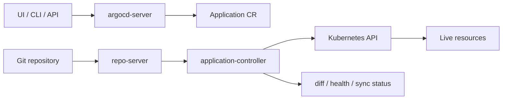

Các component chính:

| Component | Vai trò |
|---|---|
| `argocd-server` | API/UI/CLI endpoint, xử lý auth và request người dùng |
| `argocd-repo-server` | clone/render manifest từ Git, Helm, Kustomize hoặc plugin |
| `argocd-application-controller` | reconcile Application, diff desired/live state, sync tài nguyên |
| `argocd-dex-server` | optional SSO/OIDC connector |
| Redis | cache state, session hoặc data trung gian tùy chế độ triển khai |
| Application CR | object mô tả source repo, destination cluster/namespace và sync policy |

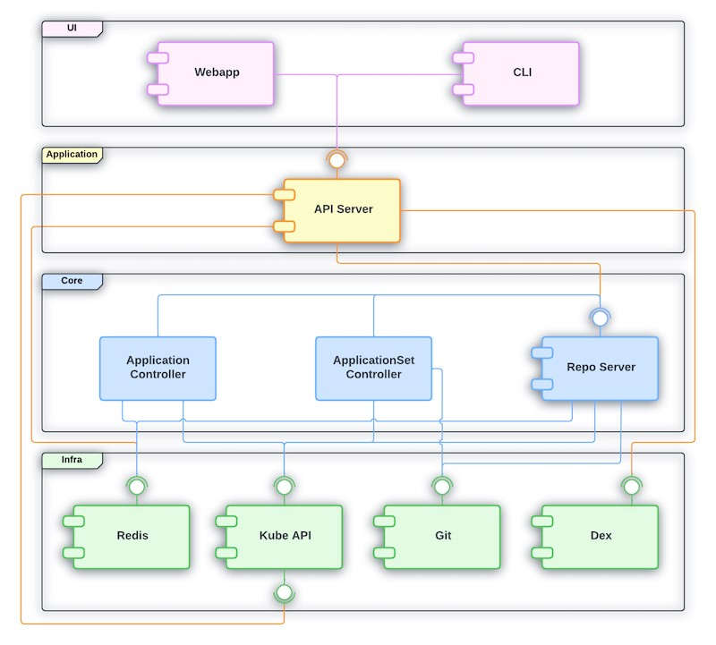

## Application

Một `Application` nối ba thứ:

- source: repo URL, path/chart, target revision;
- destination: cluster API server và namespace;
- project: boundary policy như repo nào được phép, cluster nào được deploy, namespace nào được chạm.

Ví dụ tối giản:

```yaml
apiVersion: argoproj.io/v1alpha1
kind: Application
metadata:
  name: app-a
  namespace: argocd
spec:
  project: default
  source:
    repoURL: https://example.com/platform/app-a.git
    targetRevision: main
    path: deploy
  destination:
    server: https://kubernetes.default.svc
    namespace: app-a
  syncPolicy:
    automated:
      prune: true
      selfHeal: true
```

Điểm cần hiểu:

- `targetRevision` quyết định commit/branch/tag/chart version nào là desired state.
- `path` quyết định thư mục manifest hoặc Kustomize base/overlay.
- `prune` xóa resource không còn trong Git.
- `selfHeal` sửa drift do thay đổi trực tiếp ngoài Git.
- Auto-sync rất mạnh, nhưng phải đi kèm review, policy và rollback rõ.

## Sync, Diff Và Health

Argo CD vận hành quanh ba trạng thái:

| Trạng thái | Ý nghĩa |
|---|---|
| Sync status | desired state và live state có khớp không |
| Health status | workload chạy ổn không, ví dụ Deployment available, Pod ready |
| Operation state | sync/rollback/hook đang chạy hay đã fail |

Command nền:

```bash
argocd app list
argocd app get app-a
argocd app diff app-a
argocd app sync app-a
argocd app history app-a
argocd app rollback app-a <revision-id>
```

Khi sync fail, đọc theo thứ tự:

1. Application condition và operation message.
2. Render output từ repo-server nếu Helm/Kustomize/plugin lỗi.
3. Kubernetes event của resource fail.
4. RBAC/policy nếu Argo CD không được phép apply resource.
5. Admission webhook/policy engine nếu API server reject manifest.

## GitOps Workflow

Luồng production nên là:

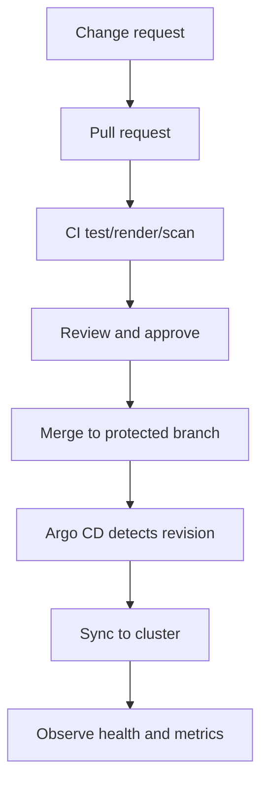

Nguyên tắc:

- Git là source of truth.
- Không dùng `kubectl edit` cho resource đang do Argo CD quản lý, trừ emergency có ghi nhận rõ.
- CI nên render manifest trước khi merge để bắt lỗi Helm/Kustomize sớm.
- Rollback nên rollback Git revision hoặc Argo CD app revision, không sửa tay live object.

## Multi-Tenancy

`AppProject` là ranh giới quan trọng nhất khi nhiều team dùng chung Argo CD.

Một project nên giới hạn:

- repo nào được phép deploy;
- cluster/namespace nào được phép deploy;
- resource kind nào được phép hoặc bị cấm;
- role nào được sync/get/update Application.

Ví dụ ý tưởng:

```yaml
apiVersion: argoproj.io/v1alpha1
kind: AppProject
metadata:
  name: team-a
  namespace: argocd
spec:
  sourceRepos:
    - https://example.com/team-a/*
  destinations:
    - server: https://kubernetes.default.svc
      namespace: team-a-*
  clusterResourceWhitelist:
    - group: ""
      kind: Namespace
```

Best practice:

- Tách project theo team, environment hoặc blast radius.
- Không để mọi team dùng `default` project không giới hạn.
- Hạn chế cluster-scoped resource nếu team chỉ cần namespace-scoped resource.
- Dùng RBAC của Argo CD kết hợp Kubernetes RBAC.

## Security

Các điểm hardening quan trọng:

- Bật SSO/OIDC thay vì chia sẻ local admin account.
- Tắt hoặc xoay password admin mặc định sau bootstrap.
- Dùng RBAC least privilege cho role sync/delete/override.
- Bảo vệ repo credentials bằng Secret management phù hợp.
- Không để Argo CD có cluster-admin nếu không thật sự cần.
- Review `prune`, `selfHeal`, hook và plugin vì chúng có thể thay đổi live cluster rất rộng.
- Chặn manifest nguy hiểm bằng policy engine như Kyverno/Gatekeeper nếu cluster dùng.

Checklist:

```bash
argocd account list
argocd proj list
argocd proj get <project>
kubectl get secret -n argocd
kubectl get applications -n argocd
```

Không paste token/repo credential vào note, ticket hoặc log. Dùng placeholder như `<TOKEN>` và secret manager trong triển khai thật.

## Scale Và Enterprise Operations

Khi số lượng Application tăng, các điểm dễ nghẽn là repo-server render, controller reconcile và Kubernetes API rate limit.

Triệu chứng:

- sync queue dài;
- repo-server CPU/memory cao;
- diff chậm;
- nhiều Application `Unknown` hoặc health update chậm;
- Kubernetes API throttling.

Hướng xử lý:

- Scale repo-server/controller theo mô hình Argo CD đang dùng.
- Tách Application theo App-of-Apps hoặc ApplicationSet có kiểm soát.
- Hạn chế manifest quá lớn hoặc plugin render chậm.
- Theo dõi metrics của Argo CD bằng Prometheus.
- Giới hạn auto-sync ở môi trường nhạy cảm, dùng sync window hoặc approval gate nếu cần.

## Troubleshooting Nhanh

| Triệu chứng | Kiểm tra |
|---|---|
| Application `OutOfSync` | `argocd app diff`, live drift, ignore differences |
| Sync fail do render | repo-server log, Helm values, Kustomize path, plugin |
| Sync fail do permission | Argo CD RBAC, Kubernetes RBAC, AppProject policy |
| Resource unhealthy | `kubectl describe`, workload event, probe, rollout |
| Không thấy repo/cluster | credential, repo secret, cluster secret, network/DNS |
| Auto-sync xóa nhầm | kiểm tra `prune`, project scope, Git revision, rollback |

```bash
kubectl logs -n argocd deploy/argocd-repo-server
kubectl logs -n argocd deploy/argocd-server
kubectl logs -n argocd sts/argocd-application-controller
```

## Full Source Coverage: Argo CD Up And Running

Deep pass của `_inbox/Argo-CD.docx` cho thấy tài liệu bao phủ các nhóm sau. Note này gom theo năng lực vận hành thay vì bám chương sách.

### Install And Architecture

Tài liệu nhấn mạnh Argo CD là Kubernetes controller-based system:

- Application controller là reconciliation loop chính.
- API server phục vụ UI/CLI/API và auth.
- Repo server render manifest từ Git, Helm, Kustomize hoặc plugin.
- Redis/cache giúp giảm chi phí truy vấn và lưu state trung gian.
- Dex/SSO, notifications và CLI là các phần mở rộng quan trọng trong deployment thực tế.

Khi cài đặt, hai đường phổ biến là manifest YAML upstream hoặc Helm chart. YAML giúp hiểu object thô; Helm phù hợp hơn khi cần quản trị values, upgrade và GitOps hóa chính Argo CD.

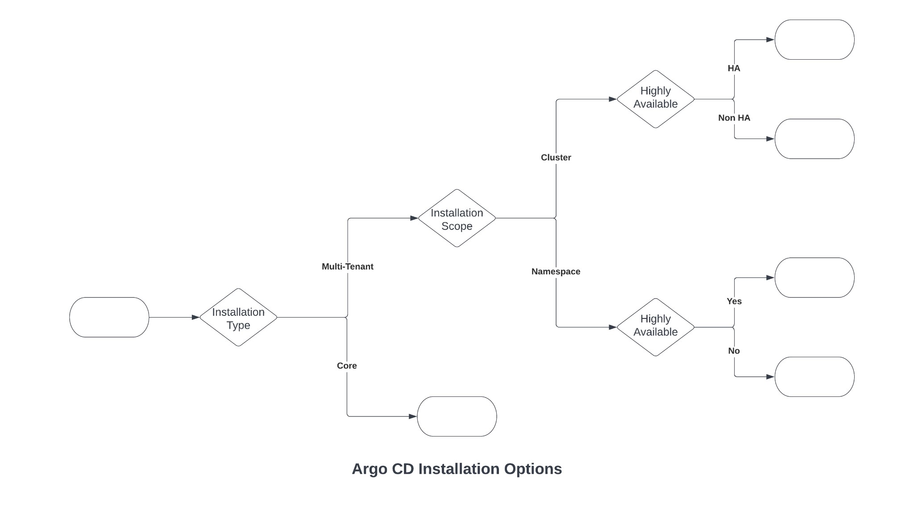

### UI, CLI And API Interaction

Source đi khá sâu vào UI, CLI và Swagger/API. Kiến thức bền vững cần giữ:

- UI hữu ích để đọc health, sync status, resource tree, history và diff.
- CLI hữu ích cho automation và troubleshooting nhanh.
- API/Swagger giúp tích hợp tool nội bộ, nhưng phải bảo vệ auth/RBAC chặt.
- Port-forward/host mapping trong lab chỉ là tiện ích học; production cần ingress/TLS/SSO đúng chuẩn.

Command nhóm này:

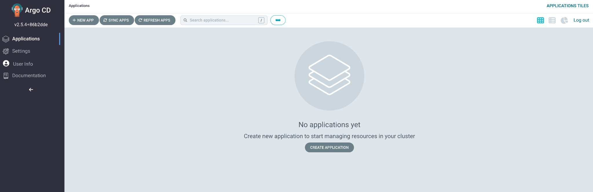

```bash
argocd login <argocd-server>
argocd app list
argocd app get <app>
argocd app diff <app>
argocd app sync <app>
argocd app history <app>
```

### Application Sources And Render Tools

Application source có thể là:

- plain Kubernetes YAML;
- Helm chart;
- Kustomize overlay;
- Jsonnet hoặc tool/plugin khác;
- multi-source pattern tùy phiên bản và cấu hình.

Điểm vận hành:

- Render lỗi ở repo-server thường không phải lỗi cluster.
- Helm values, chart version, Kustomize path và environment variable là nguồn lỗi phổ biến.
- Với custom plugin, cần kiểm soát binary, image, security context và input vì plugin mở rộng attack surface.

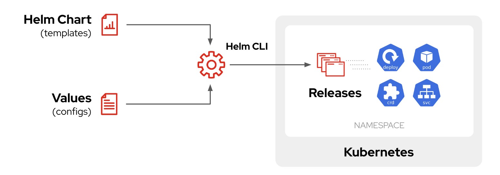

### Sync Options, Hooks And Waves

Source có phần đáng giá về sync behavior:

- sync option điều chỉnh validate, prune, apply strategy và namespace behavior;
- hook dùng cho tác vụ theo phase như PreSync, Sync, PostSync, SyncFail;
- hook deletion policy quyết định giữ/xóa hook resource sau khi chạy;
- sync wave điều khiển thứ tự apply resource;
- compare option và ignore difference giúp xử lý drift có chủ đích.

Pattern database schema setup trong source cho thấy hook/wave nên dùng cẩn thận: migration chạy sai thứ tự có thể gây outage. Với production, migration nên idempotent và có rollback.

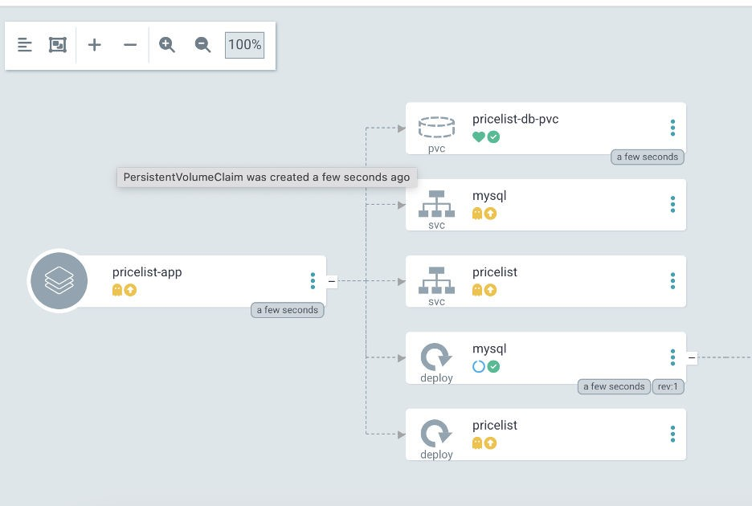

### Authentication, SSO And RBAC

Tài liệu có phần dài về local user, disable user, SSO/Dex/Keycloak và RBAC.

Operational rules:

- Local admin chỉ dùng bootstrap/break-glass.
- SSO/OIDC là mặc định tốt hơn cho team.
- Disable local user không dùng.
- RBAC phải gắn với project/team/action cụ thể.
- Anonymous access chỉ nên bật khi có lý do rất rõ và scope cực hẹp.

RBAC cần phân biệt:

```text
subject -> role -> permission -> object scope
```

Ví dụ permission nên trả lời: user/group nào được `get`, `sync`, `update`, `delete` Application nào trong project nào.

### Cluster Management

Argo CD có thể deploy vào local cluster hoặc remote cluster.

Các mô hình:

- local cluster: đơn giản cho lab/single cluster;
- hub-and-spoke: một Argo CD quản nhiều cluster;
- multi-Argo: mỗi environment/cluster có Argo CD riêng để giảm blast radius.

Khi add remote cluster, Argo CD cần credential đủ quyền trên cluster đích. Đây là điểm security rất nhạy: credential cluster không nên rộng hơn phạm vi cần deploy.

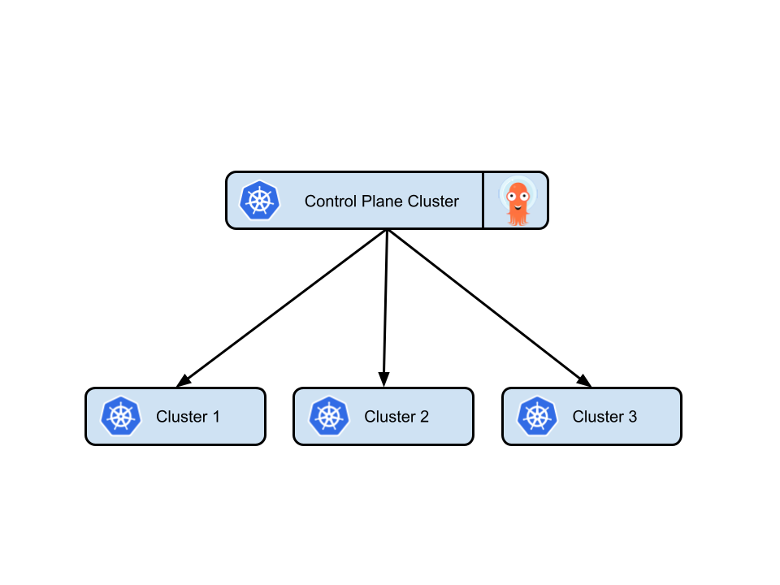

### App Of Apps And ApplicationSet

App-of-Apps dùng một Application cha để quản lý nhiều Application con. Pattern này hữu ích cho bootstrap platform, nhưng có thể làm blast radius lớn nếu parent app sync/prune sai.

ApplicationSet phù hợp khi cần generate nhiều Application từ:

- list of clusters;
- Git directories/files;
- matrix/merge generator;
- plugin generator.

Progressive sync giúp giảm rủi ro khi rollout nhiều Application/cluster, nhưng vẫn cần health gate và rollback path.

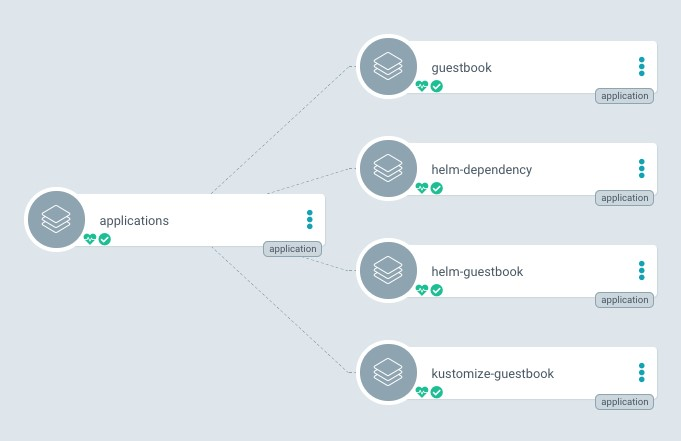

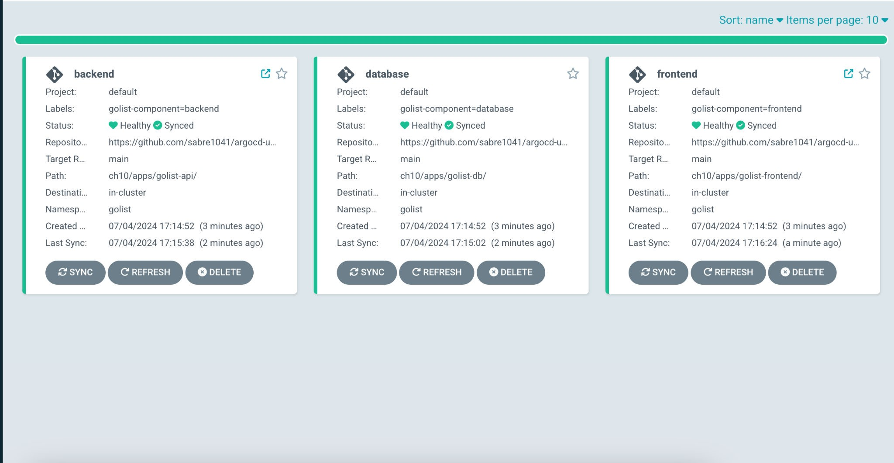

### Multi-Tenancy

Source nói rõ namespace-scoped install, Project, resource management và developer portal use case.

Multi-tenancy tốt cần:

- AppProject riêng cho team/environment;
- source repo allowlist;
- destination cluster/namespace allowlist;
- resource whitelist/blacklist;
- RBAC theo project;
- quota/resource ownership ở cluster;
- guardrail bằng admission policy nếu team có quyền tự deploy.

### Security

Các mảng security trong source:

- TLS cho Argo CD server.
- TLS certificate cho repository access.
- Protected repository.
- SSH based authentication.
- Credential template để reuse repo credential.
- GnuPG/signature verification để xác minh Git commit/tag/manifest provenance.

Điểm cần nhớ: GitOps không tự an toàn. Nếu repo credential, signing key hoặc Argo CD cluster credential bị lộ, attacker có thể biến GitOps thành đường deploy mã độc rất nhanh.

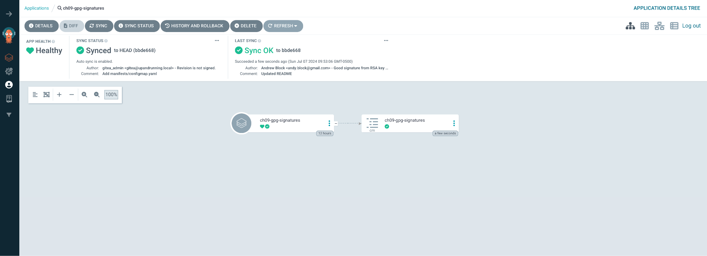

### Scale, Health And Eventual Consistency

Source nhấn mạnh drawback của Application model, probes, health check, eventual consistency và ApplicationSet/progressive sync.

Checklist scale:

- repo-server có đủ CPU/memory cho render Helm/Kustomize không;
- controller queue có tăng không;
- Kubernetes API có bị throttle không;
- health check custom có cần cho CRD không;
- probe của Argo CD component có phản ánh trạng thái thật không;
- eventual consistency có làm người vận hành hiểu nhầm trạng thái tức thời không.

### Extending Argo CD

Config Management Plugin là phần mở rộng mạnh nhưng rủi ro:

- plugin manifest định nghĩa cách discover/generate manifest;
- environment variable và parameter có thể ảnh hưởng output;
- plugin chạy code để render manifest, nên cần sandbox/least privilege;
- UI customization như custom style/toolbar chỉ nên dùng để tăng phân biệt environment, không thay thế policy/security.

Ví dụ use case hợp lý: toolbar màu khác nhau cho prod/staging để giảm thao tác nhầm môi trường.

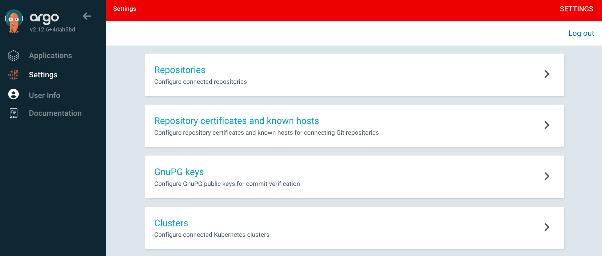

### Source Coverage Matrix

| Source section | Đã chuyển hóa vào note |
|---|---|
| Installing Argo CD, architecture, controller pattern | Install And Architecture, Mental Model |
| UI, CLI, API/Swagger | UI, CLI And API Interaction |
| Application sources: Git, Helm, Kustomize, tools | Application Sources And Render Tools |
| Sync options, hooks, sync waves, compare options, DB schema use case | Sync Options, Hooks And Waves |
| Users, admin password, local users, disable user, SSO/Dex/Keycloak | Authentication, SSO And RBAC |
| Cluster architecture, local vs remote, hub-and-spoke, add cluster CLI | Cluster Management |
| App of Apps, ApplicationSet, progressive sync | App Of Apps And ApplicationSet |
| Namespace-scoped install, Projects, resource management, developer portal | Multi-Tenancy |
| TLS, repository access, SSH auth, credential template, signature verification | Security |
| App drawbacks, probes, health checks, eventual consistency | Scale, Health And Eventual Consistency |
| Config Management Plugins, parameters, UI customization | Extending Argo CD |

## Related Pages

- [Helm Chart Và Kustomize](./Helm%20chart,%20Kustomize.md)
- [BlueGreen, Canary, Rolling](./BlueGreen,%20Canary,%20Rolling.md)
- [Secrets handling in CI/CD](./03-Secrets%20handling%20in%20CI%20CD.md)
