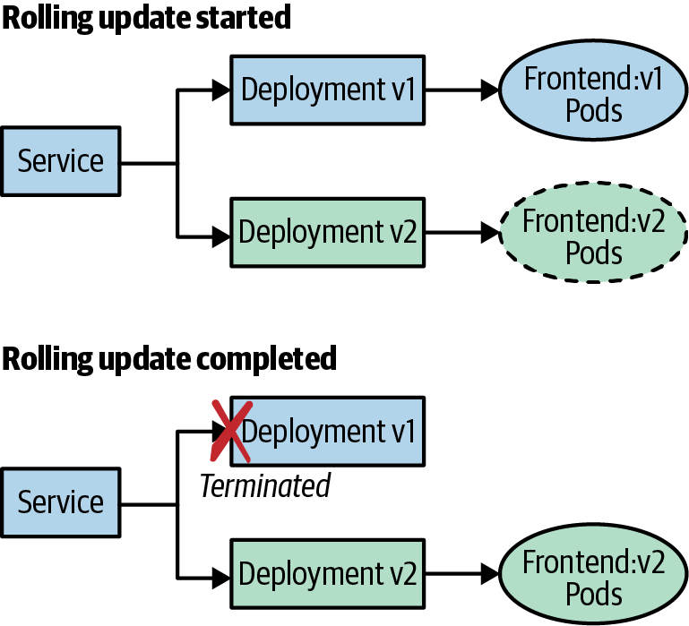
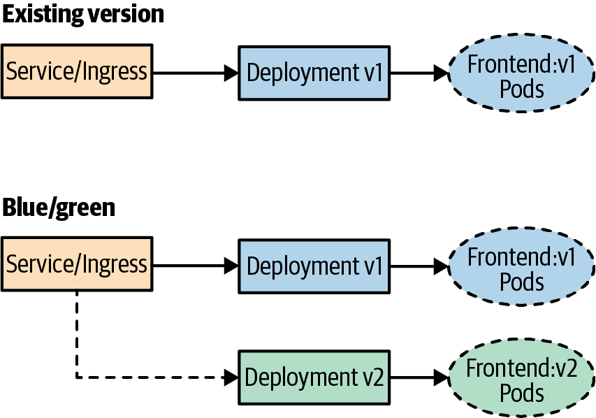
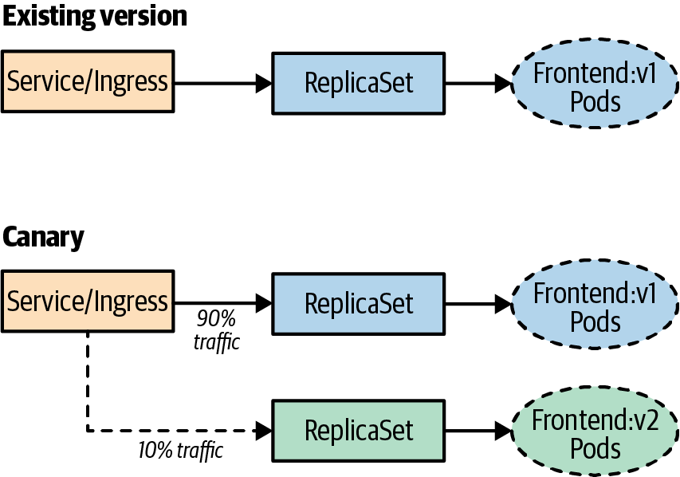

# Blue/Green, Canary Và Rolling Deployment

## Overview

Release strategy quyết định cách traffic đi từ version cũ sang version mới. Trong production, chọn strategy không chỉ dựa vào công cụ hỗ trợ gì, mà dựa vào rủi ro của ứng dụng: connection draining, database migration, backward compatibility, capacity, observability và khả năng rollback.

## Rolling Update

Rolling update thay dần Pod cũ bằng Pod mới. Kubernetes Deployment hỗ trợ trực tiếp strategy này thông qua `maxSurge` và `maxUnavailable`.



Mental model:

```text
Deployment template thay đổi
-> ReplicaSet mới được tạo
-> Pod mới Ready
-> ReplicaSet cũ scale down
-> Service chỉ route tới endpoint Ready
```

Ưu điểm:

- đơn giản, built-in với Deployment;
- không cần gấp đôi toàn bộ capacity nếu `maxSurge` nhỏ;
- phù hợp với stateless service có backward compatibility tốt.

Rủi ro:

- trong rollout sẽ có nhiều version cùng chạy;
- connection có thể bị rớt nếu app shutdown quá nhanh;
- schema/API phải tương thích với cả version cũ và mới;
- `rollout status` xanh không chứng minh business flow đúng.

Guardrails:

- readiness probe quyết định Pod mới có được nhận traffic hay không;
- `preStop` và `terminationGracePeriodSeconds` hỗ trợ graceful shutdown;
- `maxUnavailable=0` khi không muốn mất serving capacity;
- metric/error budget quyết định tiếp tục hay rollback.

Voi VM/bare metal va Ansible, rolling deployment thuong duoc kiem soat bang `serial` va nguong fail:

```yaml
- name: Deploy app gradually
  hosts: app
  serial: 2
  max_fail_percentage: 25
  tasks:
    - name: Deploy app version
      import_tasks: deploy-app.yml
```

`serial` gioi han so host duoc deploy cung luc; `max_fail_percentage` dung de abort neu loi vuot nguong. Neu service chi vua du capacity, chon `serial` nho va dam bao con it nhat mot backend healthy trong moi thoi diem.

Voi app server sau load balancer, pattern an toan hon la drain tung backend:

```text
disable backend in load balancer
-> deploy app on backend
-> wait_for local health/port
-> run smoke test
-> enable backend in load balancer
-> move to next backend
```

Ansible pattern:

```yaml
- name: Rolling deploy behind load balancer
  hosts: app
  serial: 1
  pre_tasks:
    - name: Disable backend before deploy
      command: lbctl disable {{ inventory_hostname }}
      delegate_to: "{{ item }}"
      loop: "{{ groups['load_balancer'] }}"
  tasks:
    - name: Deploy application
      import_tasks: deploy-app.yml
  post_tasks:
    - name: Wait for app health
      wait_for:
        host: "{{ inventory_hostname }}"
        port: 8080
        state: started
        timeout: 60
    - name: Enable backend after validation
      command: lbctl enable {{ inventory_hostname }}
      delegate_to: "{{ item }}"
      loop: "{{ groups['load_balancer'] }}"
```

Production guardrails:

- `pre_tasks` disable backend phai co rollback/cleanup neu deploy fail giua chung.
- `wait_for` chi check port; can them HTTP smoke test hoac metric check neu app co health endpoint.
- Neu load balancer co connection draining, doi drain xong truoc khi stop/restart app.
- Khong deploy tat ca backend cung luc neu khong co capacity du phong.
- Test failure path trong staging: backend fail deploy phai bi giu out-of-rotation, backend con lai van phuc vu duoc.

## Blue/Green Deployment

Blue/green giữ hai environment hoặc hai workload song song: version đang phục vụ traffic và version mới đã deploy sẵn. Traffic switch diễn ra ở Service, Ingress, Gateway, load balancer hoặc routing layer.



Ưu điểm:

- switch traffic có chủ đích;
- rollback nhanh bằng cách chuyển traffic về version cũ;
- test version mới trước khi nhận production traffic.

Rủi ro:

- cần capacity cho cả blue và green;
- database migration phức tạp vì transaction và schema phải tương thích;
- dễ thao tác nhầm nếu xóa hoặc scale cả hai environment;
- hybrid/legacy dependency có thể không chịu được hai version song song.

Với VM/EC2 truyền thống, blue/green thường được triển khai bằng cách launch server hoặc Auto Scaling Group mới từ AMI/template/bootstrap mới, chạy smoke test, rồi chuyển traffic ở load balancer hoặc DNS. Trước khi xóa môi trường cũ, cần xác nhận log/metric/business signal ổn định và còn rollback window đủ dài.

## Zero-Downtime Switchover Bằng Routing Layer

Với web/service stateless, zero-downtime deploy thường là bài toán routing hơn là bài toán “restart nhanh”. Có thể chạy version mới song song với version cũ, verify backend mới, rồi cập nhật routing layer như Nginx/HAProxy/Ingress/Gateway/service mesh để nhận traffic.

Workflow:

```text
start new backend version
-> run readiness/smoke test directly against backend
-> add backend to routing config/service discovery
-> wait for traffic and metrics healthy
-> drain/remove old backend from routing
-> stop old backend after rollback window
```

Config source có thể là static file rendered bởi automation, service discovery, key-value store như etcd/Consul, hoặc orchestrator control plane. Công cụ như `confd` từng được dùng để render Nginx/HAProxy config từ key-value store rồi reload proxy; trong Kubernetes, pattern tương đương thường là Service/Endpoint/Ingress/Gateway controller.

Production guardrails:

- Routing update phải idempotent và audit được: backend nào thêm/xóa, version nào, actor/pipeline nào.
- Proxy reload phải hỗ trợ graceful reload hoặc connection draining; nếu không, “zero downtime” chỉ là kỳ vọng.
- Không thêm backend mới vào pool trước khi health check trực tiếp pass.
- Không stop old backend bằng lệnh force nếu chưa drain xong và còn request đang xử lý.
- Rollback nhanh nhất là đưa old backend trở lại routing hoặc giảm traffic về version cũ, nhưng chỉ an toàn nếu database/schema/config backward-compatible.
- Key-value store/service discovery phải có quorum, backup và alert; mất quorum có thể làm hệ thống fail closed hoặc không cập nhật route mới.

## Canary Deployment

Canary đưa một phần nhỏ traffic sang version mới, quan sát signal, rồi tăng dần tỷ lệ nếu ổn.



Canary cần routing layer hỗ trợ chia traffic theo phần trăm, header, region, user segment hoặc feature flag. Ingress controller, Gateway API, service mesh hoặc progressive delivery controller thường đảm nhiệm phần này.

Điều kiện tối thiểu:

- biết steady state của service trước khi release;
- có metric phân biệt version cũ và version mới;
- có ngưỡng stop/rollback rõ ràng;
- dependency và schema chịu được nhiều version đồng thời.

## Testing In Production Và Chaos Experiment

Testing in production không có nghĩa là thử bừa trên người dùng thật. Đây là practice có kiểm soát để kiểm chứng resilience, scalability và user experience trong điều kiện production thật.


Trước khi thử nghiệm:

- xác định hypothesis và steady state;
- giới hạn blast radius theo namespace, region, percentage traffic hoặc user segment;
- có observability đủ để thấy tác động lên người dùng;
- có automation để rollback/stop experiment;
- bắt đầu nhỏ, tăng dần sau khi đã học được từ experiment trước.

Staging vẫn cần thiết, nhưng staging thường không giống production về traffic, data, quota, dependency, monitoring và user behavior. Vì vậy production experiment chỉ nên xuất hiện sau khi hệ thống đã có monitoring, alert, rollback và ownership rõ.

## Choosing A Strategy

| Strategy | Dùng khi | Cần chú ý |
|---|---|---|
| Rolling | stateless service, thay đổi nhỏ, app backward-compatible | readiness, graceful shutdown, schema compatibility |
| Blue/green | cần switch/rollback nhanh, đủ capacity kép | data migration, traffic switch, cleanup môi trường cũ |
| Canary | muốn giảm rủi ro theo từng phần traffic | metric theo version, routing control, stop criteria |
| Feature flag | muốn tách deploy khỏi release | flag lifecycle, config drift, cleanup flag cũ |

## Related Pages

- [Pipeline Stages: Build, Test, Deploy](../01-continuous-integration/02-Pipeline%20stages%20build,%20test,%20deploy.md)
- [Argo CD GitOps Operations](./04-argocd-gitops-operations.md)
- [Kubernetes Environment Promotion, Release Và Rollback](../../../03-compute-and-orchestration/03-container-orchestration/01-kubernetes/06-packaging-and-gitops/05-environment-promotion-release-and-rollback.md)
