# SBOM And Dependency Tracking

## Overview

Dependency tracking giup biet application phu thuoc package nao, version nao, source nao va artifact nao dang chay. SBOM khong tu dong lam he thong an toan, nhung no tao inventory de review, scan, incident response va upgrade.

## Threats

- Dependency confusion: package private bi resolve nham sang public registry co cung ten.
- Typosquatting: package co ten gan giong package hop le.
- Maintainer/package takeover: package hop le bi chiem quyen publish.
- Lockfile drift: CI build dung version khac local/review.
- Transitive dependency co CVE hoac code doc hai.

## Guardrails

- Cau hinh package manager uu tien private registry cho scope/package noi bo.
- Dat naming convention cho package private de tranh trung public namespace.
- Pin version bang lockfile va review lockfile diff.
- Khong dung `latest` cho dependency quan trong.
- Dung dependency review/SCA trong pull request.
- Tao SBOM gan voi artifact/image digest.
- Monitor package takeover/deprecation/CVE cho dependency quan trong.

## License And Open Source Intake

Open source trong production không chỉ là việc source code có xem được hay không. Một dependency chỉ nên được đưa vào product, platform hoặc pipeline khi license, nguồn phân phối, maintainer trust, patent risk và nghĩa vụ khi redistribute/SaaS đã được hiểu rõ. Đây là guardrail kỹ thuật cho engineering workflow, không thay thế legal review khi có nghi ngờ.

Mental model nhanh:

| Nhóm | Ý nghĩa vận hành |
| --- | --- |
| No license | Có source nhưng không có quyền reuse rõ ràng; mặc định phải block hoặc yêu cầu owner/license exception |
| Source-available | Có thể đọc source, nhưng license có thể vẫn hạn chế sửa, redistribute, dùng thương mại hoặc dùng để cung cấp hosted service |
| Freeware/shareware | Có thể miễn phí hoặc dùng thử, nhưng không đồng nghĩa với open source hoặc được quyền sửa/redistribute |
| Public domain | Có thể không có copyright restriction ở một số bối cảnh, nhưng không nên giả định an toàn nếu project không tuyên bố rõ và jurisdiction không rõ |
| Permissive license | Thường cho phép dùng, sửa, phân phối và thương mại hóa rộng hơn, nhưng vẫn phải giữ notice/copyright và điều khoản license |
| Weak/file-level copyleft | Thường giới hạn nghĩa vụ copyleft theo library hoặc file đã sửa; cần kiểm tra cách link, đóng gói và phân phối |
| Strong copyleft | Có thể yêu cầu source của derivative/combined work được phân phối theo cùng license, tùy license và cách tạo sản phẩm |
| Network copyleft | Có thể kích hoạt nghĩa vụ khi phần mềm được dùng để cung cấp service qua network, không chỉ khi ship binary |
| Commercial/dual license | Cùng một project có thể có bản community và bản thương mại với quyền/nghĩa vụ khác nhau |

Các điểm cần phân biệt khi review:

- `Copyright` bảo vệ code/tài liệu mặc định; việc repository public không tự tạo quyền copy/sửa/redistribute.
- License là điều kiện cấp quyền. Nếu vi phạm điều kiện, quyền sử dụng có thể bị chấm dứt và rủi ro chuyển thành vấn đề copyright/legal.
- `Distribution`, `conveying` hoặc ship artifact cho customer thường là trigger quan trọng hơn việc dependency chỉ nằm trong source tree.
- SaaS không phải lúc nào cũng là distribution, nhưng các license kiểu AGPL/network copyleft có thể đặt nghĩa vụ khi user tương tác qua network.
- Static linking, dynamic linking, vendoring, embedding vào appliance/container image và expose dưới dạng SDK có mức rủi ro khác nhau; không review bằng tên package alone.
- License compatibility có thể một chiều. Ví dụ một license có thể tương thích khi đưa vào project GPLv3 nhưng không tương thích với GPLv2-only.
- Patent grant/termination là rủi ro riêng. Apache 2.0 có language rõ hơn về patent so với nhiều license permissive ngắn, nhưng vẫn cần legal review cho sản phẩm thương mại hoặc tranh chấp patent.

Guardrails cho pipeline:

- Không merge dependency mới chỉ vì `npm install`, `pip install` hoặc image build chạy thành công.
- Gắn license scan với SBOM để biết artifact/image digest nào chứa package, version và license nào.
- Fail hoặc yêu cầu exception cho dependency `unknown`, `no license`, custom license, source-available hạn chế, hoặc license ngoài allowlist.
- Ghi usage mode cho từng dependency quan trọng: dev-only, build-time, runtime, static/dynamic linking, vendored source, container base image, redistributed SDK/appliance hoặc SaaS service.
- Khi redistribute binary, container image, appliance hoặc SDK, kiểm tra notice, copyright attribution, source offer, modified-file notice và third-party attribution bundle.
- Với LGPL/weak copyleft library, kiểm tra khả năng thay thế library, cách link và việc sửa trực tiếp vào library.
- Với GPL/AGPL/strong copyleft, yêu cầu legal/security review trước khi nhúng vào runtime product, customer-facing appliance hoặc hosted service.
- Lưu bằng chứng theo build ID, commit SHA và artifact/image digest để incident response biết bản phát hành nào bị ảnh hưởng.

Release gate nên block khi:

- Dependency không xác định license hoặc license file khác với metadata registry.
- Policy không cho phép license đó trong usage mode hiện tại.
- Thiếu NOTICE/source bundle/source offer cho artifact đã redistribute.
- Copyleft compatibility chưa được review cho derivative/combined work.
- Exception chưa có owner, expiry và bằng chứng review.

Rollback/remediation khi phát hiện license issue sau release:

1. Xác định artifact, image digest, release và customer scope chứa dependency đó.
2. Freeze release line liên quan nếu issue có thể tạo nghĩa vụ redistributing hoặc legal exposure.
3. Thay thế dependency, đổi license path hoặc tách component theo hướng đã được legal/security chấp thuận.
4. Rebuild artifact và SBOM, phát hành bản thay thế.
5. Nếu cần, bổ sung NOTICE/source bundle hoặc customer communication theo hướng dẫn legal/compliance.

## Non-Code Asset And Data License Intake

Pipeline không chỉ ingest source code. Documentation, diagram, screenshot, icon, font, dataset, database dump, model training data, map tile, media file và generated asset đều có thể tạo nghĩa vụ license khi được commit, build vào image, publish lên docs site, ship trong appliance hoặc dùng để train/evaluate model.

Mental model:

| Nhóm tài sản | Điều cần kiểm tra trước khi dùng |
| --- | --- |
| Documentation và tutorial | License của prose, hình minh họa, code snippet và bản in/PDF có thể khác nhau |
| Image, icon, audio, video | Cần quyền copy, modify, redistribute, attribution và commercial use; quyền cá nhân/trademark có thể tồn tại ngoài copyright |
| Font | License font có thể cho phép dùng để render nhưng hạn chế sửa, bundle hoặc redistribute font file |
| Dataset/database | License của database collection khác với license của từng record/item bên trong; DBMS không tự là một phần của database license |
| ML training data | Cần biết nguồn, license, consent, privacy và quyền dùng cho training/evaluation, không chỉ quyền download |
| Open access article | Open access nghĩa là truy cập được, không tự động đồng nghĩa với quyền reuse không giới hạn |

Creative Commons thường dùng cho nội dung, tài liệu và media hơn là software package. Bốn module chính là:

- `BY`: phải attribution, kèm license link và nêu thay đổi nếu có; không được ám chỉ tác giả endorse sản phẩm.
- `SA`: derivative/adaptation phải được chia sẻ theo cùng license hoặc license tương thích.
- `NC`: hạn chế commercial use; đây là vùng xám trong môi trường enterprise, training paid course, SaaS docs hoặc customer-facing product.
- `ND`: không được phân phối bản đã sửa/biến đổi; phù hợp để redistribute nguyên trạng hơn là chỉnh sửa hoặc dịch.

Các license/mark thường gặp:

| License/mark | Ý nghĩa intake |
| --- | --- |
| CC BY | Dễ dùng nhất trong nhóm CC core nếu attribution được quản lý đúng |
| CC BY-SA | Cần kiểm tra share-alike khi sửa, dịch, remix hoặc nhúng vào tài liệu phát hành |
| CC BY-NC | Không dùng cho customer-facing commercial deliverable nếu chưa có legal exception rõ |
| CC BY-NC-SA | Kết hợp rủi ro NC và SA; cần review kỹ trước khi đưa vào docs/product |
| CC BY-ND | Có thể redistribute nguyên trạng, nhưng tránh dịch, crop, annotate hoặc remix |
| CC BY-NC-ND | Mức hạn chế cao nhất trong nhóm CC core; thường không phù hợp làm material có chỉnh sửa trong KB/product |
| CC0 | Tác giả cố gắng từ bỏ quyền trong phạm vi luật cho phép; vẫn cần kiểm tra privacy, trademark và nguồn gốc |
| Public Domain Mark | Dấu hiệu cho tác phẩm được đánh dấu public domain; không giống một license cấp quyền mới |

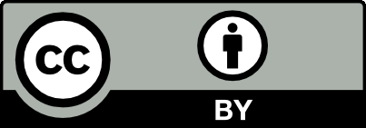

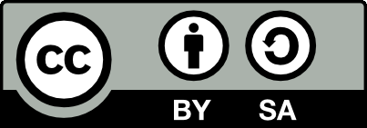

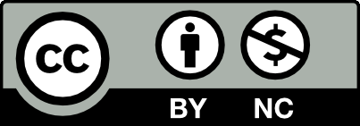

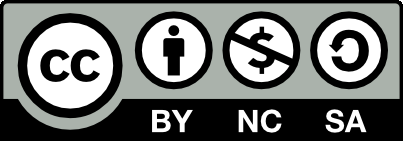

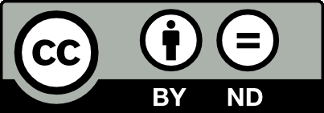

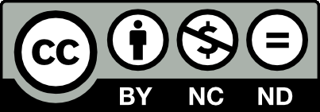

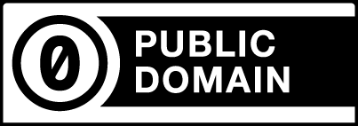

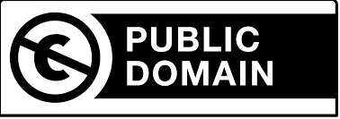

Pre-check trước khi publish asset hoặc dataset:

1. Xác định owner hoặc nguồn gốc hợp lệ của asset/dataset.
2. Xác nhận người publish có quyền cấp license cho asset đó.
3. Ghi license, attribution, source URL, retrieval date, checksum hoặc artifact digest vào inventory.
4. Phân loại usage: internal docs, public docs, training material, product UI, container image, customer deliverable, model training hoặc dataset redistribution.
5. Kiểm tra quyền sửa/dịch/crop/remix, commercial use, share-alike, no-derivatives, privacy, trademark và export/privacy constraints.
6. Với dataset, tách license của database/container dữ liệu khỏi license của từng record, file hoặc media item bên trong.
7. Với ML dataset, không dùng dữ liệu chỉ vì download được; cần provenance, consent/privacy review và policy về output/model risk.

License chooser có thể giúp giảm lỗi chọn nhầm license, nhưng vẫn phải xem như pre-check, không phải approval tự động.

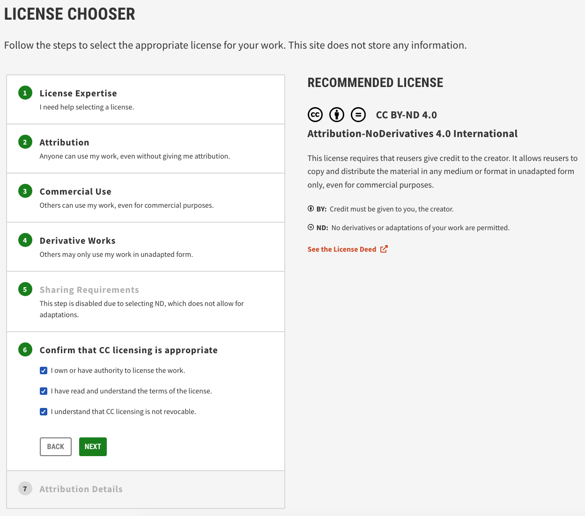

Khi publish web/docs, attribution nên được tạo thành HTML/notice có link tới license và giữ được thông tin sửa đổi. Build pipeline nên kiểm tra notice bundle giống như kiểm tra SBOM.

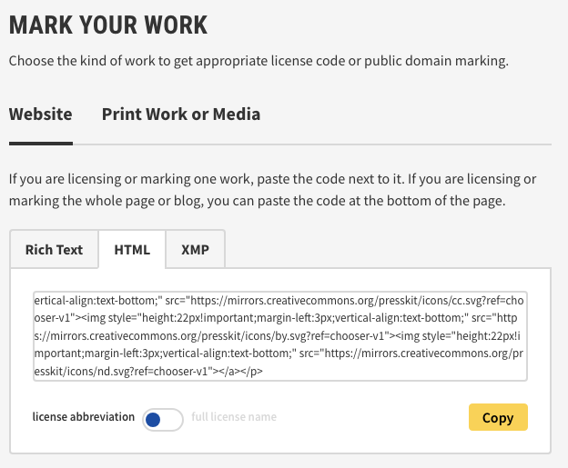

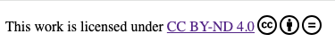

Release gate nên block asset/dataset khi:

- Không xác định được nguồn hoặc quyền cấp license.
- License không cho phép usage mode hiện tại.
- `NC`/`ND` được đưa vào commercial docs/product mà không có exception.
- `SA`/copyleft nội dung có nguy cơ áp điều kiện lên tài liệu downstream nhưng chưa được review.
- Attribution, license link, modification notice hoặc third-party notice bị thiếu.
- Dataset thiếu provenance, consent/privacy basis hoặc có record license lẫn lộn chưa phân loại.

## Checks

```bash
npm ls --all
npm audit
pip freeze
pipdeptree
```

Lenh tren chi la local signal. Production pipeline nen dung policy tap trung va ket qua scan co trace ve build ID/artifact digest.

## Incident Response

Khi phat hien dependency doc hai:

1. Xac dinh artifact/image nao chua package do.
2. Freeze deploy tu dependency source lien quan.
3. Rebuild voi version sach hoac remove dependency.
4. Rotate secret neu package co the da chay trong CI/runtime.
5. Kiem tra log/egress trong khoang thoi gian bi anh huong.

## Related Pages

- [CI/CD Threat Model And Attack Surface](./04-ci-cd-threat-model-and-attack-surface.md)
- [Image Scanning And Registry Integrity](./01-Image%20scanning.md)
