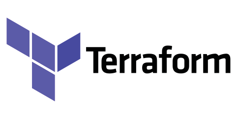
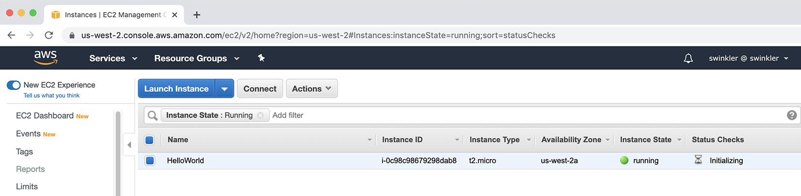

# Terraform Core Concepts and Workflow

## Terraform Là Gì

Terraform là IaC tool dùng để mô tả hạ tầng bằng HCL. Terraform đọc cấu hình, so với state và trạng thái thật từ provider, sau đó tạo execution plan.



Ví dụ tối giản:

```hcl
terraform {
  required_providers {
    local = {
      source  = "hashicorp/local"
      version = "~> 2.5"
    }
  }
}

resource "local_file" "example" {
  filename = "hello.txt"
  content  = "Hello Terraform"
}
```

## Declarative Khác Imperative Như Thế Nào

Imperative là mô tả từng bước phải làm gì:

```text
Tạo network
Tạo subnet
Tạo VM
Attach VM vào subnet
```

Declarative là mô tả kết quả mong muốn:

```text
Tôi cần một network, một subnet và một VM gắn vào subnet đó
```

Trong production, cách declarative giúp dễ review, dễ phát hiện drift và giảm sai lệch do thao tác tay.

## Provider

Provider là plugin cho phép Terraform gọi API của nền tảng bên ngoài. Không có provider, Terraform không biết cách tạo resource cụ thể.

```hcl
terraform {
  required_providers {
    aws = {
      source  = "hashicorp/aws"
      version = "~> 5.0"
    }
  }
}

provider "aws" {
  region = "ap-southeast-1"
}
```

File `.terraform.lock.hcl` được tạo sau `terraform init` để khóa provider version đã chọn. File này nên commit vào Git để team dùng cùng phiên bản provider.

Provider chủ yếu nhận input/configuration argument như region, endpoint, profile hoặc credential source. Không nên nhúng secret trực tiếp trong `provider` block; ưu tiên shared credential file, environment variable hoặc secret injection của CI/CD. Khi plan fail với lỗi authentication, hãy kiểm tra provider config và credential chain trước khi suy luận lỗi ở resource.

## Terraform Settings Block

Block `terraform` định nghĩa các thiết lập nền của root module, ví dụ Terraform version, provider version và backend.

```hcl
terraform {
  required_version = ">= 1.6.0, < 2.0.0"

  required_providers {
    aws = {
      source  = "hashicorp/aws"
      version = "~> 5.0"
    }
  }

  backend "s3" {
    bucket = "example-terraform-state"
    key    = "prod/network/terraform.tfstate"
    region = "ap-southeast-1"
  }
}
```

Trong team, `required_version` và `required_providers` giúp tránh việc mỗi người hoặc mỗi CI runner chạy bằng một version khác nhau.

### Provider Alias

Dùng alias khi cần nhiều cấu hình provider cùng loại, ví dụ nhiều region:

```hcl
provider "aws" {
  region = "ap-southeast-1"
}

provider "aws" {
  alias  = "dr"
  region = "ap-northeast-1"
}

resource "aws_s3_bucket" "backup" {
  provider = aws.dr
  bucket   = "example-backup-dr"
}
```

## Resource Và Resource Address

Resource là object hạ tầng Terraform quản lý, ví dụ VM, VPC, subnet, DNS record, bucket hoặc database.

```hcl
resource "resource_type" "local_name" {
  argument = "value"
}
```

Terraform định danh resource bằng address:

```text
aws_instance.web
module.network.aws_vpc.main
aws_instance.web[0]
aws_instance.web["api"]
```

Address rất quan trọng khi `import`, `state show`, `state mv`, `state rm` hoặc `apply -replace`.

### Argument, Attribute Và Computed Attribute

Trong Terraform, resource block có hai nhóm thứ cần phân biệt:

- `argument`: input người viết cấu hình truyền vào resource, ví dụ `ami`, `instance_type`, `tags`.
- `attribute`: output Terraform/provider trả về cho resource, có thể được resource khác tham chiếu.
- `computed attribute`: attribute chỉ biết sau khi provider tạo hoặc đọc remote object, thường hiển thị trong plan là `(known after apply)`.

Mental model:

```text
HCL arguments
-> provider API request
-> remote object
-> attributes/computed attributes
-> state
```

Khi review plan, `(known after apply)` không phải lỗi. Nó chỉ nói rằng giá trị như `id`, `arn`, `public_ip` hoặc `volume_id` chưa tồn tại cho đến khi provider thực thi API call. Với production, cần tập trung vào argument đang đổi và lifecycle của resource, vì đó mới là nguyên nhân dẫn tới create/update/replace/destroy.

### Data Source

`data` block dùng để đọc object đã tồn tại bên ngoài Terraform thay vì quản lý lifecycle của object đó.

```hcl
data "aws_ami" "ubuntu" {
  most_recent = true

  filter {
    name   = "name"
    values = ["ubuntu/images/hvm-ssd/ubuntu-*-amd64-server-*"]
  }

  owners = ["099720109477"]
}

resource "aws_instance" "web" {
  ami           = data.aws_ami.ubuntu.id
  instance_type = "t3.micro"
}
```

Data source có query constraint argument để lọc object và attribute để resource khác dùng lại. Nên xem data source là read-only dependency: Terraform đọc nó trong plan/apply, nhưng không destroy hay update object đó. Trong production, query quá rộng như "latest image" có thể làm plan thay đổi ngoài ý muốn khi vendor publish image mới; hãy pin filter, owner và tiêu chí chọn thật rõ.

## Dependency Giữa Resource

Terraform tự suy luận dependency khi resource này tham chiếu resource khác.

```hcl
resource "aws_instance" "web" {
  subnet_id = aws_subnet.app.id
}
```

Nếu không có reference trực tiếp nhưng vẫn cần thứ tự, dùng `depends_on`:

```hcl
resource "aws_instance" "web" {
  ami           = var.ami_id
  instance_type = "t3.micro"

  depends_on = [aws_security_group.web]
}
```

Không nên lạm dụng `depends_on`; ưu tiên dependency tự nhiên qua reference.

### Explicit Và Implicit Dependency

`depends_on` là explicit dependency: người viết cấu hình nói thẳng resource này phải chờ resource kia.

Reference như `subnet_id = aws_subnet.app.id` là implicit dependency: Terraform tự xây dependency graph từ các tham chiếu trong cấu hình.

Implicit dependency thường dễ maintain hơn vì dependency đi cùng dữ liệu thật sự được dùng. Explicit dependency chỉ nên dùng khi thứ tự là yêu cầu vận hành nhưng không thể biểu diễn qua reference.

## Resource Lifecycle Và Provider CRUD

Mỗi managed resource trong Terraform có thể hiểu như một object được provider quản lý bằng các thao tác CRUD:

```text
Create -> tạo object thật
Read   -> đọc object thật và refresh state
Update -> thay đổi object khi provider hỗ trợ update in-place
Delete -> xóa object thật khi destroy hoặc replace
```

Data source khác managed resource ở chỗ nó chỉ đọc dữ liệu. Data source không sở hữu lifecycle của object, nên Terraform không gọi `Delete` hay `Update` cho object đó.

Khi chạy `terraform plan`, Terraform thường đi qua các bước:

```text
đọc HCL configuration
-> đọc state
-> refresh/read object thật qua provider
-> dựng dependency graph
-> tính hành động: create, no-op, update, replace hoặc destroy
-> in execution plan
```

Điểm quan trọng khi review plan:

- `Read` có thể làm lộ drift: object thật khác với state hoặc khác desired state.
- Provider quyết định attribute nào có thể update in-place và attribute nào buộc replace.
- Một thay đổi nhỏ trong HCL có thể thành `-/+` nếu provider đánh dấu attribute đó là force replacement.
- `terraform graph` giúp hiểu dependency phức tạp, nhưng graph chỉ hữu ích khi code đã có boundary rõ.

Không nên suy luận rằng mọi resource đều update được tại chỗ. Với production, `-/+` phải được xem như destroy/create với identity mới, cần đánh giá downtime, backup, quota và rollback.

## Variable, Local Và Output

Input variable giúp cấu hình linh hoạt:

```hcl
variable "instance_type" {
  type        = string
  description = "EC2 instance type"
  default     = "t3.micro"
}
```

Khai báo type rõ giúp phát hiện lỗi sớm:

```hcl
variable "servers" {
  type = map(object({
    instance_type = string
    subnet_id      = string
  }))
}
```

Output trả thông tin sau apply hoặc truyền dữ liệu từ module con ra module cha:

```hcl
output "instance_public_ip" {
  value = aws_instance.web.public_ip
}
```

Không nên output secret nếu không thật cần. `sensitive = true` chỉ ẩn giá trị trong CLI, không đảm bảo giá trị không nằm trong state.

## Workflow CLI Cơ Bản

```bash
terraform init
terraform fmt
terraform validate
terraform plan
terraform plan -out=tfplan
terraform apply tfplan
terraform output
```

Trong lab, có thể kiểm chứng resource đã được tạo bằng cloud console hoặc lệnh đọc trạng thái như `terraform show`. Console giúp nhìn nhanh object thật, nhưng trong production không nên xem thao tác tay trên console là source of truth; source of truth vẫn là code, plan đã review, state/backend và audit trail của pipeline.



`terraform destroy` xóa toàn bộ resource đang được quản lý bởi root module hiện tại. Đây là lệnh nguy hiểm, chỉ dùng trong lab hoặc khi đã có quy trình hủy hạ tầng rõ ràng.

## Đọc Terraform Plan

Ký hiệu thường gặp:

```text
+ create
~ update in-place
-/+ destroy and then create replacement
- destroy
```

Nếu thấy `destroy` hoặc `replace`, phải đọc kỹ attribute nào gây thay đổi, resource đó có dữ liệu hay traffic production không, có backup và maintenance window chưa.

## Plan Là Pha Đọc, Apply Là Pha Ghi

Một mental model hữu ích khi review Terraform là tách rõ các pha:

```text
configuration + variables
-> provider schema
-> refresh/read remote objects
-> dependency graph
-> execution plan
-> apply CRUD operations
-> update state
```

`terraform plan` không chỉ “in diff”. Nó đọc configuration, đọc state, refresh trạng thái thật qua provider rồi tính hành động cần làm để đưa actual state về desired state. Vì vậy plan có thể fail trước khi apply nếu provider auth lỗi, schema không hợp lệ, dependency graph không dựng được hoặc remote API không trả lời.

Trong production, plan nên được xem như change request:

- `+` là tạo mới, thường ít rủi ro hơn nhưng vẫn có thể chạm quota hoặc security exposure.
- `~` là update in-place, cần đọc attribute đổi và impact runtime.
- `-/+` là replace, phải xem như destroy rồi create lại một resource identity mới.
- `-` là destroy, cần backup, owner approval và rollback/restore path rõ.

Không nên apply một plan vừa được generate lại ngoài pipeline nếu plan cũ đã được review. Plan review chỉ còn giá trị khi input, provider version, state và remote state không đổi đáng kể.
