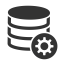
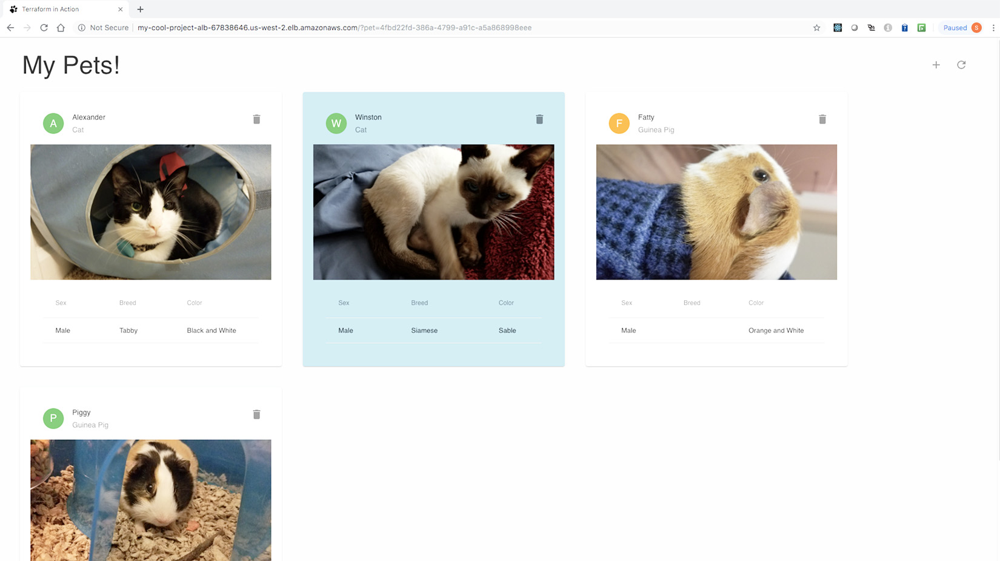
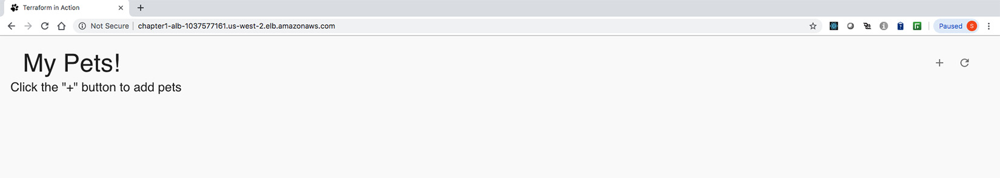

# Terraform Cloud Patterns and Advanced Use Cases

## Overview

Các pattern trong file này là phần ứng dụng nâng cao sau khi đã nắm project structure, state/backend, module và workflow production. Terraform có thể provision nhiều kiểu hạ tầng, nhưng mỗi pattern vẫn cần kiến trúc vận hành riêng ngoài phần code.

## Multi-Region

Dùng provider alias cho nhiều region:

```hcl
provider "aws" {
  region = "ap-southeast-1"
}

provider "aws" {
  alias  = "dr"
  region = "ap-northeast-1"
}
```

Có thể gọi cùng một module nhiều lần:

```hcl
module "network_primary" {
  source = "./modules/network"
  name   = "primary"
}

module "network_dr" {
  source = "./modules/network"
  name   = "dr"

  providers = {
    aws = aws.dr
  }
}
```

Triển khai đa vùng không chỉ là tạo resource ở hai region. Cần thiết kế thêm DNS failover, data replication, backup/restore, monitoring theo region, IAM/secret theo region và quy trình disaster recovery.

## Zero-Downtime Deployment

Terraform có thể hỗ trợ zero-downtime deployment khi resource model của provider cho phép tạo phiên bản mới trước khi gỡ phiên bản cũ. Pattern phổ biến là blue/green hoặc immutable infrastructure:

```text
version cũ đang nhận traffic
-> tạo version mới song song
-> health check version mới
-> chuyển traffic qua load balancer/DNS
-> giữ version cũ trong thời gian rollback
-> xóa version cũ sau khi ổn định
```

Các điều kiện cần kiểm tra trước khi kỳ vọng không downtime:

- Resource phải hỗ trợ chạy song song, ví dụ autoscaling group, launch template, instance group, target group hoặc function version.
- Tên resource, port, IP, hostname và quota không được làm `create_before_destroy` thất bại.
- Load balancer, health check và readiness signal phải phản ánh trạng thái ứng dụng thật, không chỉ trạng thái VM/container đang chạy.
- Database migration phải backward-compatible; Terraform không tự giải quyết rủi ro schema/data migration.
- Rollback phải có artifact/version cũ, cấu hình cũ và đường chuyển traffic ngược.

`create_before_destroy` chỉ là một guardrail ở lớp lifecycle, không phải bảo đảm zero-downtime. Nếu provider buộc replace resource có identity duy nhất, Terraform vẫn có thể cần xóa cũ rồi mới tạo mới. Với production, luôn đọc plan để tìm `-/+`, kiểm tra resource nào force replacement và xác nhận có đủ capacity/quota cho giai đoạn chạy song song.

## Serverless

Serverless thường gồm function, API gateway, event trigger, queue, object storage, IAM role và logging.

Terraform phù hợp để quản lý:

```text
IAM role
Lambda/function
API Gateway
SQS/EventBridge
CloudWatch log group
S3 trigger
```

Với hệ thống lớn, nên để CI build artifact rồi Terraform chỉ deploy artifact đã version hóa.

```text
CI build function artifact
        |
        v
Push artifact to storage/registry
        |
        v
Terraform deploy function version from artifact
```

## Multi-Tier AWS Web Application

Một web application ba tầng thường tách thành:

- Presentation layer: UI/static/frontend, nhận HTTP/HTTPS từ người dùng.
- Application layer: API hoặc web server xử lý business logic.
- Data layer: database hoặc persistent storage.




Với Terraform trên AWS, pattern cơ bản thường là:

```text
users
-> public load balancer
-> private EC2 autoscaling group / application instances
-> private database subnet
```

Các boundary quan trọng:

- Load balancer nằm public subnet và chỉ mở cổng cần thiết ra Internet.
- Application instances nằm private subnet, nhận traffic từ security group của load balancer.
- Database nằm private/database subnet, chỉ nhận traffic từ security group của application layer.
- Autoscaling group dùng launch template để chuẩn hóa AMI, user data, IAM instance profile và security group.

Ảnh dưới là ví dụ lab app sau khi triển khai; trong production cần HTTPS, domain/certificate, observability, backup database và quy trình rollback rõ ràng.



Các production caveat khi chuyển lab thành hệ thống thật:

- Không public HTTP port 80 làm endpoint chính; dùng HTTPS/443 với certificate quản lý qua ACM hoặc cơ chế tương đương.
- Không dùng IAM policy quá rộng như `logs:*` hoặc `rds:*`; giới hạn action/resource theo nhu cầu thật của instance.
- Không output database password ra terminal/pipeline log. Secret có thể nằm trong state, output và plan; cần backend có encryption, access control và audit.
- Không đặt `skip_final_snapshot = true` cho database production nếu chưa có backup/restore policy thay thế.
- Không tải application artifact trực tiếp từ URL "latest" trong cloud-init cho production; CI nên build artifact có version, lưu vào registry/storage đáng tin cậy, rồi Terraform hoặc deployment system trỏ tới version đó.
- `most_recent = true` cho AMI tiện trong lab nhưng có thể làm rolling change ngoài ý muốn; production nên có image promotion workflow.

Một triển khai lab có thể hiển thị app rỗng sau khi apply xong:



## Container Infrastructure

Terraform có thể tạo container infrastructure như:

- ECS cluster, service và task definition.
- EKS cluster, node group và addon.
- Kubernetes namespace, deployment, service, ingress.

Tuy nhiên cần phân định rõ:

```text
Terraform tạo nền tảng cluster và resource nền
Helm/GitOps triển khai workload ứng dụng
```

Trong production, thường tách:

```text
State 1: tạo cluster
State 2: cấu hình addon nền
State 3: triển khai workload qua GitOps/Helm
```

## Static Infrastructure Và Dynamic Infrastructure

Một lỗi thiết kế phổ biến là bắt Terraform redeploy toàn bộ stack mỗi khi application code thay đổi. Terraform mạnh ở lớp static infrastructure: network, IAM, cluster, load balancer, repository, registry, pipeline và service shell ban đầu. Application artifact, image tag, config runtime và rollout thường thay đổi nhanh hơn, nên nên đi qua CI/CD hoặc GitOps.

Mental model:

```text
Terraform
-> tạo nền tảng ổn định: network, IAM, registry, pipeline, runtime service

CI/CD hoặc GitOps
-> build/test/publish artifact
-> deploy version ứng dụng
-> health check và rollback
```

Khi dùng Terraform để dựng CI/CD pipeline, tách rõ hai luồng:

- Static apply: tạo source repo, build trigger, service account, registry, Cloud Run/ECS/EKS nền.
- Dynamic deploy: commit ứng dụng kích hoạt build, publish image và rollout version mới.

Nếu Terraform phải quản lý cả image version, hãy đảm bảo plan/apply không trở thành bottleneck cho mọi deploy ứng dụng và rollback vẫn nhanh hơn việc chờ một root module lớn refresh toàn bộ cloud.

## Multi-Cloud

Terraform hỗ trợ multi-cloud vì provider là plugin độc lập.

```hcl
provider "aws" {
  region = "ap-southeast-1"
}

provider "cloudflare" {
  api_token = var.cloudflare_api_token
}
```

Multi-cloud không tự động làm hệ thống portable. Mỗi cloud vẫn có resource model khác nhau. Nên dùng Terraform để chuẩn hóa workflow, không nên kỳ vọng một module dùng y nguyên cho mọi cloud nếu semantics khác nhau.

## Cloud-Agnostic

Cloud-agnostic là khả năng ứng dụng hoặc platform vận hành trên nhiều cloud mà không phụ thuộc quá sâu vào API hoặc service riêng của một provider.

Các đặc điểm thường nhắc tới:

- Interoperability: hoạt động được trong nhiều môi trường cloud.
- Portability: dễ migrate hoặc deploy qua cloud khác.
- Independence: giảm phụ thuộc vào API hoặc service đặc thù.
- Flexibility: có khả năng chọn hoặc thay đổi provider theo nhu cầu.

Terraform hỗ trợ workflow multi-provider, nhưng cloud-agnostic không chỉ đến từ Terraform. Thường cần kết hợp container, Kubernetes, chuẩn hóa network/storage interface, observability và quy trình release độc lập provider.

Không nên theo đuổi cloud-agnostic tuyệt đối nếu nó làm kiến trúc phức tạp hơn giá trị nhận được. Với nhiều hệ thống, cách thực tế hơn là giảm lock-in ở các lớp quan trọng và chấp nhận dùng managed service khi lợi ích vận hành đủ lớn.

