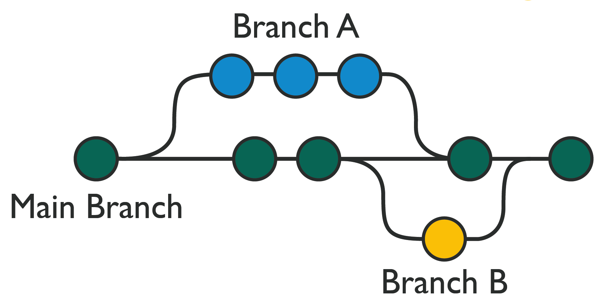
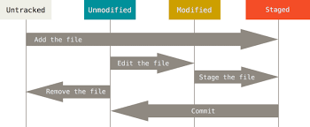

# Git Principles
Git là công cụ dòng lệnh (CLI) hoặc công nghệ nền tảng cho phép phiên bản hóa mã nguồn và sự cộng tác giữa nhiều nhà phát triển. Còn Github là kho chứa mã dựa trên Git có thể truy cập công khai, nơi bạn đẩy code của mình lên. Và nó có một giao diện web nơi bạn có thể mời các nhà phát triển mới, quản lý dự án, quản lý các vấn đề (issues) với dự án, thêm tài liệu cho code, v.v

## Mental Model

Git là distributed version control: mỗi developer có bản sao lịch sử đầy đủ ở local, làm việc trên working tree/staging area/commit history, rồi đồng bộ với remote repository khi cần. Nền tảng như GitHub/GitLab/Bitbucket không thay thế Git; chúng thêm workflow cộng tác như pull request/merge request, issue tracker, wiki, access control và CI/CD integration.

Trong production engineering, repository không chỉ là nơi chứa code. Nó là nguồn sự thật cho source, pipeline, infrastructure-as-code, tài liệu vận hành, release tag và audit trail của thay đổi.

## Các khái niệm cơ bản

**Repo:** chứa dữ liệu của dự án code,… gồm repo localhos và remote trên các máy server server.

**Commit:** thay đổi, thêm sửa, xóa file, code thì mỗi lần nvay là 1 conmit.

**Branch:** nhánh trong git, tách thành các nhánh để code dễ hơn ( mỗi chức năng là 1 nhánh).

**Tag:** tên ổn định trỏ đến một commit cụ thể, thường dùng để đánh dấu release, milestone hoặc artifact provenance.

**Pull request / Merge request:** yêu cầu review và merge thay đổi từ một branch/fork vào branch đích. Đây là control point để chạy CI, review security/compliance, kiểm tra tài liệu và thảo luận thiết kế trước khi thay đổi đi vào nhánh chính.

**Submodule / Subrepository:** cách tham chiếu một repository độc lập bên trong repository khác. Dùng khi cần giữ dependency ở một lịch sử riêng, nhưng phải kiểm soát version pin, quyền truy cập và quy trình update rõ ràng.

## Branch, Merge Và Release Flow

Branch là dòng phát triển song song. Nhánh giúp cô lập feature, bug fix hoặc release stabilization trước khi merge về nhánh chính.



Một flow thực dụng:

```text
main/trunk
-> short-lived feature branch
-> pull request / merge request
-> CI test + review
-> merge to main
-> release tag
-> deploy artifact built from tagged commit
```

Guardrails:

- giữ feature branch ngắn hạn để giảm merge conflict và drift khỏi `main`;
- chạy CI trên pull request trước khi merge, không chỉ sau merge;
- commit message nên nêu lý do thay đổi và link issue/ticket khi có;
- tag release phải trỏ đến commit đã build/test, không tag tùy tiện sau khi artifact đã publish;
- branch release chỉ nên nhận bug fix/security fix cần thiết, tránh thêm feature vào giai đoạn ổn định;
- repository public không có nghĩa ai cũng được write; quyền write/merge cần gắn với reviewer/maintainer rõ ràng.

Khi có conflict, Git đánh dấu vùng khác nhau trong file để người sửa chọn phiên bản đúng hoặc kết hợp lại. Không giải conflict bằng cách “chọn đại cho hết marker”; cần hiểu logic nghiệp vụ, chạy test liên quan và nhờ reviewer kiểm tra nếu conflict nằm ở code nhạy cảm.

## Centralized Và Distributed VCS

Git là distributed VCS: local clone có lịch sử đầy đủ nên developer có thể commit, diff, branch và inspect history khi offline. Subversion/CVS là mô hình centralized hơn: lịch sử chính nằm trên server trung tâm, client phụ thuộc nhiều hơn vào server khi thao tác.

Trong môi trường hiện đại, Git thường là lựa chọn mặc định vì branch/merge nhanh, offline workflow tốt và ecosystem CI/CD rộng. SVN/CVS chỉ nên giữ khi có legacy requirement, tooling nội bộ hoặc migration risk chưa được xử lý.

## Thao tác cơ bản 

- Xem cấu hình cơ bản của git 
```bash
git config --list
```

- Thiết lập username/email cho git 
```bash
git config --global user.name "username"
git config --global user.email "email"
```

### Các trạng thái cơ bản của file trong git
- **Untracked:** không đươc theo dõi bởi git

- **Unmodified:** không có thay đổi gì
- **committed :** Dữ liệu đã lưu trữ an toàn tên local
- **modified :** Dữ liệu có sự thay đổi nhuwg chưa thực hiện lưu trữ local
- **staged :** Đánh dấu các file sử đổi **modified** chuẩn bị **commit **




