# Go Orchestrator Implementation Patterns

Note này gom các pattern Go quan trọng khi hiện thực một orchestrator nhỏ: manager, worker, scheduler, queue, store, runtime adapter, HTTP API và CLI. Nội dung được rút từ `_inbox/build-an-orchestrator-in-go-from-scratch.md`, nhưng được tổ chức lại theo concept bền vững thay vì theo chapter.

## Mental Model Tổng Thể

Orchestrator trong source tiến hóa theo một trục rất rõ: bắt đầu từ domain model compile được, thêm runtime adapter, thêm worker queue, expose worker API, thêm metrics, thêm manager API, rồi refactor scheduler/store/CLI. Nếu nhìn bằng Go design, đây là bài học về cách biến mental model thành package boundary.

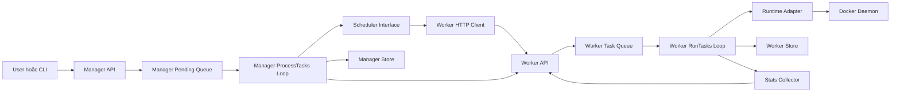

Điểm quan trọng: manager và worker đều là service có state riêng. API chỉ là boundary nhận request; loop mới là nơi reconcile intent thành hành động thật.

## Package Boundary

Một layout tốt không chỉ là chia folder cho đẹp. Nó phải thể hiện ai sở hữu behavior nào:

```text
task/       Task, TaskEvent, State, transition validation
worker/     queue, RunTasks, StartTask, StopTask, UpdateTasks, CollectStats
manager/    pending queue, SendWork, UpdateTasks, DoHealthChecks
scheduler/  Scheduler interface, RoundRobin, E-PVM
node/       worker node identity, stats client
store/      Store interface, memory store, persistent store
runtime/    Docker SDK wrapper hoặc container runtime adapter
cmd/        Cobra command, flags, process entrypoint
```

Nếu package `manager` phải biết chi tiết `bolt.Tx`, `docker.ContainerCreate`, hoặc cách parse `/proc/stat`, boundary đã bị thủng. Những chi tiết đó nên nằm sau `store`, `runtime`, `node` hoặc `stats`.

## Task Lifecycle

Source dùng 5 state chính: `Pending`, `Scheduled`, `Running`, `Completed`, `Failed`. Đây không chỉ là enum; nó là contract giữa API, manager, worker, store và runtime.

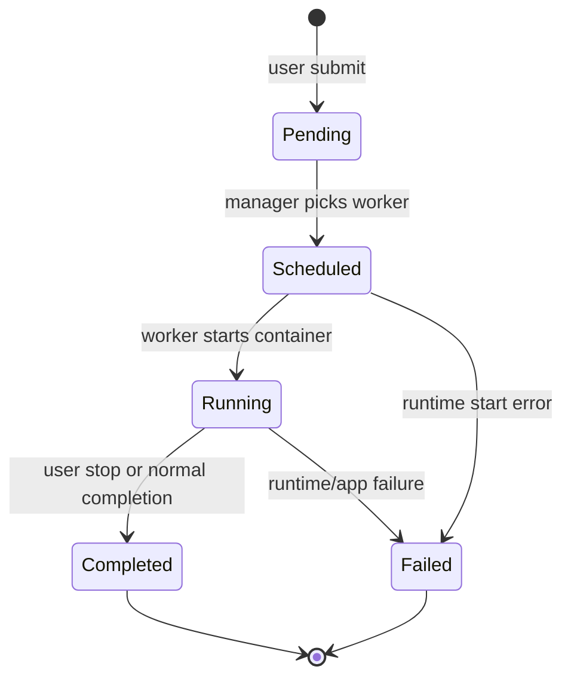

Prototype có thể hard-code transition bằng `map[State][]State`. Production code nên có error rõ cho invalid transition và nên test state machine độc lập.

## Desired State Và Current State

Trong source, queue được dùng như desired state, còn DB/store là current known state. Đây là một chi tiết rất dễ bỏ qua nhưng cực kỳ quan trọng.

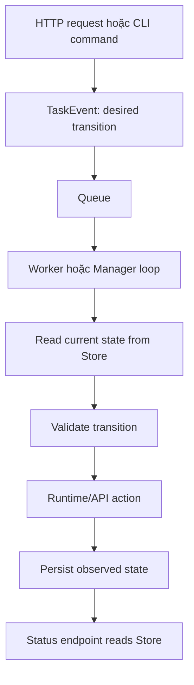

Không nên để handler mutate store như thể hành động đã hoàn tất. Handler chỉ nên nói "đã nhận intent". Trạng thái thật phải đến từ loop sau khi runtime/API call trả kết quả.

## Worker Internal Flow

Worker là node agent của orchestrator. Nó nhận task từ manager, queue lại, chạy container qua runtime adapter, lưu state và expose status/metrics.

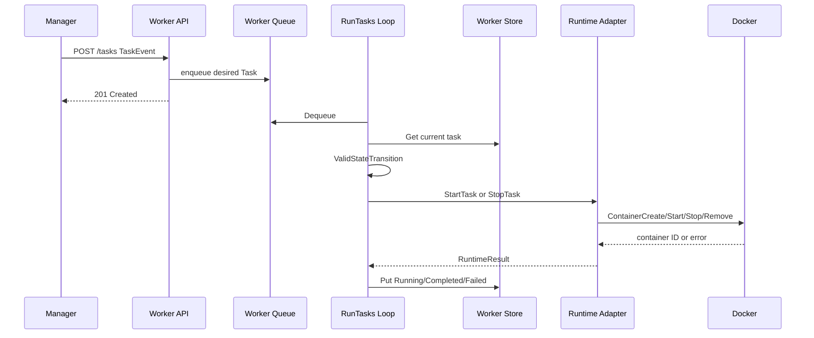

Source bắt đầu bằng `map[uuid]*Task`, nhưng sau đó refactor sang `Store` interface. Bài học Go ở đây là: cứ prototype bằng map để học flow, nhưng đừng để manager/worker phụ thuộc vĩnh viễn vào map.

## Manager Internal Flow

Manager là control-plane service. Nó nhận request từ user/CLI, quyết định worker, gọi worker API, rồi poll worker để cập nhật view của mình.

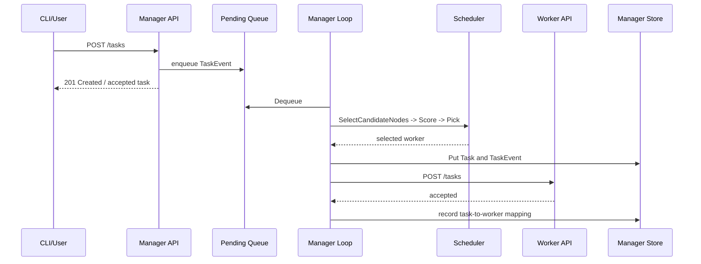

Một điểm sâu trong source: `GET /tasks` từ manager có thể chưa thấy `ContainerID` ngay sau `POST /tasks`, vì manager update view bằng vòng `UpdateTasks` polling worker. Đây là eventual consistency ở mức rất nhỏ.

## Stop Task Bug Khi Có Nhiều Worker

Khi chỉ có một worker, stop task có vẻ chạy đúng. Khi có ba worker, nếu manager gọi scheduler lại cho event stop, xác suất chọn nhầm worker tăng lên. Source chỉ ra bug này rất hay: stop/update existing task không phải scheduling decision mới.

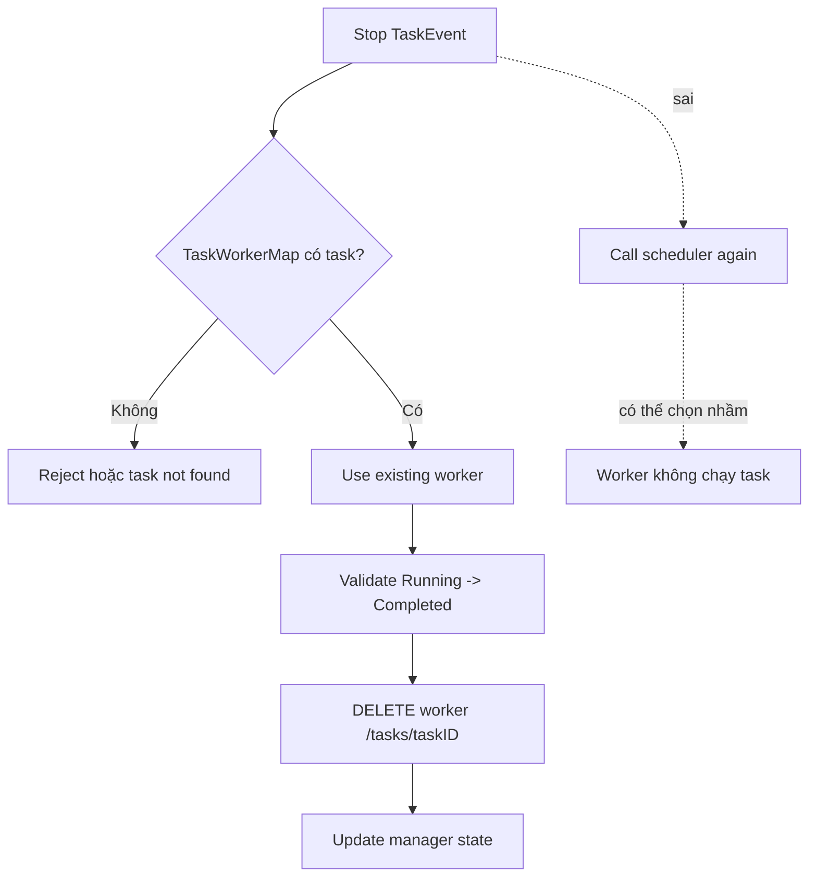

Rule: create/start task dùng scheduler; stop/restart/update task đang tồn tại dùng mapping hiện có, trừ khi có logic reschedule rõ ràng.

## Scheduler Interface

Source refactor scheduler thành ba phase: filter, score, pick. Đây là một interface tốt vì nó mô tả đúng domain, không leak implementation.

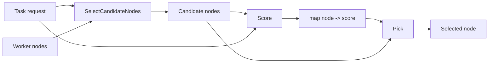

Round-robin chỉ cần policy đơn giản: node tiếp theo được score tốt nhất. E-PVM-style scheduler dùng resource view: disk filter trước, sau đó tính cost dựa trên CPU/memory/task count. Điểm học Go là interface cho phép manager giữ nguyên flow, còn policy thay đổi bằng implementation khác.

## Node Stats Không Nên Nằm Trong Scheduler

Source ban đầu có helper lấy `/stats` trong scheduler, sau đó refactor sang `Node.GetStats()`. Đây là một boundary rất đáng nhớ:

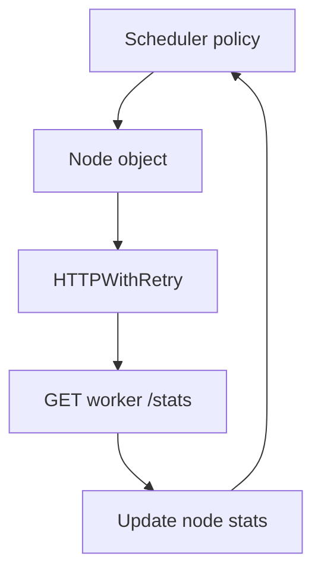

Scheduler nên nhận node đã có stats hoặc gọi method của node; nó không nên tự biết URL endpoint, decode JSON, retry HTTP. Nếu không, policy scheduling bị trộn với network client.

## Worker Metrics Flow

Worker metrics trong source đi từ Linux `/proc` và disk stat vào một `Stats` struct, sau đó expose qua `/stats`.

```mermaid
flowchart LR
    ProcStat[/proc/stat] --> StatsCollector[CollectStats Loop]
    MemInfo[/proc/meminfo] --> StatsCollector
    LoadAvg[/proc/loadavg] --> StatsCollector
    Disk[Filesystem Stat] --> StatsCollector
    StatsCollector --> Snapshot[Worker.Stats Snapshot]
    Snapshot --> StatsAPI[GET /stats]
    StatsAPI --> Manager[Manager/Scheduler]
```

Điểm học Go: collector chạy nền cập nhật snapshot; HTTP handler chỉ encode snapshot. Handler không nên đọc `/proc` trực tiếp trên mỗi request nếu có thể tránh.

## Health Check Và Restart Flow

Source tách health thành hai lớp:

- worker inspect container bằng Docker API để biết runtime state;
- manager gọi health endpoint của app để biết application health.

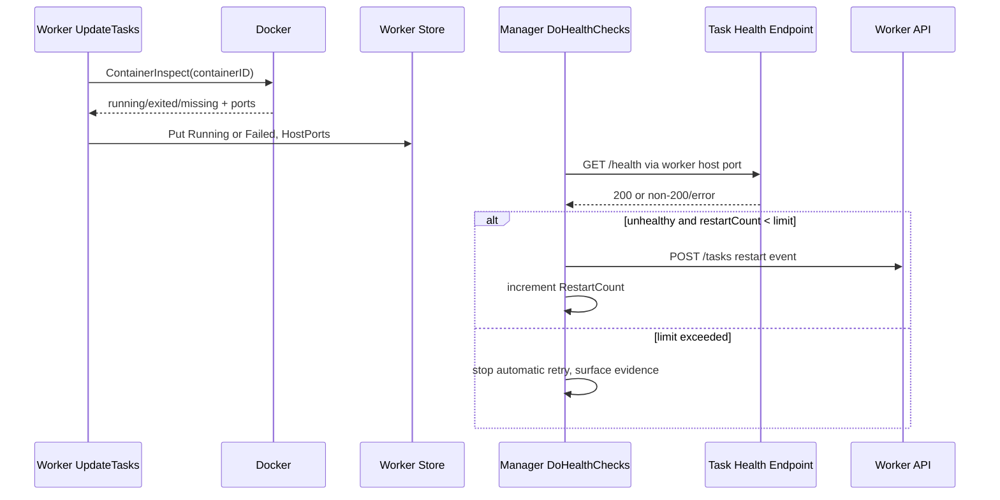

Không gọi được worker API, container exit, app health fail và manager mất state là bốn failure khác nhau. Nếu gom hết thành "task chết", orchestrator dễ tạo duplicate hoặc restart sai nơi.

## Store Interface Và Persistence

Source refactor store theo cùng chiến lược với scheduler: tạo interface trước, rồi có memory implementation và persistent implementation.

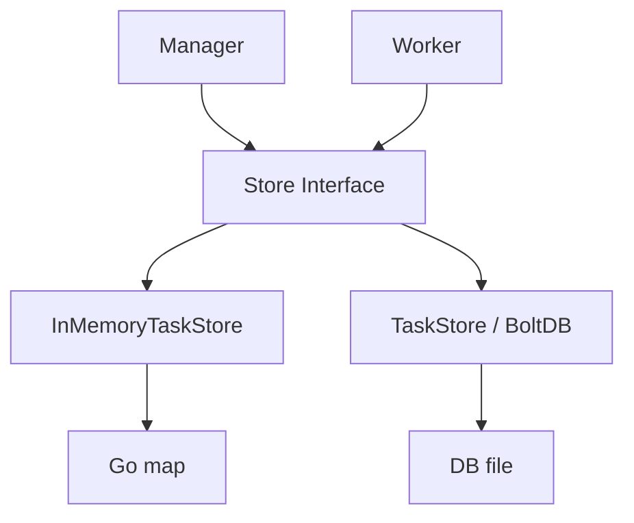

Interface tối thiểu:

```text
Put(key, value)
Get(key)
List()
Count()
```

Source cố ý không có `Delete` vì store cũng là lịch sử task/event. Production có thể cần delete/compact, nhưng khi đó phải có retention policy.

## BoltDB Boundary

Persistent store trong source dùng embedded key-value database. Pattern tổng quát:

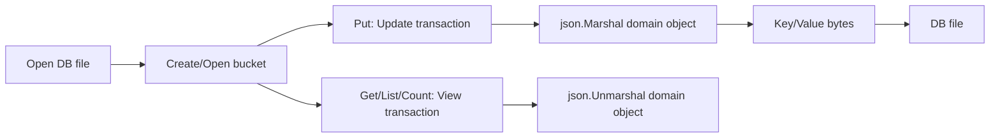

Điểm học Go:

- `View` dùng cho read-only transaction;
- `Update` dùng cho write transaction;
- domain object phải được serialize, source dùng JSON;
- `Close()` cần tồn tại vì store giữ file handle;
- bucket đã tồn tại khi restart không nên được coi như lỗi chết người;
- persistent local file giúp restart không mất state, nhưng không giải quyết HA manager.

## CLI Boundary

Cobra trong source không chỉ để "cho đẹp CLI". Nó tách process mode thành command rõ ràng:

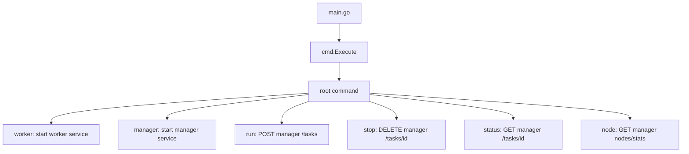

Có hai nhóm command:

- service command: `worker`, `manager` chạy process dài hạn, mở API, start goroutine;
- client command: `run`, `stop`, `status`, `node` gọi manager API rồi thoát.

CLI phải đi qua manager API để giữ source of truth. Nếu CLI ghi thẳng vào store hoặc gọi worker để start task, nó bypass scheduling, audit, task-to-worker mapping và state machine.

## Deep Lessons Từ Source

Các bài học Go quan trọng hơn bản thân orchestrator:

- Skeleton compile được giúp validate mental model sớm.
- `TaskEvent` là object nội bộ để chuyển state, không chỉ là request body.
- Queue và store không thay thế nhau: queue là intent, store là evidence.
- API handler nên làm ít việc: decode, validate, enqueue, response.
- Long-running loop cần lifecycle: context, timeout, backoff, shutdown.
- Interface có ích khi nó cắt dependency thật: scheduler, store, runtime, worker client.
- Dùng `interface{}` trong Store prototype làm code linh hoạt nhưng kéo theo type assertion và lỗi runtime; production nên cân nhắc typed repository hoặc generics.
- Metrics nên được snapshot bởi background loop, không đọc trực tiếp trong handler.
- Retry HTTP nên nằm ở client/node layer, không rải trong scheduler.
- Health check cần phân biệt runtime state, app state, node reachability và manager state.
- CLI là UX của control plane, không phải đường tắt quanh control plane.

## Checklist Thiết Kế

- Handler có chỉ nhận intent và trả response không?
- Background loop có context/timeout/shutdown path không?
- Runtime SDK có được bọc sau interface/adapter không?
- Store có thể đổi backend mà không sửa manager/worker logic không?
- Stop/update task có dùng mapping hiện có không?
- Health check có tách runtime state, app health và worker reachability không?
- Scheduler có tách filter, score, pick không?
- Metrics client có nằm ở node/client layer thay vì scheduler policy không?
- CLI có đi qua manager API thay vì bypass store/worker không?

## Liên Quan

- [Go Programming](./overview.md)
- [Go Project Structure And Domain Modeling For Ops Tools](./01-go-project-structure-and-domain-modeling.md)
- [Go HTTP API, CLI And Background Workers](./02-go-http-api-cli-and-background-workers.md)
- [Go Runtime Integration, Metrics And Persistence](./03-go-runtime-integration-metrics-and-persistence.md)
- [Orchestrator Internals From Scratch](../../03-compute-and-orchestration/03-container-orchestration/01-kubernetes/00-architecture/02-orchestrator-internals-from-scratch.md)
