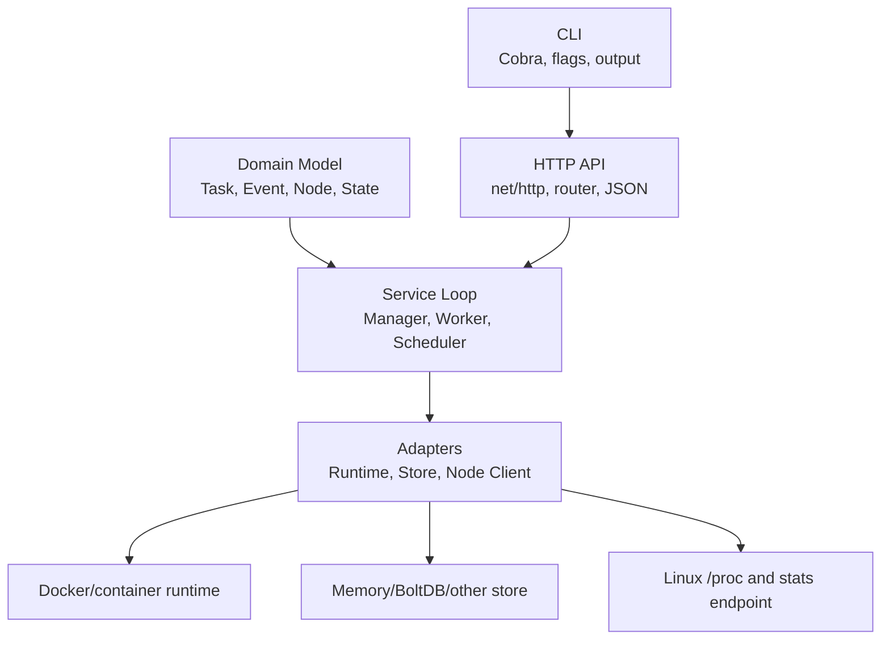

# Go Programming

Go là nhánh học ngôn ngữ dành cho cách viết service, CLI, agent, controller, runtime integration và tool hạ tầng bằng Go. Nội dung ở đây tập trung vào kiến thức Go bền vững: package/module, struct/interface, concurrency, HTTP API, CLI, background service, runtime adapter, persistence và testing mindset.

Nếu nội dung là workflow vận hành bằng tool đã có sẵn, đặt ở [Infrastructure Automation](../../05-infrastructure-automation/overview.md). Nếu nội dung là behavior của Kubernetes object/control plane, đặt ở Kubernetes. Nếu nội dung là Linux kernel, network, storage backend hoặc database engine, đặt ở Core Infrastructure.

## Khi Dùng Go Cho Hạ Tầng

- Cần binary độc lập, dễ ship vào VM, container image, bastion, CI runner hoặc node agent.
- Cần service nhỏ expose HTTP API, nhận JSON request, chạy background loop và cập nhật state.
- Cần CLI có subcommand/flag rõ ràng cho operator.
- Cần gọi Docker/container runtime, Linux `/proc`, cloud API, Kubernetes API hoặc endpoint nội bộ.
- Cần concurrency vừa phải bằng goroutine/channel/queue nhưng vẫn giữ lifecycle và error handling dễ đọc.

## Phạm Vi Học Go Trong KB

- Go language foundations: type, struct, method, interface, error, package, module.
- Go application structure: `cmd/`, `internal/`, domain package, adapter package.
- Go concurrency: goroutine, loop lifecycle, queue, `context.Context`, timeout, graceful shutdown.
- Go API/CLI: `net/http`, router, JSON boundary, Cobra-style command, flags, output.
- Go systems integration: Docker SDK/container runtime, Linux `/proc`, embedded store, retry, health check.
- Go cho control-plane style tooling: manager/worker, scheduler, state machine, desired/actual state.

## Mental Model

Một Go infrastructure tool thường có các lớp:

- domain model: struct, enum/state, ID, event, config;
- adapter layer: Docker SDK, HTTP client, Linux `/proc`, database, queue;
- service loop: reconcile, schedule, collect metrics, health check, retry;
- API boundary: `net/http`, router, JSON decode/encode, status code;
- CLI boundary: subcommand, flag, output, request đến manager API;
- store boundary: interface để tách in-memory store khỏi persistent store.

Điều quan trọng là không để handler, runtime SDK và state store trộn lẫn với nhau. Handler nên nhận intent và trả response; worker/manager loop mới là nơi thực hiện hành động, ghi state và xử lý failure.

Khi đọc hoặc viết Go code dạng này, hãy hỏi: object nào là domain model, boundary nào nhận intent, loop nào reconcile, adapter nào nói chuyện với hệ thống ngoài, và store nào giữ evidence sau khi action xảy ra.

## Learning Path

- [Go Project Structure And Domain Modeling For Ops Tools](./01-go-project-structure-and-domain-modeling.md)
- [Go HTTP API, CLI And Background Workers](./02-go-http-api-cli-and-background-workers.md)
- [Go Runtime Integration, Metrics And Persistence](./03-go-runtime-integration-metrics-and-persistence.md)
- [Go Orchestrator Implementation Patterns](./04-go-orchestrator-implementation-patterns.md)

## Liên Quan

- [Programming Languages](../overview.md)
- [Infrastructure Automation](../../05-infrastructure-automation/overview.md)
- [Python Programming](../02-python/overview.md)
- [C++ Programming](../03-cpp/overview.md)
- [Orchestrator Internals From Scratch](../../03-compute-and-orchestration/03-container-orchestration/01-kubernetes/00-architecture/02-orchestrator-internals-from-scratch.md)
