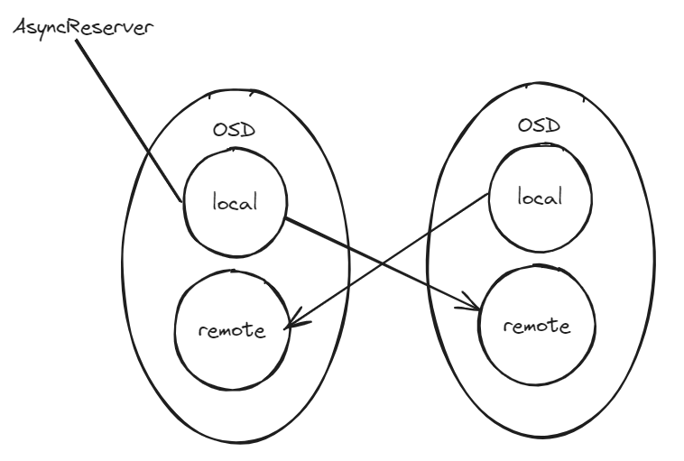

#  —  Ceph Rebalance 

## Rebalance 
- "Rebalance" trong Ceph là **quá trình di chuyển dữ liệu (CRUSH objects) giữa các thiết bị lưu trữ (OSD) khi cấu trúc của cụm bị thay đổi**, chẳng hạn như khi thêm hoặc bớt OSD. 
=> Quá trình này nhằm mục đích **phân phối lại dữ liệu** để **đảm bảo tính cân bằng và hiệu suất của hệ thống**, **tránh tình trạng OSD nào đó bị quá tải** trong khi OSD khác lại không dùng hết công suất. 

- Cơ chế hoạt động 
    1. Khi một OSD mới được thêm vào hoặc một OSD cũ bị gỡ bỏ, các thành phần của Ceph như Monitor và Manager sẽ phát hiện ra sự thay đổi cấu trúc này.
    2.  Dựa trên sự thay đổi, Ceph sử dụng thuật toán CRUSH (Controlled Replication Under Scalable Hashing) để tính toán lại vị trí dữ liệu phù hợp trên các OSD mới hoặc còn lại.
    3. Ceph bắt đầu di chuyển dữ liệu (các object) từ các OSD cũ sang các OSD mới hoặc phân bổ lại trên các OSD còn lại. Quá trình này diễn ra song song với hoạt động đọc/ghi thông thường, nhưng có thể ảnh hưởng đến hiệu suất trong thời gian ngắn.
    4. Sau khi quá trình di chuyển hoàn tất, Ceph sẽ cập nhật lại bản đồ trạng thái của cụm để phản ánh sự phân phối dữ liệu mới. Các máy khách (clients) và OSD sẽ sử dụng bản đồ mới này để truy cập dữ liệu một cách hiệu quả hơn.
    5. Việc phân bổ lại dữ liệu giúp hệ thống cân bằng tải, giảm tải cho các OSD quá tải, tăng cường khả năng chịu lỗi và cải thiện hiệu suất đọc/ghi tổng thể của cụm Ceph. 

### Automatic rebalancing triggers
- Automatic Rebalancing xảy ra khi tham số ClusterMap thay đổi. Khi tham số này đổi, kết quả đầu ra (danh sách các OSD lưu trữ) thay đổi. Ceph phát hiện sự sai lệch giữa vị trí dữ liệu hiện tại và vị trí dữ liệu được tính toán, từ đó kích hoạt quá trình di chuyển dữ liệu để đồng bộ hóa.
- Rebalancing được kích hoạt bởi các sự kiện thay đổi OSDMap Epoch (phiên bản của bản đồ OSD). Cụ thể là sự thay đổi trạng thái `IN/OUT` và `WEIGHT` của OSD.
    - `UP/DOWN`: Trạng thái kết nối (Liveness). OSD có đang chạy và giao tiếp với Monitor không?
        - Nếu OSD chết —> `DOWN`.
        - Lưu ý: Chỉ `DOWN` thôi thì chưa kích hoạt Rebalancing ngay (để tránh trường hợp mạng chập chờn - flapping).
    - `IN/OUT`: Trạng thái phân bổ dữ liệu (Data Placement).
        - `IN`: OSD này có trong CRUSH map và được phép chứa dữ liệu.
        - `OUT`: OSD này bị loại khỏi CRUSH map (trọng số về 0).
—> Trigger thực sự là khi trạng thái chuyển sang `OUT` hoặc từ `OUT` sang `IN` : 

- **Scale Out (Thêm Node)**: OSD mới được thêm vào, trạng thái từ `OUT` —> `IN`. Trọng số (Weight) của toàn cluster tăng lên. CRUSH tính toán lại và thấy một số PG cần chuyển sang OSD mới này.
- **Scale In/Failure (Mất Node)**:
    - OSD bị `DOWN`.
    - Sau khoảng thời gian `mon_osd_down_out_interval` (mặc định 600s), Monitor tự động đánh dấu nó là `OUT`.
    - Lúc này Rebalancing mới bắt đầu để tái tạo (recover) các bản sao bị thiếu.
- Thay đổi trọng số của OSD (`ceph osd crush reweight`):
    - Weight đại diện cho dung lượng đĩa (TB).

    - Nếu bạn đổi Weight của `OSD.1` từ 1.0 xuống 0.8, xác suất hàm CRUSH chọn `OSD.1` giảm xuống. Các PGs "dư thừa" sẽ bị đẩy sang các OSD khác.

### Workflow
Quá trình này diễn ra qua các giai đoạn của PG State Machine:

- Bước 1: **Map Update & Notification**
    - Monitor cluster cập nhật OSDMap mới (tăng số Epoch).
    - Monitor gửi map mới này cho các OSD thông qua giao thức OSD heartbeat hoặc khi OSD report lên.
- Bước 2: **Peering (Đồng bộ trạng thái - Không phải copy dữ liệu)**
Đây là bước quan trọng nhất về mặt logic. Khi OSD nhận map mới, các OSD thuộc cùng một PG sẽ "họp" lại (Peering).
- **Up Set:** Là danh sách các OSD nên chứa PG theo tính toán của CRUSH map mới.
- **Acting Set:** Là danh sách các OSD đang chứa PG thực tế (có thể bao gồm OSD cũ chưa kịp xóa).

Trong quá trình Rebalancing, *Up Set* thay đổi (có thêm OSD mới hoặc mất OSD cũ). Các OSD sẽ so sánh log (PGLog) để xác định object nào đang thiếu, object nào đã cũ.
- Bước 3: **Data Movement (Recovery & Backfill)**
Sau khi Peering xong, Ceph biết được sự chênh lệch (delta). Nó thực hiện một trong hai hành động:
1. **Recovery (Phục hồi):**
    - Dùng khi OSD bị `DOWN` một thời gian ngắn rồi `UP` lại.
    - Chỉ copy các object bị thay đổi trong thời gian OSD bị down (dựa trên PGLog).
    - Tốn ít tài nguyên.
2. **Backfill (Lấp đầy):**
    - Dùng khi thêm OSD mới (`OUT` —> `IN`) hoặc mất hẳn OSD (`IN` —> `OUT`).
    - Vì OSD mới hoàn toàn trống (không có lịch sử/PGLog), Ceph không thể so sánh delta.
    - Nó phải quét toàn bộ nội dung của PG từ OSD nguồn và copy toàn bộ sang OSD đích.
    - Đây là *tác vụ gây tải nặng nhất (High I/O)*.
- Bước 4: **Active + Clean**
    - Khi dữ liệu đã đồng bộ xong:Acting Set sẽ đồng nhất với Up Set.
    - PG chuyển sang trạng thái `active+clean`.
    - Cluster đạt trạng thái cân bằng (Health OK).

> Rebalancing là con dao hai lưỡi. Nó giúp đảm bảo tính sẵn sàng (Availability) và độ bền dữ liệu (Durability) mà không cần can thiệp thủ công. Tuy nhiên khi một lượng lớn dữ liệu di chuyển qua mạng nội bộ (Cluster Network), nó tranh chấp băng thông với Client Network (Public Network) và tranh chấp IOPS của ổ cứng. Điều này gây tăng độ trễ (latency) cho ứng dụng.

- Một số tham số cấu hình cũ dùng đẻ kiểm soát giới hạn tốc độ kiểm soát giới hạn tốc độ :
    - `osd_max_backfills`: Giới hạn số PG được backfill song song trên 1 OSD.
    - `osd_recovery_sleep`: Thời gian nghỉ giữa các lần copy để nhường IO cho Client.

### Balancer module 
- Trong kiến trúc Ceph, tính năng Balancer được triển khai như một module của Ceph Manager (MGR). Mục tiêu của nó là **tự động điều chỉnh sự phân bố của các Placement Groups (PGs) để đạt được sự đồng đều tối ưu nhất trên tất cả các Object Storage Daemons (OSDs)**, vượt qua những giới hạn vốn có của thuật toán CRUSH trong việc phân bổ hoàn hảo.

- Tính năng Balancer **hoạt động trên MGR daemon**. Nó **giám sát mức độ tải (PG count và dung lượng) của từng OSD** và **so sánh với mức trung bình lý tưởng**. Nếu độ lệch (variance) vượt quá ngưỡng cho phép, nó sẽ tính toán các bước cần thiết để **đưa cluster về trạng thái cân bằng**.

#### `upmap`
- `upmap` là cơ chế hiện đại và được khuyến nghị sử dụng. Nó cung cấp khả năng **điều chỉnh trực tiếp và chính xác vị trí của các PGs**.

- Cơ chế hoạt động :
1. **Tính toán Độ lệch:** Balancer (`mgr/balancer`) xác định OSD nào đang quá tải (chứa nhiều PG hơn mức trung bình) và OSD nào đang thiếu tải (chứa ít PG hơn mức trung bình).
2. **Tạo Mapping Tường minh (Explicit Mapping):** Balancer tính toán một tập hợp các PG cần di chuyển. Thay vì chỉ thay đổi trọng số và hy vọng CRUSH tính toán đúng, `upmap` tạo ra một vector ánh xạ gọi là `upmap` entry.
3. **Ghi vào OSDMap:** Các `upmap` entries này được ghi vào OSD Map (bản đồ cụm).Ví dụ: Balancer xác định PG 1.a nên nằm trên OSD.5 thay vì OSD.10. Nó thêm ánh xạ: $PG_{1.a} \rightarrow \{OSD.3, OSD.5, OSD.7\}$ (giả sử replica=3).
4. **Override CRUSH:** Khi các OSD nhận OSDMap mới, chúng sẽ ưu tiên tuân theo `upmap` entry này. Điều này ghi đè lên kết quả mà thuật toán CRUSH tính toán.
5. **Kích hoạt Rebalancing:** Việc thay đổi vị trí PG trong OSDMap sẽ kích hoạt quá trình Peering và sau đó là `Backfill/Recovery` (quá trình di chuyển dữ liệu thực tế).

> **Ưu điểm :** 
> **Độ chính xác cao:** Giúp cluster đạt được sự cân bằng gần như hoàn hảo (thường là độ lệch dưới 5%).
> **Hiệu quả:** Phù hợp với các cluster có số lượng PG lớn (nên có ít nhất 50-100 PGs/OSD để tối ưu).

#### `crush-compat`
- `crush-compat` là một chiến lược cũ hơn, ít chính xác hơn và thường được coi là phương pháp "gần đúng" để đạt được cân bằng.
- Cơ chế hoạt động : 
    1. **Tính toán Độ lệch:** Tương tự, Balancer xác định OSD quá tải/thiếu tải.
    2. **Thao túng `Reweight`:** Thay vì tạo ánh xạ PG trực tiếp, `crush-compat` chỉ điều chỉnh thuộc tính `reweight` của các OSD trong OSD Map.
        - `Reweight` là một thuộc tính bổ sung, không phải là CRUSH weight (dựa trên dung lượng), mà là một chỉ số tạm thời để thay đổi xác suất CRUSH chọn OSD đó.
    3. **Tác động gián tiếp:** Nếu OSD.1 quá tải PG, crush-compat giảm reweight của OSD.1 (ví dụ: từ 1.0 xuống 0.95).
    4. **CRUSH Re-run:** Việc giảm reweight làm thay đổi đầu vào của thuật toán CRUSH. Trong các OSDMap Epoch tiếp theo, CRUSH sẽ có xu hướng chọn OSD khác thay vì OSD.1 cho các PGs mới hoặc PGs cần di chuyển.

> CRUSH-Compat chỉ ảnh hưởng đến kết quả của CRUSH chứ không điều khiển trực tiếp vị trí PG.
> Phải mất nhiều lần tính toán lại (nhiều OSDMap Epoch) để đạt được trạng thái cân bằng, và độ chính xác không cao bằng `upmap`.
### Các hoạt động của Ceph Rebalance 
### 1. Recovery 
- **Recovery (Phục hồi)** là quá trình tự động và ưu tiên cao nhất của Ceph nhằm khôi phục mức độ dự phòng (redundancy level) dữ liệu đã được định nghĩa cho cluster (ví dụ: khôi phục từ 2 bản sao lên 3 bản sao).
=> **Mục tiêu :** Đảm bảo tính Bền vững (Durability) và Sẵn sàng (Availability) của dữ liệu. Bất cứ khi nào số lượng bản sao (replica) của một Placement Group (PG) giảm xuống dưới mức yêu cầu (do một OSD bị lỗi hoặc bị rút ra), Recovery sẽ được kích hoạt.

#### 1.1. Cơ chế hoạt động của Recovery
- Quá trình Recovery là một chuỗi các sự kiện logic và vật lý, được điều phối bởi các Ceph Monitor và được thực thi bởi các OSD.

**Kích hoạt (Trigger)**
- Recovery được kích hoạt khi:
1. **OSD Failure:** Một OSD chuyển từ trạng thái UP sang DOWN.
2. **Monitor Action:** Sau một thời gian chờ (thông số mon_osd_down_out_interval), nếu OSD vẫn DOWN, Monitor sẽ đánh dấu OSD đó là OUT trong OSDMap mới.
3. **PG State Change:** Các PGs đang chứa dữ liệu trên OSD bị lỗi sẽ chuyển sang trạng thái degraded (suy thoái) hoặc stale (cũ kỹ), báo hiệu cluster không còn an toàn.

**Giai đoạn Peering và Lựa chọn OSD mới**
1. **Peering:** Các OSD còn lại trong **Acting Set** (tập hợp các OSD chịu trách nhiệm cho PG đó) tiến hành Peering. Chúng so sánh **PG Log** (nhật ký ghi nhận các lần thay đổi object) để xác định:
    - **Primary OSD:** OSD đóng vai trò chính (thường là OSD hoạt động lâu nhất).
    - **Authoritative Log:** Nhật ký thay đổi cuối cùng và đầy đủ nhất.
    - **Object bị thiếu:** Xác định chính xác object nào đã có trên các bản sao còn lại nhưng bị mất/cũ trên OSD mới.

2. **CRUSH Re-run:** Với OSDMap mới (đã loại bỏ OSD lỗi), thuật toán CRUSH được chạy lại để tìm ra một OSD mới để thay thế cho OSD bị lỗi trong Up Set (tập hợp các OSD lý tưởng).

**Giai đoạn Data Transfer (Phục hồi)**
Quá trình copy dữ liệu thực tế diễn ra.

#### 1.2. Recovery throttling
- **Recovery Throttling** là tập hợp các tham số cấu hình được sử dụng để kiểm soát tốc độ và mức độ ưu tiên của các hoạt động khôi phục và di chuyển dữ liệu (Recovery/Backfill) trên các OSD. Mục tiêu chính là ngăn chặn quá trình khôi phục làm bão hòa tài nguyên mạng (network I/O) và đĩa (disk I/O), đảm bảo hiệu năng của các tác vụ của client không bị ảnh hưởng nghiêm trọng.

| Tham số                  | Phạm vi kiểm soát | Giải thích kỹ thuật                                                                                                                              |
|--------------------------|-------------------|--------------------------------------------------------------------------------------------------------------------------------------------------|
| osd_max_backfills        | PG Count          | Số lượng Backfill (di chuyển toàn bộ PG) mà một OSD có thể xử lý đồng thời. Giới hạn này áp dụng cho cả nguồn (source) và đích (destination) của Backfill. |
| osd_recovery_max_active  | Operation Count   | Số lượng các Recovery Operations (các tác vụ khôi phục nhỏ, không phải full Backfill) được phép hoạt động đồng thời trên một OSD.                       |
| osd_recovery_op_priority | Priority          | Mức độ ưu tiên của các tác vụ khôi phục so với các tác vụ của client. Giá trị cao hơn (thường là 5 cho client, 10 cho recovery) có nghĩa là hệ thống sẽ ưu tiên Recovery hơn. |
| osd_recovery_max_bytes   | Bandwidth         | Giới hạn tổng băng thông tối đa (tính bằng bytes/giây) dành cho tất cả các tác vụ Recovery và Backfill gộp lại trên một OSD.                           |
| osd_recovery_sleep       | Delay             | Khoảng thời gian nghỉ (tính bằng giây) giữa các thao tác khôi phục. Việc chèn thời gian nghỉ giúp "nhường" tài nguyên cho client.                         |

- Các tham số Recovery Throttling (Giới hạn tốc độ phục hồi) là các tham số quản lý Quality of Service (QoS) của Ceph. Chúng kiểm soát sự cân bằng giữa tốc độ khôi phục và hiệu năng của client.

Nếu các tham số này thay đổi, nó sẽ ảnh hưởng trực tiếp đến hệ thống như sau:
- **Thay đổi Tham số Giới hạn Song song (osd_recovery_max_active, osd_max_backfills)**
    - **Tăng giá trị (Ví dụ: Tăng osd_recovery_max_active):**

        - **Tác động:** Cho phép nhiều thao tác khôi phục và di chuyển dữ liệu chạy đồng thời hơn trên mỗi OSD.

        - **Hệ quả:** Tốc độ phục hồi dữ liệu và cân bằng tải tăng nhanh. Cluster sớm đạt trạng thái an toàn (active+clean).

        - **Đánh đổi:** Tăng gánh nặng lên tài nguyên đĩa (IOPS) và mạng (Network Throughput), dẫn đến tăng độ trễ (latency) và giảm hiệu năng I/O cho các tác vụ của client.

    - **Giảm giá trị:**

        - **Tác động:** Giới hạn số lượng tác vụ song song.

        - **Hệ quả:** Tốc độ phục hồi chậm lại.

        - **Lợi ích:** Đảm bảo I/O dành cho client luôn được ưu tiên, giảm thiểu ảnh hưởng đến hiệu năng ứng dụng.

- **Thay đổi Tham số Ưu tiên (osd_recovery_op_priority)**
    - **Tăng giá trị:**
        - **Tác động:** Tăng mức độ ưu tiên của các yêu cầu Recovery/Backfill so với yêu cầu của client.
        - **Hệ quả:** Hệ thống sẽ ưu tiên xử lý dữ liệu nội bộ trước, dẫn đến việc khôi phục nhanh hơn. Client phải chờ đợi, độ trễ client tăng đáng kể.

- **Thay đổi Tham số Băng thông (osd_recovery_max_bytes)**
    - **Tăng/Giảm giá trị:** Giới hạn tổng băng thông tối đa mà quá trình Recovery/Backfill được phép sử dụng. Đây là cách trực tiếp nhất để kiểm soát tải mạng, giúp quản trị viên đảm bảo rằng băng thông mạng vẫn còn đủ cho Client I/O.

> Việc điều chỉnh các tham số này là một sự đánh đổi (Trade-off):
> $$\text{Tốc độ Recovery} \uparrow \Leftrightarrow \text{Client Latency} \uparrow$$

### 2. Backfill 
- `backfill` là quá trình sao chép dữ liệu sang các thiết bị lưu trữ mới (OSD) hoặc sau khi một OSD bị lỗi, để đảm bảo tính sẵn sàng và phân tán dữ liệu đúng với cấu hình. Cơ chế hoạt động là sau khi một OSD bị lỗi hoặc được thêm vào, các cặp dữ liệu (PG - Placement Group) bị ảnh hưởng sẽ được lên lịch để sao chép (**backfill**) sang OSD đích để đảm bảo dữ liệu vẫn được lưu trữ trên đủ số bản sao theo quy định. 
  <=>  

- Backfill được quản lý bởi remote AsyncReserver thuộc OSD Service giúp xếp hàng và giới hạn số lượng backfill đồng thời (mặc định theo `osd_max_backfills`), tránh overload OSD khi có nhiều PG cần backfill đến nó.

**Cơ chế hoạt động của Backfill trong Ceph:**
1. **Khi nào Backfill diễn ra:** Backfill được kích hoạt trong các tình huống sau:
- Một OSD mới được thêm vào cụm.
- Một OSD hiện có bị lỗi hoặc ngắt kết nối.
- Một OSD được đưa vào chế độ "backfill" hoặc "up" sau khi "down" hoặc "out".
2. Quá trình Backfill:

- **Chỉ định OSD nguồn và đích:** Khi một OSD mới được thêm vào, hoặc khi một OSD bị lỗi, các PG (nhóm vị trí dữ liệu) trên OSD đó sẽ được chỉ định lại cho các OSD khác làm đích sao lưu.
- **Sao chép dữ liệu:** Ceph sẽ bắt đầu sao chép dữ liệu của các PG đó từ OSD nguồn sang OSD đích. Quá trình này được gọi là "backfill".
- **Đảm bảo tính nhất quán:** Trong quá trình này, Ceph vẫn duy trì tính nhất quán của dữ liệu và cho phép ghi dữ liệu mới vào hệ thống.
- **Hoàn tất Backfill:** Sau khi quá trình sao chép hoàn tất, OSD đích sẽ được cập nhật thông tin về các PG được chỉ định, và quá trình này sẽ kết thúc.
3. Cơ chế điều chỉnh trong Ceph:
- **Số lượng backfill đồng thời:** Bạn có thể giới hạn số lượng backfill đồng thời trên mỗi OSD bằng cách cấu hình osd_max_backfills để tránh quá tải hệ thống.
- **Kiểm soát tỷ lệ đầy:** Ceph có thể từ chối yêu cầu backfill nếu OSD đã đạt đến một tỷ lệ đầy nhất định (ví dụ: backfill_full_ratio) để tránh làm đầy ổ đĩa.
- **Thử lại khi thất bại:** Nếu một yêu cầu backfill bị từ chối do OSD quá tải, Ceph sẽ thử lại sau một khoảng thời gian nhất định (được cấu hình bằng osd_backfill_retry_interval).
- **Tối ưu hóa hiệu năng:** Ceph cũng có các tham số để quản lý hiệu năng của quá trình backfill, như osd_backfill_scan_min và osd_backfill_scan_max, để kiểm soát khoảng thời gian quét dữ liệu.

#### 2.1.  Backfill priority
- **Backfill Priority** đề cập đến cách Ceph xử lý ưu tiên của các tác vụ di chuyển khối lượng lớn (**Backfill**) so với các tác vụ khôi phục nhỏ (Recovery) và các yêu cầu I/O của client.

- **Bối cảnh:** Khi một OSD mới được thêm vào, quá trình **Backfill** (di chuyển toàn bộ PGs) diễn ra. Nếu không được ưu tiên, quá trình này có thể kéo dài, khiến OSD mới không sớm tham gia vào gánh tải.

- **Cơ chế:** Trong các phiên bản Ceph hiện đại, Ceph sử dụng Priority Queue và các bộ lập lịch I/O (như `mClock` hoặc `cfq` truyền thống) để quản lý luồng dữ liệu. **Backfill** thường được đặt ở một mức ưu tiên được kiểm soát.

- **Mục tiêu:** Đảm bảo rằng việc di chuyển dữ liệu lớn diễn ra đủ nhanh để đạt được trạng thái cân bằng và an toàn nhanh nhất có thể, nhưng vẫn tôn trọng giới hạn tốc độ đặt ra bởi Recovery Throttling (ví dụ: `osd_max_backfills`) để không làm đình trệ toàn bộ hệ thống.

### Recovery vs Backfill

|Tính năng| Recovery | Backfill|
|---------|----------|---------|
| Mục đích|	Khôi phục bản sao bị thiếu/cũ (sau lỗi). |	Cân bằng tải toàn bộ PG (sau khi thêm OSD). |
| Dữ liệu copy |	Chỉ copy các object bị thiếu/cũ (dựa trên PG Log). |	Copy toàn bộ object trong PG (full copy).|
| Thời điểm	| Xảy ra ngay khi có sự cố. |	Xảy ra khi OSDMap thay đổi trọng số/topo.|

Các OSD còn lại (Primary và các Replica) sẽ gửi yêu cầu copy các object bị thiếu tới OSD mới được chọn. Sau khi tất cả dữ liệu đã được copy và đồng bộ, PG chuyển về trạng thái active+clean.

## 3. noout, norebalance flags
- Đây là các cờ trạng thái toàn cục (cluster-wide flags) mà quản trị viên có thể đặt trên hệ thống để tạm thời vô hiệu hóa các hành vi tự động của Ceph, thường được sử dụng trong quá trình bảo trì hoặc khắc phục sự cố.

### 3.1. noout 
**Commands:** `ceph osd set/unset noout`
- **Mục đích:** Ngăn OSD tự động bị đánh dấu là OUT. Nếu một OSD chuyển sang trạng thái DOWN (không hoạt động), Monitor sẽ chờ khoảng thời gian mon_osd_down_out_interval (mặc định 600s) trước khi đánh dấu nó là OUT để kích hoạt Rebalancing. Cờ noout sẽ ngăn Monitor thực hiện việc đánh dấu OUT này.
- **Ứng dụng:** Dùng khi thực hiện bảo trì ngắn hạn trên máy chủ (ví dụ: cập nhật firmware, khởi động lại) để ngăn Ceph lãng phí tài nguyên cho việc khôi phục dữ liệu không cần thiết.

### 3.2. `noreblance`
- **Commands:** `ceph osd set/unset norebalance`
- **Mục đích:** Ngăn chặn quá trình Rebalancing (di chuyển PG) tự động. Điều này ngăn CRUSH tính toán lại và di chuyển các PGs ngay cả khi có thay đổi OSDMap (ví dụ: thêm/xóa OSD).
- **Ứng dụng:** Dùng trong thời gian tải client cao điểm hoặc khi quản trị viên đang chuẩn bị cho một thay đổi topo lớn (ví dụ: thêm hàng chục OSDs cùng lúc) và muốn kiểm soát thủ công thời điểm bắt đầu Rebalancing.

## Use case 

### 1. Cụm ceph bị lỗi đầy ổ thì phải tắt backfill và rebalance

- Việc tắt Rebalance và Backfill khi cụm Ceph gần đạt ngưỡng đầy là một biện pháp kiểm soát khủng hoảng (crisis mitigation) bắt buộc. Nó được thực hiện để ngăn chặn lỗi dây chuyền khiến cluster không còn khả năng ghi dữ liệu, dẫn đến treo ứng dụng của client.

 - Nguyên nhân : Vấn đề bắt nguồn từ các ngưỡng đầy đĩa (fullness thresholds) được cấu hình trên các OSD (Object Storage Daemon).
    - `nearfull` - `90%` : OSD sẽ bắt đầu liên tục đưa ra các cảnh báo 
    - `backfillfull` - cũng thường bằng nearfull - `90 %` : OSD sẽ từ chối các quá trình Backfills
    - `full` - `95%` : OSD sẽ từ chối tất cả các tác vụ ghi (write) mới.
    - `failsafe_full` - `98%` : Ngưỡng chặn cứng, OSD sẽ tự `shutdown`.

=> Ngưỡng quan trọng nhất là full (mặc định 95%). Khi một OSD chạm ngưỡng này, nó phải dừng nhận tất cả các lệnh ghi mới. Đây là cơ chế bảo vệ thiết yếu nhằm duy trì tính toàn vẹn dữ liệu (data integrity) và đảm bảo OSD vẫn còn không gian cho các tác vụ nội bộ như ghi metadata hoặc xử lý log. Khi OSD chính của một Placement Group (PG) dừng ghi, toàn bộ PG đó sẽ bị đánh dấu là unwritable (không thể ghi được).

- Trong điều kiện cluster sắp đầy, việc bật tính năng `Rebalance` và `Backfill` sẽ gây ra phản ứng tiêu cực. `Backfill` và Recovery là các quy trình tốn nhiều tài nguyên, được thiết kế để di chuyển toàn bộ PGs (`Backfill`) hoặc các object bị thiếu (Recovery) giữa các OSD để đảm bảo cân bằng và dự phòng. Quá trình này yêu cầu không gian trống tạm thời trên OSD đích để lưu trữ bản sao dữ liệu.

- Tuy nhiên, khi tổng dung lượng trống của cluster là rất nhỏ (ví dụ: trung bình 90% đã được sử dụng), các thao tác di chuyển dữ liệu này sẽ tăng tốc độ làm đầy các OSD còn lại. OSD đang ở mức 90% sẽ nhanh chóng chạm ngưỡng full (95%) khi nhận các khối dữ liệu `Backfill`. Điều này dẫn đến lỗi dây chuyền (domino effect), khiến số lượng OSD bị dừng ghi tăng lên theo cấp số nhân.

- Quá trình `Backfill` (di chuyển toàn bộ PG) và Recovery (khôi phục bản sao bị thiếu) cần một lượng lớn không gian trống tạm thời trên OSD đích để sao chép dữ liệu.

    - Giả sử: Cluster đang ở mức 92%. OSD A đang 95% (full). OSD B đang 90%.

    - Rebalance chạy: Nó cố gắng di chuyển dữ liệu từ OSD A sang OSD B.

    - Hệ quả: OSD B nhận dữ liệu, dung lượng nhanh chóng tăng từ 90% lên 95% và chạm ngưỡng full.

    - Lỗi dây chuyền: OSD B cũng dừng ghi. Hệ thống lại cố gắng di chuyển dữ liệu khỏi OSD B sang OSD C (ví dụ đang 88%). OSD C nhanh chóng chạm ngưỡng full.

- Quá trình Rebalancing, thay vì giải quyết vấn đề, lại đẩy nhanh tốc độ OSD còn lại bị đầy, dẫn đến việc cluster nhanh chóng mất khả năng ghi hoàn toàn.

- Khi một lượng lớn PGs trở nên `unwritable` do OSD chính (Primary OSD) của chúng chạm ngưỡng full, cluster sẽ bước vào trạng thái Write Stall (tạm dừng ghi). Đây là tình trạng nghiêm trọng nhất vì ứng dụng của client hoàn toàn bị treo.

- Việc sử dụng cờ `norebalance` (`ceph osd set norebalance`) ngay lập tức ngăn chặn các OSD tự động cố gắng di chuyển PGs, giúp ổn định số lượng OSD đang hoạt động và cho phép quản trị viên có thời gian để:

    - Thêm OSD mới vào cluster (giải pháp lâu dài).

    - Xóa dữ liệu không cần thiết (giải pháp tạm thời, thường bằng cách sử dụng cờ nofull sau khi có thể ghi lại).